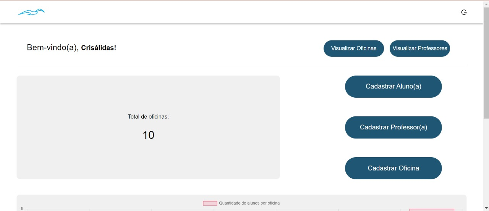
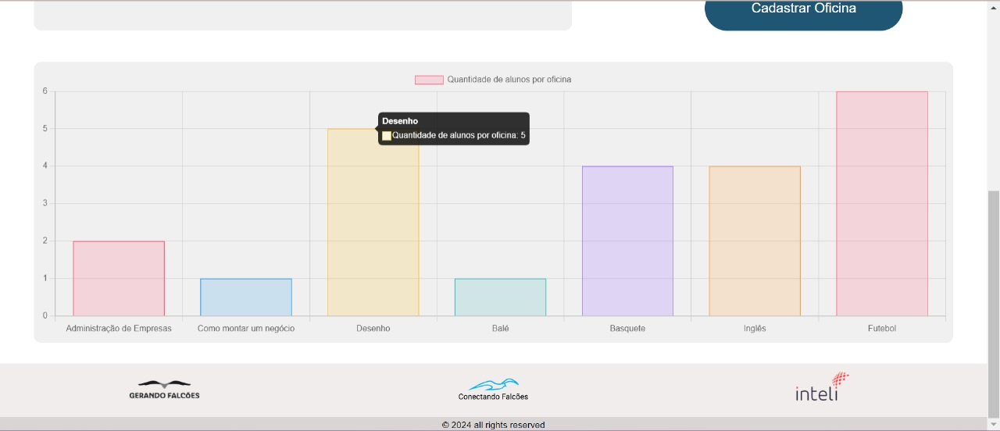
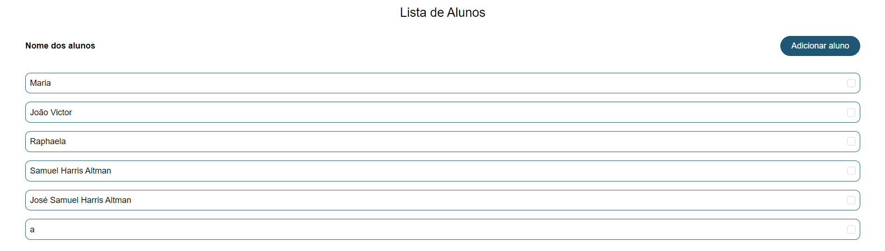
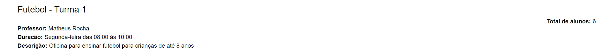
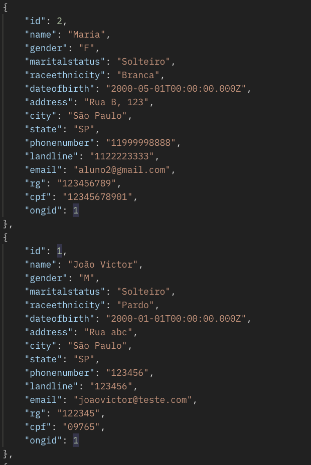
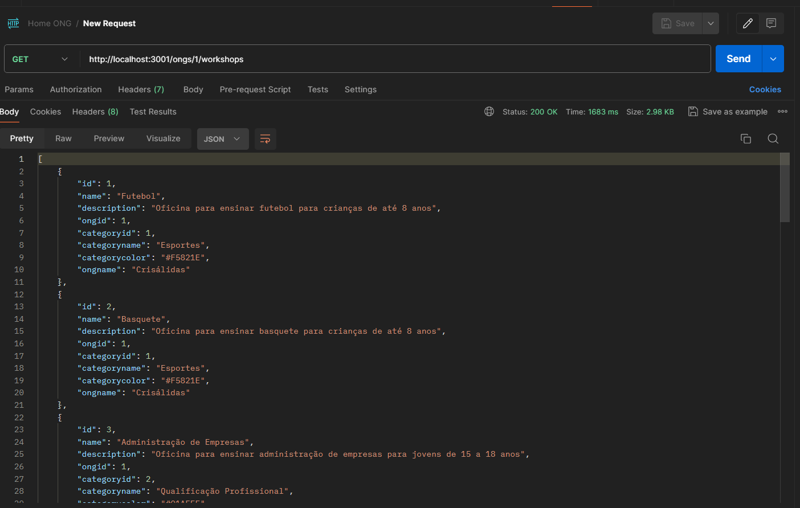

<table>
<tr>
<Table>
  <tr>
    <td><a href= "https://gerandofalcoes.com//"></td>
    <td>
      <a href= "https://www.inteli.edu.br/"></a>
    </td>
  </tr>
</table>

# Nome do Projeto: Conectando Falcões

## Nome do Grupo: Alto Voo

## :student: Integrantes:

- <a href="https://www.linkedin.com/in/bianca-borges-969586206/">Bianca Borges Lins</a>
- <a href="https://www.linkedin.com/in/joselitojunior/">Joselito Júnior Motta de Carvalho</a>
- <a href="https://www.linkedin.com/in/marcelomiguelassis/">Marcelo Miguel Pereira de Assis</a>
- <a href="https://www.linkedin.com/in/raphaela-guiland-ferraz/">Raphaela Guiland Ferraz</a>
- <a href="https://www.linkedin.com/in/renan-feitosa-44328524a/">Renan Feitosa Oliveira</a>
- <a href="https://www.linkedin.com/in/thomasreitzfeld/">Thomas Reitzfeld</a>

## Sumário

- [1. Termos e Abreviações](#1.-termos-e-abreviações)
- [2. Visão Geral do Projeto](#2.-visão-geral-do-projeto)
  - [2.1 Entendimento da Demanda](#2.1-Entendimento-da-Demanda)
    - [2.1.1 Partes Interessadas](#2.1.1-Partes-Interessadas)
    - [2.1.2 Análise da Indústria](#2.1.2-Análise-da-Indústria)
  - [2.2 Problema](#2.2-Problema)
    - [2.2.1 Análise do Problema](#2.2.1-Análise-do-Problema)
    - [2.2.2 Análise do Cenário (Matriz SWOT)](#2.2.2-Análise-do-Cenário-(Matriz-SWOT))
- [3. Proposta da Solução](#3.-Proposta-da-Solução)
  - [3.1 Descritivo Geral da Solução](#3.1-Descritivo-Geral-da-Solução)
  - [3.2 Proposta Tecnológica e Benefícios](#3.2-Proposta-Tecnológica-e-Benefícios)
    - [3.2.1 Tipo de arquitetura de nuvem escolhida](3.2.1-Tipo-de-arquitetura-de-nuvem-escolhida)
    - [3.2.2 Arquitetura de nuvem escolhida](#3.2.2-Arquitetura-de-nuvem-escolhida)
    - [3.2.3 Benefícios trazidos pela arquitetura de nuvem proposta](#3.2.3-Benefícios-trazidos-pela-arquitetura-de-nuvem-proposta)
  - [3.3 Proposta de Valor (Value Proposition Canvas)](#3.3-Proposta-de-Valor-(Value-Proposition-Canvas))
  - [3.4 Matriz de Risco](#3.4-Matriz-de-Risco)
- [4. Análise de experiência do usuário](#4.-Análise-de-experiência-do-usuário)
  - [4.1 Perfis de Usuários](#4.1-Perfis-de-Usuários)
  - [4.2 Personas](#4.2-Personas)
  - [4.3 Mapa de jornada do usuário](#4.3-Mapa-de-jornada-do-usuário)
- [5. Requisitos](#5.-Requisitos)
  - [5.1 Requisitos Funcionais](#5.1-Requisitos-Funcionais)
  - [5.2 Requisitos não Funcionais](#5.2-Requisitos-não-Funcionais)
  - [5.3 Casos de Uso](#5.3-Casos-de-Uso)
- [6. Projeto de Solução](#6.-Projeto-de-Solução)
  - [6.1 Diagrama de Classes](#6.1-Diagrama-de-Classes)
    - [6.1.1 Diagrama de Classes de Domínio](#6.1.1-Diagrama-de-Classes-de-Domínio)
    - [6.1.2 Diagrama de Classes de Implementação](#6.1.2-Diagrama-de-Classes-de-Implementação)
  - [6.2 Diagrama de Implantação](#6.2-Diagrama-de-Implantação)
  - [6.3 Tecnologias e Ferramentas](#6.3-Tecnologias-e-Ferramentas)
    -[6.3.1 Frontend](#6.3.1-Frontend)
    -[6.3.2 Backend](#6.3.2-Backend)
    -[6.3.3 Banco de Dados](#6.3.3-Banco-de-Dados)
    -[6.3.4 Infraestrutura](#6.3.4-Infraestrutura)
- [7. Interface](#7.-Interface)
  - [7.1 Design System](#7.1-Design-System)
  - [7.2 Projeto de Interface (Wireframes)](#.2-Projeto-de-Interface-(Wireframes))
  - [7.3 Frontend](#7.3-Frontend)
- [8. Projeto de Banco de Dados](#8.-Projeto-de-Banco-de-Dados)
  - [8.1 Modelo Conceitual](#8.1-modelo-conceitual)
  - [8.2 Modelo Lógico](#8.2-modelo-conceitual)
- [9. Testes de Software](#9.-Testes-de-Software)
  - [9.1 Demonstração da integração](#9.1-Demonstração-da-integração)
  - [9.2 Teste de Integração](#9.2-Teste-de-Integração)
  - [9.3 Testes automatizados](#9.3-Testes-automatizados)
  - [9.4 Testes de Usabilidade](#9.4-Testes-de-Usabilidade)
  - [9.5 Simulação de Carga](#9.5-Simulação-de-Carga)
- [10. Procedimento de Implantação da Solução](#10.-Procedimento-de-Implantação-da-Solução)
  - [10.1 Procedimento de Implantação do Sistema](#10.1-Procedimento-de-Implantação-do-Sistema-local)
  - [10.2 Procedimento de Implantação do Banco de Dados](#10.2-Procedimento-de-Implantação-do-Banco-de-Dados)
  - [10.3 Documentação Automática do Sistema (Swagger)](#10.3-Documentação-Automática-do-Sistema-(Swagger))
- [Referências](#referências)
- [Apêndice](#apêndice)

# <a name="1.-termos-e-abreviações"></a>1. Termos e Abreviações

- **ONG**: Organização Não Governamental
- **LGPD**: Lei Geral de Proteção de Dados
- **Stakeholders**: Partes interessadas em um projeto.
- **RNF**: Requisito não funcional.
- **ISO 25010**: Padrão de qualidade para sistemas de software.
- **WCAG 2.1**: Padrões de acessibilidade web

# <a name="2. Visão Geral do Projeto"></a>2. Visão Geral do Projeto

&emsp;Neste tópico serão abordados pontos que se referem ao entendimento inicial da Gerando Falcões, além de um entendimento geral do desafio proposto pelo parceiro.

## <a name="2.1 Entendimento da Demanda"></a>2.1 Entendimento da Demanda

&emsp;Neste tópico serão abordadas as seções que representam o entendimento inicial dos interessados pelo projeto desenvolvido, bem como uma análise mercadológica em que a GF está inserida. Ademais, para um maior detalhe da demanda solicitada pelo parceiro, há o tópico que irá tratar especificamente dos problemas levantados pelo mesmo.

### <a name="2.1.1 Partes Interessadas"></a>2.1.1 Partes Interessadas

&emsp; O projeto "Conectando Falcões" representa uma iniciativa colaborativa que visa integrar tecnologia e inovação social para promover mudanças significativas nas comunidades atendidas pela ONG Gerando Falcões. Este projeto é fruto da parceria entre a faculdade Inteli, a ONG Gerando Falcões, o grupo de estudantes Alto Voo da Inteli e diversas outras ONGs presentes no ecossistema da Gerando Falcões. A sinergia entre estas partes interessadas busca não apenas desenvolver soluções tecnológicas avançadas, mas também garantir que estas soluções atendam às necessidades reais das comunidades, promovendo assim um impacto social duradouro.

- **Faculdade Inteli**: Atua como um catalisador educacional e tecnológico, fornecendo o suporte acadêmico necessário e a infraestrutura para o desenvolvimento do projeto. A Inteli é responsável por orientar o grupo Alto Voo, garantindo a aplicação de práticas de engenharia de software de ponta.

- **Gerando Falcões**: Como principal parte interessada, a Gerando Falcões desempenha um papel central no projeto, definindo as necessidades e os objetivos que o "Conectando Falcões" deve alcançar. Sua profunda experiência em trabalho comunitário e desenvolvimento social é vital para direcionar as soluções tecnológicas às necessidades das comunidades.

- **Grupo Alto Voo**: Composto por estudantes da Inteli, este grupo é encarregado de conceber, desenvolver e implementar a solução tecnológica. O Alto Voo serve como a ponte entre o conhecimento acadêmico e a aplicação prática, trabalhando em estreita colaboração com a Gerando Falcões para assegurar que o projeto atenda às expectativas e requisitos estabelecidos.

- **ONGs presentes no ecossistema da Gerando Falcões**: Estas organizações representam os usuários finais e beneficiários das soluções desenvolvidas. A colaboração com estas ONGs é crucial para entender as dinâmicas locais e as necessidades específicas, garantindo que o projeto tenha um impacto real e mensurável nas comunidades.

&emsp; O "Conectando Falcões" é um exemplo emblemático de como a colaboração entre instituições educacionais, organizações não governamentais e estudantes pode gerar soluções inovadoras com um impacto social profundo. As partes interessadas, cada uma com seu papel único e contribuições essenciais, formam o alicerce sobre o qual o projeto é construído e desenvolvido. À medida que avançamos, a integração contínua de feedback e insights de todas as partes interessadas será crucial para garantir que o projeto não apenas atenda às necessidades tecnológicas, mas também promova a inclusão social e o desenvolvimento comunitário sustentável.

### <a name="2.1.2 Análise da Indústria"></a>2.1.2 Análise da Indústria

&emsp; A Rede Gerando Falcões atua no setor de desenvolvimento social, especialmente em favelas e comunidades desfavorecidas. Este setor é composto por entidades sem fins lucrativos e não governamentais e desempenha um papel crucial nesse contexto, buscando mitigar as desigualdades sociais e promover o desenvolvimento sustentável nessas áreas. Com uma presença significativa em todo o território nacional, essas organizações alcançam milhares de comunidades, oferecendo programas e iniciativas que visam à educação, saúde, capacitação profissional, entre outros aspectos fundamentais para a melhoria de vida dos indivíduos. 

&emsp; Na indústria do terceiro setor, os principais competidores da Rede Gerando Falcões podem incluir outras organizações semelhantes que atuam no mesmo espaço, isso pode incluir ONGs, fundações, institutos e programas governamentais que têm objetivos semelhantes. A seguir, destacamos alguns principais:

- _CUFA (Central Única das Favelas):_ Fundada por MV Bill e Nega Gizza, a CUFA é uma das organizações mais reconhecidas no Brasil quando se trata de representar e desenvolver projetos nas favelas. Com uma presença nacional e uma ampla gama de programas que abrangem desde esportes até educação e empreendedorismo, a CUFA é uma forte competidora, especialmente em termos de visibilidade e alcance comunitário;
- _G-10 Favelas:_ O G-10 Favelas é uma coalizão que reúne líderes de algumas das maiores favelas do Brasil. A organização tem como objetivo centralizar esforços para melhorar as condições de vida nas favelas, promovendo o desenvolvimento econômico, social e cultural. Sua influência e poder de mobilização o tornam um competidor significativo no campo do desenvolvimento comunitário;
- _Favela é Isso Aí:_ Iniciativa liderada por Raull Santiago, conhecido ativista e morador do Complexo do Alemão, no Rio de Janeiro, o Favela é Isso Aí concentra-se em promover a valorização e a autodeterminação das favelas, além de lutar contra o estigma e a discriminação. Sua abordagem centrada na comunidade e sua conexão direta com os moradores fazem dele um competidor notável na busca por soluções locais e empoderamento.

&emsp;Tendo em vista os competidores apresentados, podemos ter uma visão maior do mercado da Gerando Falcões. Para complementar esta análise, apresentamos as 5 Forças de Porter que é um modelo de análise competitiva desenvolvido por Michael Porter que avalia o ambiente externo de uma indústria, considerando cinco fatores-chave: rivalidade entre concorrentes, poder de negociação dos fornecedores, poder de negociação dos compradores, ameaça de novos entrantes e ameaça de produtos ou serviços substitutos.<sup>[\[8\]](#referências)</sup>

<div align="center">
  <p>Figura 01 - 5 forças de Porter Gerando Falcões</p>
  
  <p>Fonte: Autoria própria</p>
</div>

&emsp;Essa análise permite à Gerando Falcões compreender melhor o contexto em que operam, identificando oportunidades e ameaças, além de orientar estratégias para se posicionarem de forma mais competitiva no mercado. Ao entender as forças que moldam a competição em uma indústria, ela pode desenvolver estratégias para se diferenciar, fortalecer sua posição ou explorar lacunas no mercado, tornando-se mais resilientes e adaptáveis às mudanças externas.

&emsp;Em relação ao modelo de negócios da GF, pode-se dizer que ele é fundamentado em três pilares: captação de recursos, venda de produtos e gestão de impacto. De acordo com Souza<sup>[\[12\]](#referências)</sup>, a captação de recursos é realizada por meio de doações de pessoas físicas e jurídicas, campanhas online, eventos beneficentes e editais diversos <sup>[\[12\]](#referências)</sup>. Já a venda de produtos inclui a loja online do Bazar GF, que comercializa roupas e acessórios doados por celebridades e marcas parceiras<sup>[\[12\]](#referências)</sup>. Por fim, a gestão de impacto é realizada por meio de indicadores principais, relatórios, auditorias e avaliações externas que auxiliem na medição dos resultados e o retorno social dos projetos apoiados pela GF<sup>[\[12\]](#referências)</sup>.

&emsp;Pensando na parte lucrativa da GF, o foco do seu modelo negócio não possui o foco em acumular riqueza, haja vista que a GF pode ser considerada um empreendedorismo social, mas, sim, reinvestir os recursos obtidos em sua missão social, de modo a apoiar mais ONGs ou realizar outras atividades sociais<sup>[\[12\]](#referências)</sup>.

&emsp;Neste cenário, é relevante analisar algumas tendências emergentes no setor sem fins lucrativos que estão influenciando a maneira como organizações como a Gerando Falcões operam:

&emsp;**1. Foco na mensuração de impacto e transparência:** Doadores e partes interessadas estão cada vez mais exigindo evidências concretas de resultados. Isto está levando as ONGs a adotar uma abordagem mais orientada para dados no planejamento de programas e monitoramento.

&emsp;**2. Colaboração e iniciativas coletivas:** Atualmente, observa-se um reconhecimento cada vez maior em trabalhos colaborativos. As organizações, como a Gerando Falcões, se unem a outros atores para lidar com os desafios sociais de maneira mais eficiente.

&emsp;**3. Crescente uso da tecnologia:** A implementação de tecnologias e ferramentas digitais para arrecadação de fundos, comunicação e implementação de programas também está se tornando cada vez mais crucial para alcançar um público mais amplo e se conectar de maneira eficaz com os apoiadores.

&emsp;**4. Diversificação de fontes de financiamento:** As organizações estão cada vez mais buscando diversificar suas fontes de financiamento para garantir a continuidade de suas operações. Isso envolve a exploração de modelos de negócios sociais, parcerias estratégicas com empresas, ou até campanhas de crowdfunding. Essa tendência reflete um movimento em direção à autossustentabilidade, reduzindo a dependência de doações pontuais.

&emsp;Portanto, a Rede Gerando Falcões destaca-se como uma das principais players no mercado, ao lado de outras entidades igualmente influentes, entre estas, a CUFA (Central Única das Favelas) já citada anteriormente, que se destaca pela sua presença nacional e uma gama diversificada de programas que abordam desde esportes até empreendedorismo, garantindo uma forte visibilidade e um amplo alcance comunitário, e o G-10 Favelas, também já citado anteriormente, que, por sua vez, é uma coalizão de líderes de grandes favelas brasileiras, concentrando esforços para promover o desenvolvimento econômico, social e cultural dessas comunidades, com uma poderosa capacidade de mobilização.

&emsp;A Rede Gerando Falcões pode ser contemplada como uma importante player no desenvolvimento das favelas brasileiras, visto principalmente pelos seus números, com um alcance nacional que abrange mais de 6000 favelas em todo o Brasil, implementando programas e iniciativas que visam promover a inclusão social, o empreendedorismo e o desenvolvimento humano nas comunidades mais desfavorecidas. Sendo assim, estes três players representam uma competição significativa para o mercado, cada um trazendo perspectivas e abordagens únicas para o desenvolvimento das comunidades em situação de vulnerabilidade.

## <a name="2.2 Problema"></a>2.2 Problema

&emsp;Neste tópico serão abordados os problemas levantados pela Gerando Falcões, os quais serão utilizados como base para o desenvolvimento do projeto. Além disso, terá uma análise um pouco mais aprofundada da situação externa e interna da Gerando Falcões em seu mercado de atuação.


### <a name="2.2.1 Análise do Problema"></a>2.2.1 Análise do Problema

&emsp;Conforme o TAPI <sup>[\[6\]](#referências)</sup>, tanto a Gerando Falcões quanto as ONGs, enfrentam um problema de falta de ferramentas que apoiem a sua rede de líderes na gestão dos seus atendimentos/oficinas e dos seus atendidos. Esse problema decorre porque mais de 80% das ONG’s que fazem parte da GF não conseguem gerir seus atendimentos de maneira eficaz devido à falta de uma solução digital que possa realizar tais registros.

&emsp;Nessa direção, essa problemática de gestão compromete a capacidade da GF de obter dados precisos sobre os atendimentos e os atendidos da sua rede de líderes, de modo que determinadas oportunidades e planejamento de novas soluções. Isso afeta tanto a GF em gerir todas essas outras ONGs mas, também é um problema para as ONGs que em muitas vezes não possuem recursos eficientes para gerir todos os atendidos.

&emsp;Além disso, vale destacar que esse problema tem diversas causas, entre elas, os diferentes níveis de letramento digital dos líderes das ONG’s, que podem dificultar o uso de tecnologias ou até mesmo arquivos (como excel) em seu cotidiano, para realizar os registros de atendimentos/oficinas e dos atendidos.

&emsp;Tendo isso em vista, é necessário desenvolver uma solução web que possibilite a coleta dos dados cruciais que permitam o acompanhamento e a avaliação dos indicadores de atendidos e atendimento. Ademais, é preciso que a aplicação contemple os diversos níveis de letramento digital, o que significa que ela deve conter uma interface intuitiva e amigável para uma utilização fluida.

&emsp;Por fim, o desafio proposto pela GF contém uma pequena restrição, de acordo com o TAPI <sup>[\[6\]](#referências)</sup>, sendo relacionada a não inclusão de módulos financeiros.

### <a name="2.2.2 Análise do Cenário (Matriz SWOT)"></a>2.2.2 Análise do Cenário (Matriz SWOT)

&emsp;Segundo Gurel<sup>[\[5\]](#referências)</sup>, a análise SWOT, originária do acrônimo em inglês para Strengths (Forças), Weaknesses (Fraquezas), Opportunities (Oportunidades) e Threats (Ameaças), é uma técnica consolidada utilizada para avaliar aspectos internos e externos de uma organização ou projeto. Ela busca compreender tanto os pontos fortes e vulnerabilidades da entidade em questão (fatores internos), quanto as oportunidades e desafios presentes no ambiente em que está inserida (fatores externos).

&emsp;No contexto da realização do projeto, a análise SWOT é uma ferramenta valiosa para a compreensão do cenário em que a solução será implementada. A partir dela, é possível identificar os fatores que podem influenciar positivamente ou negativamente o desenvolvimento do projeto, bem como as características que podem ser exploradas ou mitigadas para o alcance dos objetivos propostos na solução.

<div align="center">
  <p>Figura 02 - Matriz SWOT Gerando Falcões</p>
  
  <p>Fonte: Autoria própria</p>
</div>

**Strengths (Forças):**

- Marca já consolidada no mercado: A Gerando Falcões possui uma marca reconhecida e respeitada, levando em consideração que estão presentes em 25 estados brasileiros e marcas como XP Investimentos e EMS já são investidores masters da ONG. Isso traz poder de negociação, que pode facilitar a captação de recursos e ainda mais parcerias.

- Crescimento além do previsto: No vídeo "Como a Gerando Falcões surgiu?"<sup>[\[4\]](#referências)</sup>, postado no canal da própria organização em 2021, é dito que "Nos próximos 4 anos, teremos presença em 1200 favelas no país". Três anos depois, a ONG já está presente em 5558 favelas. Isso mostra que a organização teve um crescimento exponencial.

- Rede de ONGs dispersas pelo Brasil: A Gerando Falcões possui uma rede de ONGs filiadas que atuam em favelas de todo o Brasil, em 25 estados diferentes. Isso pode ser uma vantagem para a organização, pois pode facilitar a implementação de projetos e ações em diferentes regiões do país.

- Modelo de Impacto Escalável: A Gerando Falcões utiliza um modelo que pode ser replicado em diferentes comunidades, permitindo que cada vez mais favelas sejam impactadas, independentemente das suas características internas ou da sua localização geográfica.

**Weaknesses (Fraquezas):**

- Atividades não geram margem positiva de lucro: A Gerando Falcões é uma organização sem fins lucrativos, o que significa que as atividades realizadas pela ONG geralmente não geram lucro ou pagam as próprias despesas. Isso é considerado uma fraqueza, pois a organização depende de doações e patrocínios para se manter.

- Pouca infraestrutura em ONGs filiadas: A Gerando Falcões é um ecossistema de desenvolvimento social que atua em rede. Logo, as ONGs filiadas à Gerando Falcões são independentes e podem possuir baixa infraestrutura. Com isso, as oficinas e projetos podem ser prejudicados, se tornando limitado em números, ou até mesmo inviáveis em algumas regiões.

- Gestão não unificada: Por contar com um grande número de organizações filiadas, a Gerando Falcões acaba tendo uma gestão não unificada, resultando em desafios na coordenação de esforços e na padronização de práticas. Com isso, diversos processos com os fundadores de cada ONG são necessários na tentativa de mitigar os malefícios dessa fraqueza.

**Opportunities (Oportunidades):**

- Políticas públicas inclusivas: O projeto de orçamento de 2024<sup>[\[1\]](#referências)</sup> apresentou crescimento em diversas áreas sociais, a Gerando Falcões pode se beneficiar dessas medidas políticas, que visam a redução das desigualdades sociais e a promoção da inclusão social, para alavancar seu trabalho.

- Expansão de parcerias com empresas: A Gerando Falcões já possui parcerias com grandes empresas. Porém, utilizando do seu ponto forte em negociações, a organização pode expandir essas parcerias e buscar novos investidores, o que pode trazer mais recursos e visibilidade para a ONG.

- Alto número de pessoas em favelas: No Brasil, a população da favela é estimada em 17,9 milhões de habitantes<sup>[\[2\]](#referências)</sup>. Por se tratar do público-alvo da Gerando Falcões, a organização pode se beneficiar desse alto índice de pessoas em favelas para expandir seu trabalho, alcançar e impactar mais vidas.

- Utilização de tecnologia e inovação: Meios digitais são uma forma de acelerar os processos internos e realização de atividades das ONGs, podendo auxiliar em gestão, divulgação e obtenção de recursos e outros.

**Threats (Ameaças):**

- Necessidade de voluntariado: Algumas ONGs dentro da rede da Gerando Falcões dependem de voluntários para realizar suas atividades. A falta deles pode ser uma ameaça para a organização, pois pode impactar diretamente na viabilidade de execução de projetos e oficinas, enquanto a procura por voluntários pode ser uma tarefa difícil e custosa para os organizadores.

- Doadores captados por outras ONGs: A Gerando Falcões não é a única ONG que atua em favelas. Outras redes que também atuam nesses locais gerariam competitividade em relação à captação de doadores, obtendo recursos que poderiam ser adquiridos pela Gerando Falcões.

- Dependência de financiamento externo: A falta de captação e expansão de recursos adquiridos por meio de patrocinadores impossibilita o crescimento da organização. Logo, a Gerando Falcões tem uma grande dependência em relação à verba, o que representa ameaça para a organização e para a continuidade de projetos.

- Desafios Socioeconômicos Persistentes: Favelas enfrentam realidades diversas e em algumas regiões podem-se ter a presença de violência, falta de infraestrutura básica, crimes e outros aspectos que podem ser uma ameaça contínua para o sucesso e expansão dos programas realizados.

&emsp;&emsp;Em conclusão, a análise SWOT traz uma visão geral do cenário em que a Gerando Falcões está inserida. A partir dela, é possível identificar as características de impacto em relação à organização, que tem uma marca forte e uma rede abrangente de ONGs, mas enfrenta desafios financeiros e de gestão, além de possíveis competições por recursos. No entanto, há oportunidades para parcerias e uma crescente de políticas inclusivas que podem ser de bom uso.

# <a name="3. Proposta da Solução"></a>3. Proposta da Solução

&emsp;Neste tópico será abordada uma descrição geral da solução desenvolvida pelo grupo Alto Voo para a Gerando Falcões, de modo a sanar as dores apresentadas no TAPI <sup>[\[6\]](#referências)</sup>. Além disso, este tópico contemplará qual a proposta tecnológica da solução desenvolvida e quais os seus benefícios para o parceiro.

## <a name="3.1 Descritivo Geral da Solução"></a>3.1 Descritivo Geral da Solução

&emsp; Neste tópico será abordada uma descrição geral da solução proposta pelo grupo para sanar as dores apresentadas pela Gerando Falcões.

## 3.1 Descritivo Geral da Solução

&emsp;A solução que será desenvolvida tem como base a problemática apresentada pela Gerando Falcões (GF), sendo a falta de uma ferramenta de fácil utilização que possibilite o gerenciamento da sua rede de líderes. Nessa direção, a solução que será desenvolvida trata-se de uma aplicação web que será utilizada por três usuários finais: a GF, o líder da ONG e os professores que pertencem à ONG. Essa aplicação permitirá as seguintes funcionalidades principais:

- Acesso único para cada ONG, por meio de um login;
- Acesso administrativo somente para a GF, por meio de um login;
- Por meio desse acesso único, o líder da ONG conseguirá registrar quais atendimentos/oficinas serão realizadas;
- Com os atendimentos/oficinas criadas, será possível realizar o cadastro dos professores que irão ministrar tais atividades, caso exista o professor, já que o próprio líder pode assumir essa função;
- A partir dessas criações, será possível que o líder e/ou professor consigam cadastrar todos os atendidos;
- A GF conseguirá, por meio de todos esses dados, visualizar informações específicas de cada ONG, como: os atendimentos/oficinas prestadas, a quantidade total de atendidos, a quantidade de atendidos por atendimento/oficina, a frequência de cada atendido, a frequência de cada atendimento/oficina, além de informações sobre o perfil geral das pessoas que já participaram de um atendimento dessa ONG;
- O líder de cada ONG conseguirá visualizar informações específicas, como: quais atendimentos/oficina estão sendo realizadas atualmente ou que já foram finalizadas, quantos atendidos há em cada atendimento/oficina, qual a frequência desses atendidos nos atendimentos/oficinas, entre outras informações;
- Os líderes e os professores conseguirão marcar a presença dos alunos já cadastrados na plataforma e conseguirão, também, imprimir um template de presença para fazer manualmente e, depois, passar isso para a aplicação.

&emsp;Tendo em vista as funcionalidades acima, é válido ressaltar que a aplicação desenvolvida será disponibilizada na nuvem, haja vista que tal característica possibilitará uma maior flexibilidade de utilização e acesso (mais detalhes sobre essa escolha estão descritos no tópico [3.2 Proposta Tecnológica e Benefícios](#proposta-tecnologica-beneficios)). Ademais, pensando no público-alvo deste projeto, as quais são pessoas que podem ter diferentes níveis de letramento digital, a interface da aplicação será idealizada e desenvolvida com base em boas práticas de design e visando a simplicidade de informações que serão apresentadas para o usuário.

&emsp; Em suma, a solução proposta visa atender às necessidades da Gerando Falcões e de sua rede de líderes, oferecendo uma ferramenta de gerenciamento eficiente e fácil de usar. Espera-se que, com essa solução, a GF possa ampliar seu impacto social e fortalecer sua missão de transformar as favelas em comunidades sustentáveis.

## <a name="3.2 Proposta Tecnológica e Benefícios"></a>3.2 Proposta Tecnológica e Benefícios

&emsp; A proposta tecnológica para o projeto "Conectando Falcões" emprega uma arquitetura de nuvem híbrida inovadora, integrando soluções da Vercel, AWS EC2 e ElephantSQL. Esta abordagem assegura uma combinação equilibrada de escalabilidade, segurança e eficiência, essenciais para atender às necessidades dinâmicas do projeto. Além disso, a flexibilidade e a robustez da arquitetura proposta prometem impulsionar o desempenho e a confiabilidade, destacando o projeto no cenário tecnológico atual.

### <a name="3.2.1 Tipo de arquitetura de nuvem escolhida"></a>3.2.1 Tipo de arquitetura de nuvem escolhida

&emsp; O projeto "Conectando Falcões" optou por uma arquitetura de nuvem específica para otimizar o desenvolvimento e a implantação de suas aplicações.

&emsp; Por consequência, a escolha recaiu sobre a utilização de uma arquitetura de nuvem pública, empregando serviços da AWS. Esta decisão foi baseada na flexibilidade, escalabilidade e eficiência que a nuvem pública oferece, especialmente importante para aplicações em desenvolvimento ágil e contínuo.

&emsp; Portanto, a escolha dessa arquitetura de nuvem está alinhada com os objetivos do projeto, oferecendo uma base sólida para o desenvolvimento e a expansão futura das aplicações.

### <a name="3.2.2 Arquitetura de nuvem escolhida"></a>3.2.2 Arquitetura de nuvem escolhida

&emsp; A infraestrutura do "Conectando Falcões" foi cuidadosamente planejada para suportar suas operações de backend e frontend.

&emsp; Como resultado, utilizam-se duas instâncias EC2 da AWS, uma dedicada ao backend em NestJS e outra ao frontend em NextJS. Para o banco de dados, optou-se pelo ElephantSQL, garantindo assim uma gestão eficiente e escalável dos dados.

&emsp; Logo, essa arquitetura específica facilita a manutenção, o monitoramento e a escalabilidade da aplicação, essenciais para atender às necessidades dinâmicas do projeto.

### <a name="3.2.3 Benefícios trazidos pela arquitetura de nuvem proposta"></a>3.2.3 Benefícios trazidos pela arquitetura de nuvem proposta

&emsp; A adoção de uma arquitetura de nuvem robusta no projeto "Conectando Falcões" traz benefícios significativos que impulsionam o desempenho e a escalabilidade da solução.

&emsp; Os principais benefícios incluem:

- **Escalabilidade Dinâmica**: Permite ajustes rápidos de recursos para atender às demandas variáveis, garantindo eficiência operacional.
- **Alta Disponibilidade**: As instâncias EC2 da AWS proporcionam confiabilidade e minimizam os tempos de inatividade, essenciais para manter a continuidade dos serviços.
- **Segurança Aprimorada**: A infraestrutura da AWS oferece camadas de segurança robustas, protegendo os dados e a aplicação contra ameaças virtuais.
- **Custo-Efetividade**: O modelo de pagamento conforme o uso da AWS reduz os custos operacionais, otimizando o orçamento do projeto.
- **Manutenção Simplificada**: Serviços gerenciados como ElephantSQL facilitam a gestão do banco de dados, reduzindo a carga de trabalho da equipe.

&emsp; Portanto, a arquitetura de nuvem proposta não apenas fortalece a base técnica do "Conectando Falcões", mas também oferece uma estrutura escalável e segura, essencial para seu sucesso e crescimento sustentável.

## <a name="3.3 Proposta de Valor (Value Proposition Canvas)"></a>3.3 Proposta de Valor (Value Proposition Canvas)

&emsp; O Value Proposition Canvas (VPC), de acordo com Ferreira <sup>[\[16\]](#referências)</sup>, é uma ferramenta estratégica utilizada para o desenvolvimento de uma solução de gestão para a Gerando Falcões e suas ONGs parceiras focada em suas atividades conduzidas em comunidades. Ao detalhar especificamente o perfil da Gerando Falcões, esta ferramenta nos capacita a alinhar nossa oferta com as suas necessidades, desafios e aspirações. Essa ferramenta também permite reconhecer as dores críticas enfrentadas pela Gerando Falcões e as ONGs na gestão eficiente de recursos, a medição de impacto social, a comunicação com stakeholders e os ganhos significativos que nossa solução busca proporcionar. Incorporando esses elementos, o VPC nos guia na concepção de uma plataforma que não só atende às necessidades imediatas da rede Gerando Falcões mas também promove um crescimento sustentável entre suas ONGs afiliadas.

<div align="center">
<p>Figura 03 - Value Proposition Canvas</p>

<p>Fonte: Autoria própria. Template disponível em https://www.businessmodelsinc.com/en/inspiration/tools/value-proposition-canvas</p>
</div>

&emsp; A proposta de valor acima detalha as dores da Gerando Falcões em não ter uma plataforma unificada que permite seus parceiros (ONGs) a ter uma controle de suas oficinas e alunos e de gerar relatórios de controle. A solução do grupo Alto Voo soluciona essas dores, proporcionando tal plataforma que possui funcionalidades de cadastro de beneficiários, registro de atividades, visualização de dados e mais. Além disso, os "Gain Creators" da solução são projetados para ir além de simplesmente aliviar as dores, oferecendo benefícios estratégicos que fortalecem a capacidade das ONGs de cumprir suas missões de forma mais eficaz, expandir seu alcance e impacto, e operar com maior confiança e eficiência.

## <a name="3.4 Matriz de Risco"></a>3.4 Matriz de Risco

&emsp;De acordo com Pedra<sup>[\[14\]](#referências)</sup>, a matriz de risco é uma ferramenta de gerenciamento que permite ampliar a visibilidade de possíveis riscos, classificadas de acordo com sua probabilidade de ocorrência e o impacto que podem gerar, facilitando a adoção de medidas preventivas Considerando as características da equipe e a análise de mercado específica deste projeto, foi desenvolvida a seguinte matriz de risco:

<div align="center">
<p>Figura 04 - Matriz de risco</p>

<p>Fonte: Autoria própria. Template disponível em https://ferramentasdaqualidade.org/matriz-de-riscos-matriz-de-probabilidade-e-impacto/</p>
</div>


#### Planos de ação para ameaças

&emsp;Segundo Rohr <sup>[\[15\]](#referências)</sup>, um plano de ação consiste em uma série de direções de melhorias de resultados e solução de problemas para atingir as metas e objetivos do negócio. Para a matriz de risco, ele é útil pois fornece uma visão de como gerenciar, reduzir ou responder a esses riscos.

- **Custo elevado para o cliente**: Uma ONG depende de doações e recursos financeiros para continuar operando, portanto, entregar um produto com um custo elevado para esse tipo de cliente não é interessante. É necessário lidar da melhor forma com os serviços, como armazenamento e outros oferecidos pela internet, para evitar custos financeiros altos para a ONG.

- **Internet instável**: Uma internet instável pode ocasionar falhas ao salvar os dados a nuvem. Portanto, deve-se desenvolver uma aplicação que armazena dados localmente antes de enviar para o banco de dados na nuvem.

- **Falha de acesso a internet**: O sistema, por ser uma aplicação Web, necessita ter uma conexão inicial para funcionar. Para contornar essa situação, é essencial que o sistema seja capaz de receber e processar dados por meio de um arquivo criado pelo usuário, caso a conexão com a aplicação Web não seja possível.

- **Não instigar o professor a utilizar o sistema**: É importante incentivar os professores a utilizarem o sistema dentro da própria aplicação, para evitar que recorram a métodos tradicionais ou mais simples, o que poderia resultar no abandono da plataforma.

- **Mal gerenciamento de dados e armazenamento do banco de dados**: Uma má estrutura do banco de dados poderia ocasionar falhas, além de gerar informações desnecessárias e consequentemente um alto custo do provedor. Portanto, é fundamental garantir uma estrutura sólida e eficiente.

- **Sistema de alta complexidade**: Um sistema com uma usabilidade de alta complexidade ocasionaria desentendimentos dos usuários com baixo letramento digital. Para mitigar este problema, é fundamental simplificar a interface e as funcionalidades do sistema.

- **Falta de compromisso ou experiência da equipe**: A falta de comprometimento ou experiência por parte da equipe pode comprometer a qualidade e eficiência do projeto. Para lidar com essa questão, é essencial estabelecer metas claras, promover uma cultura de trabalho colaborativa e incentivar o engajamento e a responsabilidade de todos os membros.

- **Gerar muito trabalho manual para o cadastro de todas as ONG's existentes**: O processo manual de cadastro de todas as ONGs existentes pode consumir muito tempo de trabalho por parte da Gerando Falcões. Para isso, é fundamental buscar soluções automatizadas, como a integração de bancos de dados públicos ou adaptar o sistema para receber e processar dados por meio de arquivos que contém as informações necessárias para o cadastro das ONGs.

- **Um aluno não ter CPF como identificador**: O CPF é o identificador mais utilizado para a busca dos alunos, sua ausência pode causar dificuldades no processo de cadastro e acompanhamento. Portanto, é importante oferecer outras alternativas de identificação de alunos no sistema, como nome de familiares, ID aleatório, etc.

- **Violação de dados com ataques cibernéticos**: A ameaça de violação de dados por meio de ataques cibernéticos é uma grande preocupação para um sistema que lida com informações sensíveis. É importante implementar medidas de segurança, como criptografia de dados.

#### Detalhamento das oportunidades

- **Equipe engajada com o projeto**: Uma equipe engajada pode levar a um aumento na produtividade, melhor comunicação e um ambiente de trabalho mais harmonioso, que por consequência, produz um projeto com resultados positivos.

- **Contribuição para possíveis tomadas de decisão**: A visualização de dados pelo Conectando Falcões pode desempenhar um papel crucial na tomada de decisões. Ao analisar e interpretar dados, eles podem obter insights valiosos que podem levar a decisões mais assertivas e estratégicas.

- **Adicionar requisitos extras que melhorariam a usabilidade e eficiência dos usuários**: A adição de funcionalidades extras pode melhorar significativamente a experiência do usuário.

- **Integração com o sistema/banco de dados existente da Gerando Falcões**: A integração com o sistema ou banco de dados já em uso pela Gerando Falcões poderia otimizar significativamente o processo de cadastro das ONGs. Isso possibilitaria a automação do processo, eliminando a necessidade de cadastro manual, tarefa que estaria a cargo da própria Gerando Falcões.

- **Feedbacks construtivos**: Feedbacks tanto da Gerando Falcões quanto dos usuários finais poderiam ajudar a equipe de desenvolvimento a identificar melhorias e oportunidades de crescimento do projeto.

- **Diminuição do tempo gasto em gestão durante a oficina**: A diminuição do tempo gasto em gestão pode liberar mais tempo para se concentrar em tarefas mais importantes. Isso pode levar a um aumento na eficiência e produtividade dos gestores da Gerando Falcões.

# <a name="4. Análise de experiência do usuário"></a>4. Análise de experiência do usuário

&emsp;Neste tópico será abordada uma descrição específica sobre os usuários finais da aplicação que será desenvolvida pelo grupo. Sendo assim, tais análises seguem as informações que foram transmitidas pelo parceiro (GF) e por pesquisas aprofundadas sobre as dores atuais apresentadas no TAPI <sup>[\[7\]](#referências)</sup>. Com isso, este tópico irá abordar perfis de usuário, personas, e mapa de jornada dos usuários.

## <a name="4.1 Perfis de Usuários"></a>4.1 Perfis de Usuários

&emsp; Os perfis de usuários podem ser considerados informações relevantes e macros sobre quem utilizará a solução que está sendo desenvolvida. Nesse sentido, a sua principal importância está no conhecimento de suas necessidades específicas, de acordo com as suas características, comportamentos, interesses, entre outras informações que possam materializar os possíveis usuários finais <sup>[\22\]](#referências)</sup>.

&emsp;Portanto, abaixo serão listados os quadros que representam os perfis de usuário do projeto Conectando Falcões.

| <div style="width:150px">**Perfil 1: Gerando Falcões**</div> | **Descrição**                                                                                                                                                                                                                                          |
| ------------------------------------------------------------ | ------------------------------------------------------------------------------------------------------------------------------------------------------------------------------------------------------------------------------------------------------ |
| Características                                              | Funcionários da rede Gerando Falcões que administram todos os acessos na plataforma e têm acesso a todos os dados e visualizações. Precisam de ferramentas que facilitem a gestão de recursos, o monitoramento de atividades e a avaliação de impacto. |
| Necessidades                                                 | Uma plataforma intuitiva e simples para monitorar o desempenho das ONGs parceiras além de meios simplificados para a geração de relatórios e acompanhamento de atendimentos aos beneficiários.                                                         |
| Interação com a plataforma                                   | Utilizarão a plataforma principalmente para gestão de dados, monitoramento de projetos, comunicação de resultados e geração de relatórios de performance.                                                                                              |
| Faixa etária                                                 | De acordo com uma análise geral da cultura da organização, é possível considerar que a faixa etária dos gestores da GF é de 25 a 40 anos.                                                                                                              |
| Interesses                                                   | Buscam sempre "transformar a vida de crianças, jovens, líderes e moradores das favelas, através da combinação de educação socioemocional, educação profissional, acesso ao trabalho e tecnologias <sup>[\[17\]](#referências)</sup>".                  |

<br>

| <div style="width:150px">**Perfil 2: Líderes de ONGs**</div> | **Descrição**                                                                                                                                                                                                                                                                                                         |
| ------------------------------------------------------------ | --------------------------------------------------------------------------------------------------------------------------------------------------------------------------------------------------------------------------------------------------------------------------------------------------------------------- |
| Características                                              | Empreendedores sociais que lideram as ONGs parceiras. Precisam de funcionalidades que agilizem o gerenciamento de suas organizações, permitindo um controle efetivo de atividades, participantes, colaboradores e recursos                                                                                            |
| Necessidades                                                 | Uma solução que facilite o cadastro de novos atendidos e a gestão de atividades, com uma interface simples que não exija conhecimento técnico. Ferramentas para controle de frequência e facilitação na gestão de eventos e oficinas são essenciais                                                                   |
| Interação com a plataforma                                   | Priorização do uso da plataforma para a inserção e gestão de dados de atendidos, organização de oficinas, controle de presença e monitoramento de atividades específicas da ONG                                                                                                                                        |
| Faixa etária                                                 | Devido aos diferentes contextos das ONGs que pertencem à rede da Gerando Falcões, há uma dificuldade de estabelecer uma faixa de idade específica para os líderes da ONG. Porém, de acordo com algumas informações fornecidas pelo parceiro ao longo das validações, é notório que os líderes são maiores de 18 anos. |
| Interesses                                                   | Buscam sempre realizar pequenas atividades em favelas específicas para que a vida de diferentes pessoas possam mudar. Ademais, devido a esse grande interesse, sempre tentam encontrar meios cabíveis de tornar esse anseio de transformação social realidade e, por isso, fazem parte da Gerando Falcões.            |

<br>
<br>

| <div style="width:150px">**Perfil 3: Educadores e Voluntários**</div> | **Descrição**                                                                                                                                                                                                                                                                            |
| --------------------------------------------------------------------- | ---------------------------------------------------------------------------------------------------------------------------------------------------------------------------------------------------------------------------------------------------------------------------------------- |
| Características                                                       | Indivíduos dedicados ao ensino e voluntariado em ONGs, frequentemente lidando com várias turmas ou oficinas. Buscam por soluções que os ajudem a se organizar melhor e a gerenciar as suas turmas de forma mais eficiente                                                                |
| Necessidades                                                          | Uma interface de fácil uso para a gestão de presença e cadastro de participantes. A solução deve permitir um rápido acesso à informação das oficinas geridas pelo mesmo e à capacidade de adaptar listas de presença em instantes, especialmente em ambientes com recursos limitados     |
| Interação com a plataforma                                            | Farão uso intensivo da plataforma para o gerenciamento de presenças, visualização de calendários de atividades, e para acessar informações cruciais sobre as oficinas, turmas em que estão envolvidos e seus alunos                                                                      |
| Faixa etária                                                          | Devido às diferentes realidades de professores que atuam nas ONGs pertencentes à rede da GF, é difícil mensurar uma faixa etária específica. Porém, de acordo com algumas informações fornecidas pelo parceiro ao longo das validações, é notório que os líderes são maiores de 18 anos. |
| Interesses                                                            | Aplicar seus conhecimentos dentro de favelas de modo a contribuir e enriquecer o repertório educacional e social dos moradores de tais localidades.                                                                                                                                      |

<br>

## <a name="4.2 Personas"></a>4.2 Personas

&emsp; Segundo Dam<sup>[\[7\]](#referências)</sup>, personas são representações fictícias de usuários reais que são criadas com o objetivo de ajudar designers, desenvolvedores e equipes de UX a compreender melhor os diferentes tipos de usuários que podem interagir com um produto ou serviço. Elas são construídas a partir de dados demográficos, comportamentais, necessidades e metas dos usuários reais.

&emsp; As personas ajudam a entender melhor as necessidades, expectativas e desafios dos usuários, permitindo que criem experiências mais relevantes e eficazes. Logo, no contexto do Conectando Falcões, a criação de personas é essencial para garantir que a solução atenda às dores e necessidades dos usuários finais, desde o desenvolvimento de funcionalidades até a criação de interfaces mais amigáveis e centradas.

&emsp; Dentro dos perfis de usuário, as personas desempenham um papel crucial ao personificar esses perfis, proporcionando uma compreensão mais profunda, específica e humanizada das necessidades e motivações destes. Assim, ao invés de determinar um grupo de indivíduos, é possível pensar em um tipo de indivíduo ainda mais focado ao desenvolver as funcionalidades do projeto.

### Persona 1: Priscila Amaya

<div align="center">
  <p>Figura 05 - Persona 1: Priscila Amaya</p>
  
  <p>Fonte: Autoria própria. Imagem por thispersondoesnotexist.com</p>
</div>

<br>

| **Tópico**               | **Descrição**                                                                                                                                                                                                                                                                   |
| ------------------------ | ------------------------------------------------------------------------------------------------------------------------------------------------------------------------------------------------------------------------------------------------------------------------------- |
| Nome                     | Priscila Amaya                                                                                                                                                                                                                                                                  |
| Idade                    | 28                                                                                                                                                                                                                                                                              |
| Profissão                | Gestora da Gerando Falcões                                                                                                                                                                                                                                                      |
| Perfil Socioeconômico    | Classe média                                                                                                                                                                                                                                                                    |
| Background               | - Nasceu em São Sebastião/SP <br> - Cresceu na periferia <br> - Ativista social <br> - Cursou administração com auxílio governamental <br> - Casa de familiares foi afetada por temporais em 2023 <br> - Conheceu a Gerando Falcões através das ações da ONG nessa região       |
| Personalidade            | - Metódica <br> - Perfeccionista <br> - Gentil <br> - Altruísta                                                                                                                                                                                                                 |
| Interesses e Hábitos     | - Curiosa pelo uso de novas tecnologias <br> - Costuma gerar relatórios mensais sobre ONGs analisadas <br> - Familiarizada com dashboards                                                                                                                                       |
| Dores e Necessidades     | - Análises sobre impacto social prejudicadas por falta de dados no sistema (Importância alta) <br> - Layout intuitivo que ajude na tomada de decisões (Importância média) <br> - Meio de geração de relatórios de forma simplificada (Importância baixa)                        |
| Citações diretas         | - "Analisando e ajudando o ecossistema de ONGs, sinto que estou cumprindo meu papel" <br> - "Me sinto frustrada quando vejo que existem muitos dados inconsistentes ou nulos" <br> - "Logo, por não ter noção real do impacto da GF, posso direcionar as ações de forma errada" |
| Interações com a Solução | Utilizará sempre que precisar de alguma informação voltada para o ecossistema de ONGs ou alguma ONG em específico. O contato com a solução será principalmente no local de trabalho, seja presencial (escritórios) ou remoto (home office).                                     |
| Letramento Digital       | Priscila utiliza tecnologias diariamente, especificamente notebooks e celulares. Entretanto, apesar da familiaridade com as ferramentas, pode ter dificuldades com tecnologias complexas demais ou interfaces complicadas.                                                      |

<br>
&emsp; A primeira persona, nomeada como Priscila Amaya, enquadra-se no perfil de usuário 1: funcionários da Gerando Falcões, como gestora do ecossistema de ONGs filiadas.

### Persona 2: José Tiago

<div align="center">
  <p>Figura 06 - Persona 2: José Tiago</p>
  
  <p>Fonte: Autoria própria. Imagem por thispersondoesnotexist.com</p>
</div>

<br>

| **Tópico**               | **Descrição**                                                                                                                                                                                                                                                                                                   |
| ------------------------ | --------------------------------------------------------------------------------------------------------------------------------------------------------------------------------------------------------------------------------------------------------------------------------------------------------------- |
| Nome                     | José Tiago                                                                                                                                                                                                                                                                                                      |
| Idade                    | 32                                                                                                                                                                                                                                                                                                              |
| Profissão                | Fundador ONG Crisálidas                                                                                                                                                                                                                                                                                         |
| Perfil Socioeconômico    | Classe média                                                                                                                                                                                                                                                                                                    |
| Background               | - Nasceu em São Paulo/SP <br> - Morador de favela desde criança <br> - É pai de duas meninas <br> - Tornou-se lider social pela Falcons University <br> - Fundou uma ONG para ajudar crianças                                                                                                                   |
| Personalidade            | - Impaciente <br> - Empreendedor <br> - Proativo <br> - Altruísta                                                                                                                                                                                                                                               |
| Interesses e Hábitos     | - Quer impactar vidas e ajudar as favelas <br> - Preza pela parceria com a Gerando Falcões <br> - Se esforça para manter a gestão da ONG em dia                                                                                                                                                                 |
| Dores e Necessidades     | - Não tem paciência para aprender tecnologias complexas (Importância alta) <br> - Falta de controle de frequência de atendidos (Importância alta) <br> - Dificuldade em preencher formulários longos (Importância média) <br> - Seu celular tem pouca memória (Importância baixa)                               |
| Citações diretas         | - "Eu quero mudar a realidade da favela, mostrar que é possível ter um futuro próspero" <br> - "Quero organizar tudo, mas manter o controle das atividades no site atual é complicado" <br> - "Estou disposto a aprender a utilizar novas tecnologias se ajudar na gestão da ONG"                               |
| Interações com a Solução | Utilizará a solução quando precisar cadastrar um novo atendido ou novo professor dentro da ONG, ao criar novas oficinas e ao controlar a presença de alunos por conta própria. O contato com a solução será principalmente dentro da ONG, sendo em algum escritório ou dentro das salas de oficinas e projetos. |
| Letramento Digital       | José não é habituado a utilizar outra tecnologia que não seja o seu celular e só o usa para funcionalidades simples como envio de mensagens e ver redes sociais.                                                                                                                                                |

<br>
&emsp; A segunda persona, nomeada como José Tiago, enquadra-se no perfil de usuário 2, de líderes de ONG por fundar a ONG Crisálidas e gerir seu funcionamento.

### Persona 3: Matheus Rocha

<div align="center">
  <p>Figura 07 - Persona 3: Matheus Rocha</p>
  
  <p>Fonte: Autoria própria. Imagem por thispersondoesnotexist.com</p>
</div>

<br>

| **Tópico**               | **Descrição**                                                                                                                                                                                                                                                                                     |
| ------------------------ | ------------------------------------------------------------------------------------------------------------------------------------------------------------------------------------------------------------------------------------------------------------------------------------------------- |
| Nome                     | Matheus Rocha                                                                                                                                                                                                                                                                                     |
| Idade                    | 27                                                                                                                                                                                                                                                                                                |
| Profissão                | Professor de Matemática                                                                                                                                                                                                                                                                           |
| Perfil Socioeconômico    | Classe média                                                                                                                                                                                                                                                                                      |
| Background               | - Nasceu em Londrina/PR <br> - Sempre gostou de trabalhos voluntários <br> - Se mudou para São Paulo para cursar licenciatura em matemática <br> - Tornou-se professor em escola municipal <br> - Quando tem tempo, realiza aulas de reforço de matemática em diferentes ONGs                     |
| Personalidade            | - Desorganizado <br> - Calmo <br> - Simpático <br> - Altruísta                                                                                                                                                                                                                                    |
| Interesses e Hábitos     | - Gosta de lecionar em várias ONGs diferentes <br> - Empenhado em melhorar sua organização <br> - Acostumado a não fazer chamadas nos voluntariados                                                                                                                                               |
| Dores e Necessidades     | - Perde muito tempo registrando frequência dos alunos (Importância alta) <br> - Cadastrar alunos que não estavam na lista anteriormente (Importância alta) <br> - Demora para aprender a utilizar as ferramentas (Importância média) <br> - Precisa de uma interface simples (Importância média)  |
| Citações diretas         | - "Eu acredito que o estudo pode abrir portas para essas crianças" <br> - "Como não sou funcionário fixo, me sinto perdido usando ferramentas complexas. É desmotivante" <br> - "Às vezes me dão só uma folha em branco para anotar quem veio. Acabo me perdendo e não consigo gerir os alunos" |
| Interações com a Solução | Utilizará a solução para visualizar a oficina em que está inserido e a lista de alunos dela, além de inserir alunos na lista de presença caso necessário. O contato se dará principalmente dentro das salas onde as oficinas da ONG são realizadas.                                               |
| Letramento Digital       | Matheus utiliza tecnologias diariamente, especificamente notebooks e celulares. Entretanto, apesar da familiaridade com as ferramentas, pode ter dificuldades com tecnologias complexas demais ou interfaces complicadas.                                                                         |

&emsp; A terceira persona, nomeada como Matheus Rocha, enquadra-se no perfil de usuário 3, de educadores e voluntários por trabalhar em diversas ONGs como professor de matemática voluntário

## <a name="4.3 Mapa de jornada do usuário"></a>4.3 Mapa de jornada do usuário

&emsp;De acordo com Salgado<sup>[\[13\]](#referências)</sup>, a jornada do usuário, também conhecida como “User Journey”, consiste na representação gráfica das etapas que envolvem o relacionamento do cliente com um produto ou serviço de determinada empresa. É uma ferramenta essencial no campo do design de experiência do usuário (UX) que abrange não apenas os passos e ações do usuário, mas também suas emoções, permitindo uma compreensão mais profunda de sua experiência.

&emsp;A jornada do usuário é crucial para identificar melhorias, garantindo que os produtos atendam efetivamente às necessidades dos usuários e proporcionem uma experiência positiva.

&emsp;No processo de desenvolvimento dessas jornadas, foram utilizadas três personas específicas: Priscila Amaya, José Tiago e Matheus Rocha. Através da análise detalhada das necessidades, comportamentos e expectativas dessas personas, foi possível criar jornadas de usuário mais precisas e personalizadas. Isso, por sua vez, permitiu uma melhor compreensão das experiências dos usuários, facilitando a o planejamento da solução centrada no usuário.

<div align="center">
  <p>Figura 08 - Jornada de Usuário 1: Priscila Amaya</p>
  
  <p>Fonte: Autoria própria. Template disponível em: https://miro.com/app/dashboard/?tpTemplate=customer-journey-map-hanan&isCustom=false&share_link_id=632184165677</p>
</div>

<div align="center">
  <p>Figura 09 - Jornada de Usuário 2: José Tiago</p>
  
  <p>Fonte: Autoria própria. Template disponível em: https://miro.com/app/dashboard/?tpTemplate=customer-journey-map-hanan&isCustom=false&share_link_id=632184165677</p>
</div>

<div align="center">
  <p>Figura 10 - Jornada de Usuário 3: Matheus Rocha</p>
  
  <p>Fonte: Autoria própria. Template disponível em: https://miro.com/app/dashboard/?tpTemplate=customer-journey-map-hanan&isCustom=false&share_link_id=632184165677</p>
</div>

# <a name="5. Requisitos"></a>5. Requisitos

&emsp; Requisitos, no contexto da engenharia de software, são especificações das funcionalidades e características que um sistema de software deve possuir para atender às necessidades dos usuários, clientes ou outras partes interessadas. Eles são essenciais para guiar o processo de desenvolvimento de software e garantir que o produto final atenda às expectativas e requisitos dos stakeholders.<sup>[\[9\]](#referências)</sup>

&emsp; Eles são divididos em requisitos funcionais e não funcionais, que descrevem as operações específicas que o sistema deve executar e as características que o sistema deve possuir, respectivamente.

&emsp; No contexto do Conectando Falcões, os requisitos do sistema são fundamentais para garantir que a solução proposta atenda às necessidades e expectativas dos usuários finais e do parceiro. Eles descrevem as funcionalidades e operações específicas que a aplicação deve oferecer para atender às necessidades dos gestores, líderes de ONGs e professores envolvidos no projeto.

## <a name="5.1 Requisitos Funcionais"></a>5.1 Requisitos Funcionais

&emsp; Os requisitos funcionais de um projeto descrevem as funcionalidades essenciais que a solução deve oferecer para atender às necessidades e expectativas dos usuários e partes interessadas envolvidas <sup>[\[3\]](#referências)</sup>. Eles representam as operações específicas que o sistema deve executar para cumprir seus objetivos e resolver os problemas identificados. No contexto do Conectando Falcões, os requisitos funcionais delineiam as ações que cada persona – gestores, líderes de ONGs e professores – pode realizar na plataforma.

&emsp;A seguir estão todos os requisitos funcionais divididos em subcategorias, sendo elas correspondendo a uma persona ou a uma área específica de funcionalidades.

#### Etapa comum para todas as personas:

### RF-001

**Login**

Todas as personas, incluindo líderes da ONG, professores e gestores da Gerando Falcões, devem ter a capacidade de fazer login na plataforma utilizando credenciais específicas para seu papel. Após o login bem-sucedido, a pessoa terá seu nível de acesso determinado de acordo com o seu papel na organização, permitindo acesso apenas às funcionalidades e informações pertinentes à sua função.

#### Critérios de Aceitação

1. O sistema deve verificar se o nome de usuário e a senha correspondem a uma conta existente e ativa na plataforma
2. Se o nome de usuário ou senha estiverem incorretos, o sistema deve exibir uma mensagem de erro

#### Descrição dos Testes

<div align="center">
   <sub>Quadro 1 - Descrição dos casos de teste do RF-001</sub>

| Requisito | Pré-condição                                                   | Procedimentos                                                                                 | Resultado Esperado                                               | Pós-condição       |
| --------- | -------------------------------------------------------------- | --------------------------------------------------------------------------------------------- | ---------------------------------------------------------------- | ------------------ |
| RF-001    | Usuários não logados na plataforma, acessando a página inicial | Usuários inserem suas credenciais nos campos 'Usuário' e 'Senha' e pressionar o botão 'Login' | Redirecionamento à página principal do usuário efetuando o login | Login bem sucedido |

<sup>Fonte: Os autores (2024)</sup>

</div>

#### Líder/ONG’s:

### RF-002

**Cadastrar/editar/arquivar professores**

Permite que os líderes de ONGs gerenciem o cadastro de professores que trabalham em suas oficinas e organizações.

#### Critérios de Aceitação

1. Líderes de ONGs devem ser capazes de adicionar novos professores com informações necessárias.
2. Deve ser possível editar ou remover o cadastro de professores existentes na plataforma.

#### Descrição dos Testes

<div align="center">
   <sub>Quadro X - Descrição dos casos de teste do RF-002</sub>

| Requisito | Pré-condição                                                          | Procedimentos                                                                                        | Resultado Esperado                                                         | Pós-condição                     |
| --------- | --------------------------------------------------------------------- | ---------------------------------------------------------------------------------------------------- | -------------------------------------------------------------------------- | -------------------------------- |
| RF-002    | Líder da ONG logado e na página de gestão/visualização de professores | Selecionar a opção para adicionar um novo professor, preenchendo as informações necessárias e salvar | O novo professor aparece na lista de professores cadastrados na plataforma | Professor cadastrado com sucesso |

<sup>Fonte: Os autores (2024)</sup>

</div>

### RF-003

**Cadastrar/editar/arquivar alunos**

Permite que os líderes das ONGs gerenciem o cadastro de alunos atendidos por ela.

#### Critérios de Aceitação

1. Líderes de ONGs precisam gerenciar o cadastro de alunos, incluindo adicionar, editar e excluir alunos.
2. O sistema deve permitir a visualização detalhada do perfil de cada aluno cadastrado.

#### Descrição dos Testes

<div align="center">
   <sub>Quadro X - Descrição dos casos de teste do RF-003</sub>

| Requisito | Pré-condição                                                     | Procedimentos                                                                                  | Resultado Esperado                                         | Pós-condição                 |
| --------- | ---------------------------------------------------------------- | ---------------------------------------------------------------------------------------------- | ---------------------------------------------------------- | ---------------------------- |
| RF-003    | Líder da ONG logado e na página de gestão/visualização de alunos | Selecionar a opção para adicionar um novo aluno, inserindo as informações necessárias e salvar | O novo aluno aparece na lista de alunos atendidos pela ONG | Aluno cadastrado com sucesso |

<sup>Fonte: Os autores (2024)</sup>

</div>

### RF-004

**Criar/editar/arquivar oficinas**

Permite aos líderes de ONGs gerenciarem as oficinas oferecidas por suas organizações, podendo adicionar novas, editar ou remover oficinas existentes.

#### Critérios de Aceitação

1. Líderes de ONGs devem conseguir criar novas oficinas, editá-las ou excluí-las, especificando detalhes como nome da oficina, descrição, professor responsável e data/hora.
2. A plataforma deve fornecer uma visão geral e detalhada de cada oficina cadastrada.

#### Descrição dos Testes

<div align="center">
   <sub>Quadro X - Descrição dos casos de teste do RF-004</sub>

| Requisito | Pré-condição                                                       | Procedimentos                                                                                | Resultado Esperado                                                  | Pós-condição               |
| --------- | ------------------------------------------------------------------ | -------------------------------------------------------------------------------------------- | ------------------------------------------------------------------- | -------------------------- |
| RF-004    | Líder da ONG logado e na página de gestão/visualização de oficinas | Selecionar a opção para criar uma nova oficina, preenchendo os detalhes necessários e salvar | A nova oficina é adicionada à lista de oficinas oferecidas pela ONG | Oficina criada com sucesso |

<sup>Fonte: Os autores (2024)</sup>

</div>

### RF-005

**Monitorar alunos de cada oficina**

Possibilita o controle de presença e o gerenciamento dos alunos participantes de cada oficina, permitindo marcar presença e gerenciar as atividades de cada aluno em particular.

#### Critérios de Aceitação

1. Deve haver funcionalidade para controle de presença dos alunos em cada oficina, com a possibilidade de marcar presença ou ausência.
2. Líderes devem conseguir acessar e gerenciar os dados de participação dos alunos nas oficinas.

#### Descrição dos Testes

<div align="center">
   <sub>Quadro X - Descrição dos casos de teste do RF-005</sub>

| Requisito | Pré-condição                                                          | Procedimentos                                                   | Resultado Esperado                                                 | Pós-condição                               |
| --------- | --------------------------------------------------------------------- | --------------------------------------------------------------- | ------------------------------------------------------------------ | ------------------------------------------ |
| RF-005    | Líder da ONG logado e visualizando a página de uma oficina específica | Marcar presença dos alunos participantes da oficina selecionada | A lista de presença é atualizada para refletir os alunos presentes | Presença dos alunos registrada com sucesso |

<sup>Fonte: Os autores (2024)</sup>

</div>

### RF-006

**Visualização de dados gerais e detalhados da própria ONG**

Permite aos líderes de ONGs visualizarem dados gerais e detalhados sobre sua própria organização, incluindo estatísticas de atendimento e participação.

#### Critérios de Aceitação

1. Líderes de ONGs devem ter acesso a dashboards com dados gerais e detalhados sobre a performance e atividades da ONG.
2. Os dados apresentados devem incluir estatísticas de frequência em oficinas e o progresso dos alunos.

#### Descrição dos Testes

<div align="center">
   <sub>Quadro X - Descrição dos casos de teste do RF-006</sub>

| Requisito | Pré-condição                                         | Procedimentos                                                       | Resultado Esperado                                                                                        | Pós-condição                          |
| --------- | ---------------------------------------------------- | ------------------------------------------------------------------- | --------------------------------------------------------------------------------------------------------- | ------------------------------------- |
| RF-006    | Líder da ONG logado e na página gerencial de sua ONG | Acessar a seção de visualização de dados gerais e detalhados da ONG | Dados gerais e específicos sobre a ONG são exibidos, incluindo estatísticas de atendimento e participação | Dados da ONG visualizados com sucesso |

<sup>Fonte: Os autores (2024)</sup>

</div>

#### Professor:

### RF-007

**Cadastrar alunos**

Permite aos professores cadastrarem novos alunos em suas oficinas.

#### Critérios de Aceitação

1. Professores devem poder cadastrar novos alunos, inserindo informações necessárias.
2. O sistema deve validar os dados inseridos para garantir a integridade e completude das informações do aluno.

#### Descrição dos Testes

<div align="center">
   <sub>Quadro X - Descrição dos casos de teste do RF-007</sub>

| Requisito | Pré-condição                                                  | Procedimentos                                 | Resultado Esperado                                     | Pós-condição                 |
| --------- | ------------------------------------------------------------- | --------------------------------------------- | ------------------------------------------------------ | ---------------------------- |
| RF-007    | Professor logado e na página de cadastro de alunos da oficina | Inserir as informações do novo aluno e salvar | O novo aluno é adicionado à lista de alunos da oficina | Aluno cadastrado com sucesso |

<sup>Fonte: Os autores (2024)</sup>

</div>

### RF-008

**Controlar frequência dos alunos de cada oficina**

Dá aos professores a capacidade de marcar a presença dos alunos em suas oficinas.

#### Critérios de Aceitação

1. Deve existir uma funcionalidade que permita aos professores marcar a presença dos alunos em cada sessão da oficina.
2. O sistema deve atualizar automaticamente o registro de frequência do aluno após a marcação da presença.

#### Descrição dos Testes

<div align="center">
   <sub>Quadro X - Descrição dos casos de teste do RF-008</sub>

| Requisito | Pré-condição                                                    | Procedimentos                                               | Resultado Esperado                            | Pós-condição                                |
| --------- | --------------------------------------------------------------- | ----------------------------------------------------------- | --------------------------------------------- | ------------------------------------------- |
| RF-008    | Professor logado e na página de controle de presença da oficina | Selecionar a oficina, marcar a presença dos alunos e salvar | A presença dos alunos é registrada no sistema | Registro de presença atualizado com sucesso |

<sup>Fonte: Os autores (2024)</sup>

</div>

#### Visualização de dados (ONG):

### RF-009

**Visualizar o total de atendidos da ONG**

Apresenta o número total de indivíduos atendidos pela ONG.

#### Critérios de Aceitação

1. A plataforma deve calcular automaticamente e apresentar o número total de indivíduos atendidos pela ONG, com base nos registros de alunos e participantes de oficinas.
2. A visualização deve ser atualizada em tempo real conforme novos participantes são registrados.

#### Descrição dos Testes

<div align="center">
   <sub>Quadro X - Descrição dos casos de teste do RF-009</sub>

| Requisito | Pré-condição                                              | Procedimentos                         | Resultado Esperado                                            | Pós-condição                    |
| --------- | --------------------------------------------------------- | ------------------------------------- | ------------------------------------------------------------- | ------------------------------- |
| RF-009    | Líder da ONG logado e na página de dashboard/dados da ONG | Acessar a seção de total de atendidos | Visualização do número total de indivíduos atendidos pela ONG | Dados apresentados corretamente |

<sup>Fonte: Os autores (2024)</sup>

</div>

### RF-010

**Participantes x Oficinas**

Mostra a distribuição de participantes entre as diferentes oficinas oferecidas pela ONG.

#### Critérios de Aceitação

1. Deve ser possível visualizar a distribuição de participantes entre as diversas oficinas oferecidas, com números ou gráficos para cada oficina.
2. A plataforma deve permitir filtragens por período, como mensal ou anual, para observar variações na participação.

#### Descrição dos Testes

<div align="center">
   <sub>Quadro X - Descrição dos casos de teste do RF-010</sub>

| Requisito | Pré-condição                                                  | Procedimentos                                          | Resultado Esperado                                    | Pós-condição                             |
| --------- | ------------------------------------------------------------- | ------------------------------------------------------ | ----------------------------------------------------- | ---------------------------------------- |
| RF-010    | Líder da ONG logado e na página de relatórios de participação | Selecionar a visualização de participantes por oficina | Distribuição clara de participantes entre as oficinas | Informações sobre participação acessadas |

<sup>Fonte: Os autores (2024)</sup>

</div>

### RF-011

**Oficinas ativas e desativadas**

Indica quais oficinas estão atualmente em funcionamento e quais foram desativadas.

#### Critérios de Aceitação

1. A plataforma deve claramente indicar quais oficinas estão ativas e quais foram desativadas, permitindo uma visualização fácil do status atual de cada oficina.
2. Deve ser possível acessar históricos de oficinas desativadas para análise de dados passados.

#### Descrição dos Testes

<div align="center">
   <sub>Quadro X - Descrição dos casos de teste do RF-011</sub>

| Requisito | Pré-condição                                          | Procedimentos                                       | Resultado Esperado                                       | Pós-condição                   |
| --------- | ----------------------------------------------------- | --------------------------------------------------- | -------------------------------------------------------- | ------------------------------ |
| RF-011    | Líder da ONG logado e na página de gestão de oficinas | Visualizar a lista de oficinas ativas e desativadas | Lista atualizada mostrando oficinas ativas e desativadas | Status das oficinas confirmado |

<sup>Fonte: Os autores (2024)</sup>

</div>

### RF-012

**Visualização de dados do perfil do aluno/professor**

Fornece uma visão geral dos dados relacionados ao perfil dos alunos e professores atendidos pela ONG.

#### Critérios de Aceitação

1. Informações detalhadas dos perfis de alunos e professores, participação em oficinas e progresso, devem ser acessíveis através da plataforma.
2. A visualização de perfil deve incluir um resumo das atividades e contribuições do indivíduo.

#### Descrição dos Testes

<div align="center">
   <sub>Quadro X - Descrição dos casos de teste do RF-012</sub>

| Requisito | Pré-condição                                    | Procedimentos                                               | Resultado Esperado                                                          | Pós-condição                   |
| --------- | ----------------------------------------------- | ----------------------------------------------------------- | --------------------------------------------------------------------------- | ------------------------------ |
| RF-012    | Líder da ONG logado e acessando dados de perfil | Selecionar um aluno ou professor para visualizar seu perfil | Dados completos do perfil apresentados, incluindo atividades e participação | Perfil visualizado com sucesso |

<sup>Fonte: Os autores (2024)</sup>

</div>

### RF-013

**Visualização da quantidade de alunos participantes de uma oficina**

Apresenta o número de alunos que participaram de uma determinada oficina em períodos específicos: diário, semanal, mensal e anualmente.

#### Critérios de Aceitação

1. A plataforma deve apresentar o número de alunos que participaram de cada oficina, com opções para visualizar a participação diária, semanal, mensal e anual.
2. Deve haver uma funcionalidade para comparar a quantidade de participantes entre diferentes períodos ou oficinas.

#### Descrição dos Testes

<div align="center">
   <sub>Quadro X - Descrição dos casos de teste do RF-013</sub>

| Requisito | Pré-condição                                               | Procedimentos                                                   | Resultado Esperado                                                   | Pós-condição                           |
| --------- | ---------------------------------------------------------- | --------------------------------------------------------------- | -------------------------------------------------------------------- | -------------------------------------- |
| RF-013    | Líder da ONG logado e na página de detalhes de uma oficina | Acessar a contagem de participantes para um período selecionado | Número de alunos participantes apresentado por períodos selecionados | Quantidade de participantes confirmada |

<sup>Fonte: Os autores (2024)</sup>

</div>

#### Visualização dos dados (Professores):

### RF-014

**Visualização dos alunos cadastrados**

Permite que os professores visualizem os alunos cadastrados em suas próprias oficinas.

#### Critérios de Aceitação

1. Professores devem ter acesso a uma interface na plataforma que liste todos os alunos cadastrados por eles em suas oficinas.
2. A lista de alunos deve incluir informações relevantes dos alunos.

#### Descrição dos Testes

<div align="center">
   <sub>Quadro X - Descrição dos casos de teste do RF-014</sub>

| Requisito | Pré-condição                                  | Procedimentos                                          | Resultado Esperado                                                          | Pós-condição                            |
| --------- | --------------------------------------------- | ------------------------------------------------------ | --------------------------------------------------------------------------- | --------------------------------------- |
| RF-014    | Professor logado e na página de suas oficinas | Acessar a lista de alunos cadastrados em suas oficinas | Visualização de uma lista completa de alunos com as informações pertinentes | Lista de alunos visualizada com sucesso |

<sup>Fonte: Os autores (2024)</sup>

</div>


### RF-015

**Chatbot para visualização de dados**

Permite os membros da GF a usar um chatbot que irá providenciar visualizações de dados e informações sobre os dados no banco de dados.

#### Critérios de Aceitação

1. Colaboradores da GF devem ter acesso ao chat que reage a prompts.

#### Descrição dos Testes

<div align="center">
   <sub>Quadro X - Descrição dos casos de teste do RF-015</sub>

| Requisito | Pré-condição                                                  | Procedimentos                                 | Resultado Esperado                                     | Pós-condição                 |
| --------- | ------------------------------------------------------------- | --------------------------------------------- | ------------------------------------------------------ | ---------------------------- |
| RF-007    | Colaborador logado e na página do chatbot | Mandar qualquer prompt relacionado aos dados do banco de dados | O chatbot deve responder com uma mensagem de texto ou gráfico adequado | Informações validadas |

<sup>Fonte: Os autores (2024)</sup>

</div>

&emsp; Portanto, os requisitos funcionais identificados para o Conectando Falcões proporcionam uma base sólida para o desenvolvimento de uma solução eficaz. Eles abordam desde a gestão de cadastros até a visualização detalhada de dados, atendendo às necessidades específicas de cada persona envolvida no processo. Ao implementar esses requisitos, espera-se que a solução seja capaz de melhorar significativamente a eficiência operacional das ONGs, facilitando o registro e acompanhamento dos atendimentos prestados, bem como fornecendo insights valiosos para a Gerando Falcões sobre o impacto de suas iniciativas.

## <a name="5.2 Requisitos não Funcionais"></a>5.2 Requisitos não Funcionais

&emsp; Este documento visa estabelecer os requisitos não funcionais para o desenvolvimento da solução "Conectando Falcões", focada na gestão de atividades realizadas pelos atendidos das ONGs parceiras da Gerando Falcões. O público-alvo deste documento inclui a equipe de desenvolvimento, stakeholders do projeto e representantes das ONGs envolvidas.

### RNF-001: Segurança de Dados (ISO 25010 - Segurança)

**A solução deve garantir a segurança e a privacidade dos dados de acordo com a LGPD.**

#### Critérios de Aceitação

1. Autenticação e autorização robustas para acesso aos dados.
2. Conformidade com as diretrizes da LGPD verificada por auditoria externa.

#### Descrição dos Testes

<div align="center">
   <sub>Quadro 31 - Descrição dos casos de teste do RNF-001</sub>

| Nome                        | Pré-condição                            | Procedimentos                                  | Resultado Esperado                        | Pós-condição                           |
| --------------------------- | --------------------------------------- | ---------------------------------------------- | ----------------------------------------- | -------------------------------------- |
| Teste de Segurança de Dados | Dados sensíveis cadastrados no sistema. | Tentativas de acesso não autorizado aos dados. | Acesso negado com registros de auditoria. | Sistema continua seguro e operacional. |

<sup>Fonte: Os autores (2024)</sup>

</div>

### RNF-002: Desempenho (ISO 25010 - Eficiência de Desempenho)

**A solução deve manter tempos de resposta rápidos, mesmo sob carga pesada.**

#### Critérios de Aceitação

1. Tempo de resposta inferior a 2 segundos para 95% das transações.
2. Suporte a pelo menos 1000 usuários simultâneos sem degradação de desempenho.

#### Descrição dos Testes

<div align="center">
   <sub>Quadro 32 - Descrição dos casos de teste do RNF-002</sub>

| Nome           | Pré-condição                  | Procedimentos                                         | Resultado Esperado                             | Pós-condição                                   |
| -------------- | ----------------------------- | ----------------------------------------------------- | ---------------------------------------------- | ---------------------------------------------- |
| Teste de Carga | Sistema operando normalmente. | Simulação de 1000 usuários acessando simultaneamente. | Tempos de resposta dentro do limite aceitável. | Sistema retorna ao estado normal após o teste. |

<sup>Fonte: Os autores (2024)</sup>

</div>

### RNF-003: Usabilidade (ISO 25010 - Usabilidade)

**A interface da solução deve ser intuitiva e acessível para todos os usuários.**

#### Critérios de Aceitação

1. Feedback positivo de usabilidade de pelo menos 80% dos usuários testados.
2. Conformidade com as diretrizes de acessibilidade WCAG 2.1.

#### Descrição dos Testes

<div align="center">
   <sub>Quadro 33 - Descrição dos casos de teste do RNF-003</sub>

| Nome                 | Pré-condição                                 | Procedimentos                                | Resultado Esperado                                        | Pós-condição                                          |
| -------------------- | -------------------------------------------- | -------------------------------------------- | --------------------------------------------------------- | ----------------------------------------------------- |
| Teste de Usabilidade | Usuários variados selecionados para o teste. | Usuários realizam tarefas comuns na solução. | Conclusão bem-sucedida das tarefas com feedback positivo. | Feedback integrado ao desenvolvimento para melhorias. |

<sup>Fonte: Os autores (2024)</sup>

</div>

### RNF-004: Manutenibilidade (ISO 25010 - Manutenção)

**A solução deve ser projetada para facilitar atualizações, correções e melhorias com um mínimo de esforço.**

#### Critérios de Aceitação

1. Código fonte bem documentado e seguindo padrões de codificação.
2. Facilidade de atualização do sistema sem interrupções significativas.

#### Descrição dos Testes

<div align="center">
   <sub>Quadro 34 - Descrição dos casos de teste do RNF-004</sub>

| Nome                      | Pré-condição                                      | Procedimentos                                      | Resultado Esperado                                               | Pós-condição                                                          |
| ------------------------- | ------------------------------------------------- | -------------------------------------------------- | ---------------------------------------------------------------- | --------------------------------------------------------------------- |
| Teste de Manutenibilidade | Código fonte organizado e documentado disponível. | Simulação de um cenário de atualização do sistema. | Atualização realizada com sucesso sem afetar a operacionalidade. | Sistema atualizado, operando normalmente com melhorias implementadas. |

<sup>Fonte: Os autores (2024)</sup>

</div>

&emsp; Os requisitos não funcionais especificados para o Conectando Falcões são vitais para seu sucesso e adoção pelas ONGs dentro da rede Gerando Falcões. A implementação destes requisitos garantirá uma plataforma robusta, segura e fácil de usar, que não apenas atenderá às necessidades atuais, mas também será capaz de se adaptar e crescer conforme as demandas futuras. Este foco em qualidade não funcional assegura que o Conectando Falcões se torne uma ferramenta indispensável na gestão de atendimentos, promovendo uma melhoria significativa no impacto social das ONGs associadas. Sendo assim, Este documento será revisado e atualizado conforme o projeto evolui e mais informações se tornam disponíveis.

## <a name="5.3 Casos de Uso"></a>5.3 Casos de Uso

&emsp; Um diagrama de caso, que faz parte da Linguagem de Modelagem Unificada (UML), é uma representação gráfica que possui a capacidade de demonstrar as diferentes maneiras pelas quais os usuários, considerados atores, podem interagir com o sistema<sup>[\[10\]](#referências)</sup>. Nesse sentido, esse diagrama é essencial para a formulação de requisitos funcionais e para a modelagem básica do fluxo do sistema. Assim, esse diagrama possui os seguintes componentes principais:

- Atores: usuários do sistema
- Casos de uso: interações específicas com o sistema
- Relacionamentos entre atores e casos de uso.

&emsp;Em relação às histórias de usuário, elas são definidas como descrições curtas e simples de uma funcionalidade do sistema a partir do ponto de vista do usuário final, de modo a destacar o valor que a funcionalidade traz para o cliente. Desse modo, as histórias de usuário são também uma técnica ágil para obter requisitos de software de maneira facilitada, haja vista que são escritas em uma linguagem não técnica. <sup>[\[11\]](#referências)</sup>.

<br>

<div align="center">
  <sub>Quadro 35 - User Stories 1</sub>
  <table>
    <tr>
      <th><strong>Número</strong></th>
      <td>US001</td>
    </tr>
    <tr>
      <th><strong>Título</strong></th>
      <td>Analisar os dados das ONGs como um todo.</td>
    </tr>
    <tr>
      <th><strong>Persona</strong></th>
      <td>Priscila Amaya, gestora da Gerando Falcões.</td>
    </tr>
    <tr>
      <th><strong>Requisito funcional relacionado</strong></th>
      <td>RF-003:
Visualizar detalhadamente cada ONG, cada oficina e seus alunos</td>
    </tr>
    <tr>
      <th><strong>História</strong></th>
      <td>Como gestora da Gerando Falcões, desejo visualizar as informações gerais de todas as ONGs, proporcionando uma visão abrangente que me permita tomar decisões informadas e estratégicas.</td>
    </tr>
    <tr>
      <th><strong>Critério de aceitação</strong></th>
      <td>O sistema deve gerar um dashboard que apresenta uma visão abrangente dos dados de todas as ONGs, facilitando assim a análise e a tomada de decisões.</td>
    </tr>
    <tr>
      <th><strong>Prioridade</strong></th>
      <td>Alta.</td>
    </tr>
  </table>
  <sup>Fonte: Autoria própria</sup>
</div>

<br>

<div align="center">
  <sub>Figura 11 - Caso de uso 1</sub>
  
  <sup>Fonte: Autoria própria</sup>
</div>

<br>F
<hr>
<br>

<div align="center">
  <sub>Quadro 36 - User Stories 2</sub>
  <table>
    <tr>
      <th><strong>Número</strong></th>
      <td>US002</td>
    </tr>
    <tr>
      <th><strong>Título</strong></th>
      <td>Analisar os dados de ONGs específicas.</td>
    </tr>
    <tr>
      <th><strong>Persona</strong></th>
      <td>Priscila Amaya, gestora da Gerando Falcões.</td>
    </tr>
    <tr>
      <th><strong>Requisito funcional relacionado</strong></th>
      <td>RF-003: Visualizar detalhadamente cada ONG, cada oficina e seus alunos</td>
    </tr>
    <tr>
      <th><strong>História</strong></th>
      <td>Como gestora da Gerando Falcões, desejo visualizar as informações detalhadas de uma ONG específica para acompanhar seu desempenho.</td>
    </tr>
    <tr>
      <th><strong>Critério de aceitação</strong></th>
      <td>Quando uma ONG específica é selecionada, o sistema deve fornecer aos gestores um acesso detalhado às suas informações e métricas.</td>
    </tr>
    <tr>
      <th><strong>Prioridade</strong></th>
      <td>Alta.</td>
    </tr>
  </table>
  <sup>Fonte: Autoria própria</sup>
</div>

<br>

<div align="center">
  <sub>Figura 12 - Caso de uso 2</sub>
  
  <sup>Fonte: Autoria própria</sup>
</div>

<br>
<hr>
<br>

<div align="center">
  <sub>Quadro 37 - User Stories 3</sub>
  <table>
    <tr>
      <th><strong>Número</strong></th>
      <td>US003</td>
    </tr>
    <tr>
      <th><strong>Título</strong></th>
      <td>Filtrar e procurar por ONGs.</td>
    </tr>
    <tr>
      <th><strong>Persona</strong></th>
      <td>Priscila Amaya, gestora da Gerando Falcões.</td>
    </tr>
    <tr>
      <th><strong>Requisito funcional relacionado</strong></th>
      <td>RF-021: Selecionar estado e cidade
      <br>RF-022: Filtrar as ONGs</td>
    </tr>
    <tr>
      <th><strong>História</strong></th>
      <td>Como gestora da Gerando Falcões, quero ter a capacidade de procurar por ONGs pelo nome ou localização (estado ou cidade), permitindo-me localizar a ONG desejada.</td>
    </tr>
    <tr>
      <th><strong>Critério de aceitação</strong></th>
      <td>O sistema deve disponibilizar funcionalidades de procura por ONGs, incluindo a capacidade de filtrar por localização, como estado e cidade, permitindo uma pesquisa mais direcionada.</td>
    </tr>
    <tr>
      <th><strong>Prioridade</strong></th>
      <td>Média.</td>
    </tr>
  </table>
  <sup>Fonte: Autoria própria</sup>
</div>

<br>

<div align="center">
  <sub>Figura 13 - Caso de uso 3</sub>
  
  <sup>Fonte: Autoria própria</sup>
</div>

<br>
<hr>
<br>

<div align="center">
  <sub>Quadro 38 - User Stories 4</sub>
  <table>
    <tr>
      <th><strong>Número</strong></th>
      <td>US004</td>
    </tr>
    <tr>
      <th><strong>Título</strong></th>
      <td>Editar informações de uma ONG.</td>
    </tr>
    <tr>
      <th><strong>Persona</strong></th>
      <td>Priscila Amaya, gestora da Gerando Falcões.</td>
    </tr>
    <tr>
      <th><strong>Requisito funcional relacionado</strong></th>
      <td>RF-002: Editar/arquivar ONGs</td>
    </tr>
    <tr>
      <th><strong>História</strong></th>
      <td>Como gestora da Gerando Falcões, quero ter a capacidade de atualizar as informações de uma ONG específica, garantindo assim que os dados continuem sendo coerentes com as atividades da ONG.</td>
    </tr>
    <tr>
      <th><strong>Critério de aceitação</strong></th>
      <td>A plataforma deve permitir ao gestor editar as informações das ONGs já criadas.</td>
    </tr>
    <tr>
      <th><strong>Prioridade</strong></th>
      <td>Média.</td>
    </tr>
  </table>
  <sup>Fonte: Autoria própria</sup>
</div>

<br>

<div align="center">
  <sub>Figura 14 - Caso de uso 4</sub>
  
  <sup>Fonte: Autoria própria</sup>
</div>

<br>
<hr>
<br>

<div align="center">
  <sub>Quadro 39 - User Stories 5</sub>
  <table>
    <tr>
      <th><strong>Número</strong></th>
      <td>US005</td>
    </tr>
    <tr>
      <th><strong>Título</strong></th>
      <td>Cadastro de perfis na plataforma</td>
    </tr>
    <tr>
      <th><strong>Persona</strong></th>
      <td>José Tiago, fundador e líder de ONG</td>
    </tr>
    <tr>
      <th><strong>Requisito funcional relacionado</strong></th>
      <td>RF-005:
Cadastrar/editar/arquivar professores <br>RF-006: 
Cadastrar/editar/arquivar alunos</td>
    </tr>
    <tr>
      <th><strong>História</strong></th>
      <td>Como líder de ONG, eu quero poder cadastrar novos alunos e professores para que eu consiga manter um controle de todos que estão na minha organização</td>
    </tr>
    <tr>
      <th><strong>Critério de aceitação</strong></th>
      <td>O sistema apresenta a funcionalidade “Cadastrar alunos” e “Cadastrar professores”</td>
    </tr>
    <tr>
      <th><strong>Prioridade</strong></th>
      <td>Alta</td>
    </tr>
  </table>
  <sup>Fonte: Autoria própria</sup>
</div>

<br>

<div align="center">
  <sub>Figura 15 - Caso de uso 5</sub>
  
  <sup>Fonte: Autoria própria</sup>
</div>

<br>
<hr>
<br>

<div align="center">
  <sub>Quadro 40 - User Stories 6</sub>
  <table>
    <tr>
      <th><strong>Número</strong></th>
      <td>US006</td>
    </tr>
    <tr>
      <th><strong>Título</strong></th>
      <td>Criação de oficinas</td>
    </tr>
    <tr>
      <th><strong>Persona</strong></th>
      <td>José Tiago, fundador e líder de ONG</td>
    </tr>
    <tr>
      <th><strong>Requisito funcional relacionado</strong></th>
      <td>RF-007:
Criar/editar/arquivar oficinas</td>
    </tr>
    <tr>
      <th><strong>História</strong></th>
      <td>Como líder de ONG, eu quero poder criar novas oficinas e adicionar alunos e professores responsáveis nela para que haja um controle de atividades na ONG.</td>
    </tr>
    <tr>
      <th><strong>Critério de aceitação</strong></th>
      <td>O sistema apresenta a funcionalidade “Adicionar oficina” e a personalização de pessoas inseridas dentro dela.</td>
    </tr>
    <tr>
      <th><strong>Prioridade</strong></th>
      <td>Alta</td>
    </tr>
  </table>
  <sup>Fonte: Autoria própria</sup>
</div>

<br>

<div align="center">
  <sub>Figura 16 - Caso de uso 6</sub>
  
  <sup>Fonte: Autoria própria</sup>
</div>

<br>
<hr>
<br>

<div align="center">
  <sub>Quadro 41 - User Stories 7</sub>
  <table>
    <tr>
      <th><strong>Número</strong></th>
      <td>US007</td>
    </tr>
    <tr>
      <th><strong>Título</strong></th>
      <td>Visualização de dados das oficinas</td>
    </tr>
    <tr>
      <th><strong>Persona</strong></th>
      <td>José Tiago, fundador e líder de ONG</td>
    </tr>
    <tr>
      <th><strong>Requisito funcional relacionado</strong></th>
      <td>RF-009: Visualizar histórico de alunos, turmas, oficinas | RF-010: Visualização de dados gerais e detalhados da própria ONG </td>
    </tr>
    <tr>
      <th><strong>História</strong></th>
      <td>Como líder de ONG, eu quero poder ver dados da execução da oficina em dashboard para que eu possa ter insights sobre os projetos de forma simplificada.</td>
    </tr>
    <tr>
      <th><strong>Critério de aceitação</strong></th>
      <td>O sistema apresenta um dashboard personalizado para líderes de ONGs.</td>
    </tr>
    <tr>
      <th><strong>Prioridade</strong></th>
      <td>Média</td>
    </tr>
  </table>
  <sup>Fonte: Autoria própria</sup>
</div>

<br>

<div align="center">
  <sub>Figura 17 - Caso de uso 7</sub>
  
  <sup>Fonte: Autoria própria</sup>
</div>

<br>
<hr>
<br>

<div align="center">
  <sub>Quadro 42 - User Stories 8</sub>
  <table>
    <tr>
      <th><strong>Número</strong></th>
      <td>US008</td>
    </tr>
    <tr>
      <th><strong>Título</strong></th>
      <td>Gestão de presença em aulas</td>
    </tr>
    <tr>
      <th><strong>Persona</strong></th>
      <td>Matheus Rocha, professor de matemática</td>
    </tr>
    <tr>
      <th><strong>Requisito funcional relacionado</strong></th>
      <td>RF-013: Controlar frequência dos alunos de cada oficina</td>
    </tr>
    <tr>
      <th><strong>História</strong></th>
      <td>Como um professor, eu quero poder dar presença aos alunos da oficina para que haja uma gestão de frequência dentro da ONG</td>
    </tr>
    <tr>
      <th><strong>Critério de aceitação</strong></th>
      <td>O sistema apresenta uma lista de presença dentro das oficinas e a opção de marcar presença para cada aluno</td>
    </tr>
    <tr>
      <th><strong>Prioridade</strong></th>
      <td>Alta</td>
    </tr>
  </table>
  <sup>Fonte: Autoria própria</sup>
</div>

<br>

<div align="center">
  <sub>Figura 18 - Caso de uso 8</sub>
  
  <sup>Fonte: Autoria própria</sup>
</div>

<br>
<hr>
<br>

&emsp;Nesse viés, a relação entre os diagramas de caso de uso e as histórias de usuário se dá pela complementaridade entre ambos. Isso porque, enquanto os diagramas oferecem um panorama visual das interações entre os usuários e o sistema, as histórias de usuário detalham essas interações em termos de requisitos específicos e o valor que elas conseguem trazer tanto para o cliente quanto para o usuário final. Ademais, essas são duas ferramentas bastante utilizadas no planejamento de desenvolvimento de software ao permitir uma visualização mais direta do escopo do sistema.

# <a name="6. Projeto de Solução"></a>6. Projeto de Solução

&emsp; Neste tópico serão abordados diagramas que auxiliam na compreensão macro do projeto que está sendo desenvolvido para a Gerando Falcões, de modo que qualquer stakeholder envolvido neste projeto, consiga compreender os detalhes do sistema.

## <a name="6.1 Diagrama de Classes"></a>6.1 Diagrama de Classes

&emsp;Neste tópico serão apresentados diagramas de classes que representam o entendimento do sistema que está sendo desenvolvido para a Gerando Falcões. Esses diagramas são essenciais para a compreensão do sistema, uma vez que eles representam as entidades e suas relações, além de fornecer uma visão geral da estrutura do sistema.

### <a name="6.1.1 Diagrama de Classes de Domínio"></a>6.1.1 Diagrama de Classes de Domínio

&emsp; O diagrama de classe de domínio, de acordo com Bezerra e Bandeira <sup>[\[22\]](#referências)</sup>, é uma representação gráfica das entidades relevantes para um sistema de software específicos e as suas inter-relações. Este tipo de diagrama é um aspecto crucial de modelagem orientada a objetos e é amplamente uitlizado em Engenharia de Software para visualizar a estrutura do sistema que está sendo desenvolvido.

&emsp;Nesse sentido, a importância desse diagrama para um projeto reside no seu papel fundamental de comunicar a estrutura e o design do sistema de forma clara e padronizada. Ele auxilia na compreensão das responsabilidades das classes e como elas interagem para realizar as funcionalidades do sistema. O diagrama de classe de domínio ajuda a identificar e organizar os componentes do sistema antes da implementação do código, o que pode economizar tempo e recursos ao evitar mal-entendidos e refatorações significativas no futuro. Portanto, a imagem abaixo evidencia o diagrama de classes de domínio do projeto que está sendo desenvolvido para a Gerando Falcões.

<div align="center">
  <sub>Figura 20 - Diagrama de Classes de Domínio</sub>
  
  <sup>Fonte: Autoria própria</sup>
</div>

&emsp;Analisando o conteúdo da imagem acima, é possíve notar quatro entidades principais que estão envolvidas na problemática pautada pela Gerando Falcões: ONG,Oficina, Aluno, Professor e Turmas. Sendo assim, é importante analisar qual a importância de cada uma dessas entidades para a problemática e o que elas representam dentro do diagrama desenvolvido:

- **ONG:** Esta entidade representa a organização não governamental que fazem parte da rede de ONG's da Gerando Falcões. Assim, tal entidade possui atributos importantes para definir uma ONG, como nome, endereço, email, CNPJ e listas gerais para oficinas e professores relacionados a ONG específica. Portanto, esta entidade é responsável por gerenciar múltiplas oficinas e professores, além de conter dados básicos.
- **Workshop (Oficina):** Esta entidade representa as atividades que são oferecidas pela ONG. Sendo assim, ela possui alguns atributos como nome, duração, descrição, turmas que pertencem a ela e categoria, que indica a natureza das atividades de tal oficina. Logo, esta entidade é importante para se ter noção de quais atividades estão sendo oferecidas por uma determinada ONG, algo necessário para a GF analisar o impacto de uma ONG.
- **Student (Aluno):** Esta entidade representa as pessoas que participam das oficinas oferecidas por uma ONG. Assim, ela possui alguns atributos como nome completo, data de nascimento, gênero, estado civil, etnia, contato e endereço. Nesse viés, tal entidade é essencial para gerenciar quem está recebendo educação/treinamento de uma determinada ONG a partir de uma certa oficina.
- **Teacher (Professor):** Esta entidade representa as pessoas que serão responsáveis por ministrar as atividades de uma oficina. Assim, os seus atributos são similares aos atributos da entidade Aluno, algo importante, tanto para a ONG quanto para a GF, uma vez que é possível ter um perfil geral das pessoas que ministram as atividades da ONG.
- **Classroom (Turma):** Esta entidade representa as turmas que uma determinada oficina pode ter, haja vista que, dentro de uma ONG, uma oficina pode atender uma quantidade grande de alunos, sendo necessária uma organização mais divisória dos participantes. Nesse sentido, tal entidade possui alguns atributos importantes como nome, a oficina em que ela está relacionada, os alunos que estão cadastrados e o professor responsável por ministrar as aulas.

&emsp;Além das entidades, é importante destacar a ligação entre cada uma delas:

- Uma ONG pode ter várias oficinas;
- Uma oficina só pode estar relacionada com uma ONG e pode ter várias turmas.
- Uma turma só pode estar relacionada com uma oficina e pode ter um ou mais alunos e professores;
- Cada aluno pode estar relacionado com várias turmas;
- Cada professor pode estar relacionado com várias turmas.

&emsp;Portanto, o diagrama de classe de domínio fornecido oferece uma visão clara das entidades envolvidas no sistema que está sendo desenvolvido para a GF e suas relações. Os atributos escolhidos para cada entidade são relevantes para a gestão da rede ONG's da GF e as associações entre as entidades sugerem um fluxo de informações e operações bem definido. Este diagrama é um passo crucial no desenvolvimento de um sistema eficiente que atenda às necessidades tanto da ONG quanto de seus beneficiários, possibilitando uma implementação de software mais organizada e eficiente.

### <a name="6.1.2 Diagrama de Classes de Implementação"></a>6.1.2 Diagrama de Classes de Implementação

&emsp;O Diagrama de Classes de Implementação é uma representação gráfica das classes e interfaces que compõem um sistema, bem como o relacionamento entre elas [29]. É válido ressaltar que tal diagrama também faz parte da UML.

&emsp;Nesse sentido, a importância desse diagrama para um projeto é significativa, pois ele ajuda a equipe de desenvolvimento a entender como o sistema será construído. Para o código backend, especificamente, ele é crucial porque define a estrutura lógica do sistema, representando entidades, seus atributos, métodos e as relações entre elas, como associações, heranças e dependências. Isso facilita o planejamento, a manutenção e a expansão do código. Assim, abaixo há tal diagrama desenvolvido para o projeto atual.

<div align="center">
  <sub>Figura 21 - Diagrama de Classes de Implementação</sub>
  
  <sup>Fonte: Autoria própria</sup>
</div>

&emsp;De acordo com a imagem acima, o diagrama inclui alguns elementos que fazem parte do backend desenvolvido divido em seções, de modo a facilitar o entendimento. Assim, cada seção será detalhada a seguir:

- **Listagem de Oficinas:** Esta seção está focada nas funcionalidades de cadastro e listagem das oficinas do sistema. Para isso, o backend do projeto precisa de um módulo específico para isso, haja vista que a tecnologia utilizada exige esse arquivo. Esse módulo sempre se comunica com um controller, então, é necessária a presença de um controller para esta entidade, o qual irá se comunicar com os serviços relacionados à oficinas (workshop), os quais, por sua vez, se comunicam com a entidade de oficina.
- **Listagem de ONGs:** Esta seção está focada na funcionalidade de listagem das ONGs. Para isso, o backend do projeto precisa de um módulo específico que irá se comunicar com um controller para contatar os serviços relacionados às ONGs, os quais, por sua vez, se comunicam com a entidade de ONG.
- **Listagem e Cadastro de Professores:** Esta seção está focana na funcionalidade de cadastro e listagem de professores. Para isso, o backend do projeto precisa de um módulo específico, além de um controller para se comunicar com os serviços relacionados aos professores, os quais, por sua vez, se comunicam tanto com a entidade do professor quanto com o DTO (objeto que simplifica a entidade original) do professor. Vale ressaltar que o DTO é importante para que o usuário insira, ao cadastrar um professor, somente os dados que fazem sentido para ele, ou seja, o usuário não precisará colocar o ID do professor, haja vista que o DTO já irá fornecer somente os dados que o usuário precisa ter contato.
- **Cadastro de Alunos:** Esta seção está focada na funcionalidade de cadastrar alunos. Para isso, o backend do projeto precisa de um módulo específico para isso, além de um controller para se comunicar com os serviços relacionados ao aluno, os quais, por sua vez, se comunicam tanto com a entidade de aluno quanto o DTO de aluno.
- **Listagem de Categoria:** Esta seção está focada na funcionalidade de listar as categorias existentes das oficinas de uma ONG. Para isso, o backend do projeto precisa de um módulo específico para isso, o qual irá se comunicar com um controller, o qual contata os serviços relacionados à categoria que, por sua vez, se comunicam com a entidade de categoria.
- **Armazenamento de turmas:** Esta seção é extremamente simples, haja vista que não há uma funcionalidade específica. Sendo assim, nela só há a entidade de turma, uma vez que, no backend do projeto, é necessário um molde de dados que representa uma turma. A partir desse molde de dados da turma, que é a sua entidade, é possível que outras partes do backend a utilize, como, por exemplo, a entidade de oficina (workshop) que a utiliza para armazenar dados relacionados à turma de uma oficina.

&emsp;Sobre mais detalhes do diagrama de classe de implementação, cada classe no diagrama inclui atributos e métodos, que são fundamentais para a implementação das funcionalidades do sistema. As linhas que conectam as classes indicam os tipos de relações, como herança (uma seta com linha sólida) ou associação (uma linha com um losango na ponta).

&emsp;Portanto, este diagrama é uma ferramenta essencial para o desenvolvimento e a compreensão do projeto em questão. Ele proporciona uma visão clara da arquitetura do sistema, o que é crítico para a construção de um backend robusto e escalável. Além disso, ele serve como um guia para os desenvolvedores durante o processo de codificação e pode ser usado para comunicar a estrutura do sistema a novos membros da equipe ou partes interessadas externas. Por fim, a sua existência indica uma abordagem metódica e profissional para o desenvolvimento de software, o que é um indicativo de qualidade e seriedade no projeto da Gerando Falcões.

## <a name="6.2 Diagrama de Implantação"></a>6.2 Diagrama de Implantação

&emsp;Um diagrama de implantação, no contexto da computação em nuvem, é uma representação gráfica que ilustra como os diversos componentes de um sistema são distribuídos e executados dentro da infraestrutura de nuvem.<sup>[\[20\]](#referências)</sup>

&emsp;Cada elemento no diagrama é representado para refletir sua função e relação com outros elementos do sistema. Os nós (nodes) geralmente representam os recursos físicos ou virtuais disponíveis na nuvem, enquanto os artefatos representam os diversos módulos, aplicativos ou serviços que compõem o sistema. A conexão entre esses elementos é representada por meio de redes, indicando como funciona o fluxo de dados entre eles.

<div align="center">
  <sub>Figura 22 - Diagrama de implantação</sub>
  
  <sup>Fonte: Autoria própria</sup>
</div>

### Amazon EC2

&emsp;O Amazon Elastic Compute Cloud (Amazon EC2) é um serviço da web que disponibiliza capacidade computacional segura e redimensionável na nuvem. O EC2 oferece muitas opções que permitem criar e executar praticamente qualquer aplicação. Com essas possibilidades, começar a usar o EC2 é rápido e fácil. Esta página fornece os recursos para você começar com as instâncias EC2.<sup>[\[12\]](#referências)</sup>

&emsp;Através do EC2, é possível provisionar e dimensionar servidores virtualizados conforme necessário, ajustando recursos como capacidade de CPU, memória, armazenamento e rede de acordo com os requisitos específicos e necessidades do usuário. Isso permite que as organizações implementem e gerenciem facilmente aplicativos e serviços sem se preocupar com a infraestrutura física subjacente.

&emsp;Hospedar o backend e frontend em instâncias EC2 oferece à equipe uma série de vantagens e benefícios significativos. Entre eles, a flexibilidade é uma característica crucial das instâncias EC2. As organizações podem dimensionar sua capacidade de acordo com as demandas de tráfego ou mudanças nas cargas de trabalho.

&emsp;Além disso, possibilita a integração perfeita com outros serviços da AWS. Ao utilizar instâncias EC2, as empresas podem facilmente integrar seu backend com uma variedade de serviços, como Relational Database Storage (RDS), Simple Storage Service (S3) e outros, permitindo construir uma infraestrutura completa e altamente escalável.

#### HTTPS

&emsp;A comunicação entre o frontend e o backend será realizada pelo HTTPS. O Hypertext Transfer Protocol Secure é uma extensão do protocolo HTTP que utiliza criptografia SSL/TLS para garantir a segurança da comunicação entre um cliente (como um navegador web) e um servidor web. Ele protege os dados durante a transmissão, evitando que sejam interceptados ou alterados por terceiros mal-intencionados.

&emsp;Quando o frontend precisa se comunicar com um backend, como o servidor web hospedado em uma instância EC2, o HTTPS é comumente utilizado para garantir a segurança da comunicação. Isso é especialmente importante ao lidar com dados sensíveis, como informações de login, detalhes do cartão de crédito, entre outros.

&emsp;Ademais, é válido ressaltar que a EC2 de backend interage com serviços fundamentais da AWS para armazenamento e gerenciamento dos dados, sendo: Amazon S3 e Amazon RDS.

### Amazon RDS

&emsp;A EC2 que contém o backend também se conecta ao Amazon Relational Database Service (RDS), o qual estará configurado para utilizar o PostgreSQL. Dessa forma, a EC2 em questão se comunica com o RDS por meio do protocolo TCP/IP, de modo a permitir que o backend realize operações de banco de dados de maneira mais confiável.

&emsp;Portanto, por meio desses dois serviços disponibilizados pela AWS, é possível visualizar que o backend possui uma forte integração com tais serviços, de modo que o sistema seja coeso, com suporte à gestão de dados estáticos e operações de banco de dados.

## <a name="6.3 Tecnologias e Ferramentas"></a>6.3 Tecnologias e Ferramentas

&emsp;Neste tópico serão apresentadas as tecnologias e ferramentas utilizadas para desenvolver o projeto Conectando Falcões. A escolha dessas tecnologias e ferramentas foi feita com base na sua adequação aos requisitos do projeto, bem como na experiência e conhecimento da equipe de desenvolvimento. Sendo assim, abaixo serão listadas as tecnologias utilizadas.

### <a name="6.3.1 Frontend"></a>6.3.1 Frontend


- **NextJS:** Este é um framework de desenvolvimento web baseado em React que permite a criação de aplicativos web modernos e escaláveis. O NextJS oferece uma série de recursos poderosos, como renderização do lado do servidor, geração de páginas estáticas e dinâmicas, roteamento automático e muito mais. Ele é uma escolha popular para o desenvolvimento de aplicativos web devido à sua facilidade de uso, desempenho e flexibilidade.

- **React ChartJS 2:** Esta é uma biblioteca de gráficos para React que permite a criação de gráficos interativos e responsivos em aplicativos web. O React ChartJS 2 é baseado na biblioteca Chart.js e oferece uma série de componentes de gráficos personalizáveis e fáceis de usar. Ele é uma escolha popular para a visualização de dados em aplicativos web devido à sua facilidade de uso e flexibilidade.

- **Ant Design:** Este é um sistema de design de código aberto para React que oferece uma ampla variedade de componentes de interface do usuário prontos para uso. O Ant Design é uma escolha popular para o desenvolvimento de aplicativos web devido à sua facilidade de uso, consistência visual e flexibilidade. Ele oferece uma série de componentes de interface do usuário, como botões, formulários, tabelas, gráficos e muito mais.

- **Styled Components:** Esta é uma biblioteca para React que permite a criação de estilos CSS em JavaScript. O Styled Components oferece uma maneira fácil e flexível de estilizar componentes React, permitindo a criação de estilos reutilizáveis e dinâmicos. Ele é uma escolha popular para o desenvolvimento de aplicativos web devido à sua facilidade de uso, desempenho e flexibilidade.

- **Next Auth:** Esta é uma biblioteca de autenticação para NextJS que oferece uma maneira fácil e segura de adicionar autenticação a aplicativos web. O Next Auth oferece suporte a vários provedores de autenticação, como Google, Facebook, GitHub e muito mais, permitindo a criação de um sistema de autenticação flexível e personalizável. Ele é uma escolha popular para o desenvolvimento de aplicativos web devido à sua facilidade de uso, segurança e flexibilidade.

### <a name="6.3.2 Backend"></a>6.3.2 Backend

- **NestJS:** Este é um framework de desenvolvimento web baseado em Node.js que permite a criação de aplicativos web escaláveis e robustos. O NestJS oferece uma série de recursos poderosos, como injeção de dependência, middleware, validação de dados, autenticação e muito mais. Ele é uma escolha popular para o desenvolvimento de aplicativos web devido à sua facilidade de uso, desempenho e flexibilidade.

- **TypeORM:** Este é um ORM (Object-Relational Mapping) para Node.js que permite a interação com bancos de dados relacionais de forma fácil e eficiente. O TypeORM oferece suporte a vários bancos de dados, como PostgreSQL, MySQL, SQLite e muito mais, permitindo a criação de aplicativos web escaláveis e robustos. Ele é uma escolha popular para o desenvolvimento de aplicativos web devido à sua facilidade de uso, desempenho e flexibilidade.

### <a name="6.3.3 Banco de Dados"></a>6.3.3 Banco de Dados

- **PostgreSQL:** Este é um sistema de gerenciamento de banco de dados relacional de código aberto que oferece uma série de recursos poderosos, como suporte a transações ACID, integridade referencial, gatilhos, procedimentos armazenados e muito mais. O PostgreSQL é uma escolha popular para o desenvolvimento de aplicativos web devido à sua confiabilidade, desempenho e flexibilidade.

### <a name="6.3.4 Infraestrutura"></a>6.3.4 Infraestrutura

- **EC2 (Elastic Compute Cloud):** Este é um serviço da AWS que disponibiliza capacidade computacional segura e redimensionável na nuvem. O EC2 oferece muitas opções que permitem criar e executar praticamente qualquer aplicação. Com essas possibilidades, começar a usar o EC2 é rápido e fácil. Esta página fornece os recursos para você começar com as instâncias EC2.

- **RDS (Relational Database Service):** Este é um serviço da AWS que facilita a configuração, operação e escalabilidade de bancos de dados relacionais na nuvem. O RDS oferece suporte a vários bancos de dados, como PostgreSQL, MySQL, MariaDB, Oracle e SQL Server, permitindo a criação de bancos de dados escaláveis e robustos. Ele é uma escolha popular para o desenvolvimento de aplicativos web devido à sua facilidade de uso, desempenho e flexibilidade.

&emsp; Portanto, as tecnologias e ferramentas listadas acima foram escolhidas com base em suas adequações para o projeto Conectando Falcões. Ademais, elas oferecem uma série de recursos poderosos e flexíveis que permitem a criação de aplicativos web modernos, escaláveis e robustos. Além disso, elas são amplamente utilizadas na indústria de desenvolvimento de software e têm uma comunidade ativa e de suporte, o que facilita o desenvolvimento e a manutenção do projeto.

# <a name="7. Interface"></a>7. Interface

&emsp; Neste tópico será abordada um estudo sobre Design System e o quanto ele pode ser aplicado ao projeto desenvolvido. Além disso, será apresentado os wireframes do projeto e um detalhamento sobre o front-end.

## <a name="7.1 Design System"></a>7.1 Design System

&emsp;De acordo com Souza<sup>[\[18\]](#referências)</sup>, o Design System (DS) é um documento que contém vários componentes reutilizáveis, padronizados e organizados para um determinado produto digital de uma organização. O seu propósito principal é manter a consistência visual e funcional de um produto digital, de modo a tornar a interação do usuário mais agradável e uniforme, além de facilitar a construção desses produtos digitais<sup>[\[19\]](#referências)</sup>. Desse modo, a sua importância se dá devido à possibilidade de acelerar o desenvolvimento de um produto, reduzir possíveis erros, aumentar a colaboração entre os times de design e de desenvolvimento e, principalmente, melhorar a experiência do usuário<sup>[\[18\]](#referências)</sup>.

&emsp;Nesse sentido, o projeto desenvolvido para a Gerando Falcões irá seguir o Design System da ONG, definido pelo Ant Design (https://ant.design/components/overview). Assim, o que a GF fez foi pegar os componentes do Ant Design como base para definir os seus próprios componentes conforme o manual da marca, de modo a criar plataformas padronizadas e compatíveis com as diretrizes da GF. Sendo assim, abaixo terá explicações de como realizaremos a aplicação desses dois designs systems, Ant Design e da Gerando Falcões, no projeto desenvolvido.

**Grid:** O sistema de grid é um componente essencial para o Design System, pois ele fornece uma estrutura para o layout e a organização dos elementos na interface do usuário.
Nesse sentido, após analisar o Ant Design, que utiliza o sistema de grid em 24 colunas, e o Design System da GF, que utiliza o sistema de grid em 12 colunas, o grupo optou por seguir o grid de 12 colunas, seguindo o guia de estilos da GF. A escolha se baseou nos seguintes aspectos:

- Flexibilidade e Organização: O grid de 12 colunas oferece uma maior flexibilidade de organização dos elementos na interface. Ademais, essa flexibilidade é fundamental para criar designs responsivos que se adaptem harmoniosamente a diversos dispositivos e tamanhos de tela.
- Elementos maiores: O grid de 12 colunas permite a criação de elementos visuais maiores e com mais espaçamento entre eles, proporcionando uma experiência do usuário mais leve, intuitiva e acessível.
- Estética mais limpa: O grid de 12 colunas, por meio de elementos maiores e da sua flexibilidade e organização, possibilita a criação de interfaces com uma estética mais limpa e organizada, visto que os elementos terão mais espaços entre si e tamanhos adequados.
- Consistência com o Design System da Gerando Falcões: Esta escolha faz com que a estética do projeto esteja diretamente conectada com as diretrizes do Design System da GF, garantindo uma coesão visual e estrutural com outros produtos digitais da organização, reforçando a identidade de marca e facilitando a interoperabilidade entre projetos.

&emsp;Sendo assim, as imagens abaixo demonstra a diferença entre o grid de 24 colunas proposto pelo Ant Design e o grid de 12 colunas proposto pelo guia de estilos da GF.

<div align="center">
   <sub>Figura 23 - Demonstração de Grid de 12 colunas do guia de estilos da GF</sub>

   

<sub>Fonte: Autoria própria</sub>

</div>

<div align="center">
   <sub>Figura 24 - Demonstração do Grid de 24 colunas do Ant Design</sub>

   
    <sub>Fonte: Autoria própria</sub>
</div>

**Paleta de Cores:** A seleção da paleta de cores é fundamental no design de um projeto, uma vez que ela desempenha um papel crucial em transmitir os valores e a identidade visual da marca Gerando Falcões. Sendo assim, a estratégia do grupo para definir as cores que irão compor a paleta é uma abordagem híbrida, que aproveita tanto as cores oferecidas pelo Ant Design quanto aquelas especificadas pelo Design System da Gerando falcões. Sendo assim, abaixo será destacado quais categorias de cores terá na paleta de cores da aplicação, com base no Ant Design e no guia de estilos da Gerando Falcões:

- Cores neutras: As cores neutras são cruciais para a interface ao fornecer uma base sólida que contrasta e complementa as cores mais vibrantes. Assim, a escolha de cores neutras visa não apenas estabelecer uma hierarquia visual clara, mas também garantir que a interface seja intuitiva e acolhedora para os usuários. Sendo assim, essa categoria de cores será utilizada para conteúdos textuais, cor de fundo de elementos, borda de elementos principais, como inputs, entre outros.
- Cores de alerta: As cores de alerta são essenciais para comunicar visualmente para o usuário se alguma ação está correta, parcialmente correta ou incorreta, fazendo com que o usuário seja orientado durante a sua interação com a aplicação. Isso faz com que eles se sintam mais seguros e confiáveis ao utilizar a aplicação, algo eficaz para o público-alvo do projeto. Nesse sentido, essa categoria de cores será utilizada em mensagens de sucesso/erro, validação de dados, entre outras interações importantes.
- Cores da GF: As cores primárias, secundárias e terciárias definidas pelo Design System da Gerando Falcões enriquecem visualmente o projeto, garantindo o alinhamento com a identidade visual da marca. Nesse sentido, essas cores serão utilizadas estrategicamente para dar vida à interface, com elementos mais coloridos e efeitos mais vibrantes, promovendo uma experiência de usuário mais engajadora. Sendo assim, essas cores fazem com que o projeto permaneça fiel à estética e aos valores da GF.

&emsp;Sendo assim, as imagens abaixo irão demonstrar exemplos de cada uma das categorias de cores citadas anteriormente.

<div align="center">
   <sub>Figura 25 - Demonstração de exemplo da categoria de cores neutras, seguindo sugestão do Ant Design</sub>
   
   <sub>Fonte: Autoria própria</sub>
</div>

<div align="center">
   <sub>Figura 26 - Demonstração de exemplo da categoria de cores de alerta, seguindo sugestão do Ant Design</sub>
   
   <sub>Fonte: Autoria própria</sub>
</div>

<div align="center">
   <sub>Figura 27 - Demonstração de exemplo da categoria de cores da GF, seguindo o seu guia de estilos</sub> <br>
    <br>
   <sub>Fonte: Autoria própria</sub>
</div>

**Tipografia:** A escolha da tipografia desempenha um papel fundamental para a experiência do usuário e na comunicação da identidade visual da marca Gerando Falcões. Nesse sentido, neste projeto serão seguidas estritamente as orientações estabelecidas pelo Design System da Gerando Falcões, de modo a adotar a família de fontes sans-serif, que inclui fontes como Roboto e Open Sans. Porém, vale destacar que as orientações de utilização destacadas no Ant Design, como o tamanho básico da fonte, serão seguidas, para ter uma consistência na interface do usuário. Sendo assim, abaixo há outras motivações para esta escolha:

- Legibilidade: As fontes da família sans-serif são reconhecidas pela sua facilidade de leitura, haja vista que as letras possuem uma simplicidade que facilita a leitura em diferentes resoluções e tamanhos de telas. Isso faz com que as informações sejam rapidamente absorvidas pelo usuário, independente do seu dispositivo, algo essencial para o público-alvo deste projeto.
- Alinhamento com a identidade da marca: A escolha de seguir com a família sans-serif, algo definido pelo guia de estilos Gerando Falcões, reflete o compromisso do grupo de manter a coesão com a identidade visual da marca e o projeto desenvolvido.

**Iconografia:** A iconografia desempenha um papel crucial na comunicação visual da Gerando Falcões, pois oferece uma maneira eficaz de transmitir informações e funcionalidades de forma rápida e intuitiva. Portanto, na aplicação será adotada uma abordagem que combine ícones do Ant Design com ícones personalizados, seguindo o guia de estilos da Gerando Falcões. A seguir, detalhamos os principais pontos desta abordagem:

- Seleção de ícones do Ant Design: Serão utilizados ícones do Ant Design para elementos comuns e amplamente reconhecidos, como ícones de menu, botões de ação e indicadores de status. Esses ícones proporcionam uma experiência familiar aos usuários e garantem consistência visual dentro do produto digital.
- Coerência visual e temática: Deve ser garantido que tanto os ícones do Ant Design quanto os possíveis ícones personalizados da Gerando Falcões estejam alinhados visualmente e sigam uma temática coesa. Isso inclui manter consistência no estilo de design, proporções e paleta de cores, de modo a criar uma experiência de usuário integrada e harmoniosa.

<div align="center">
   <sub>Figura 28 - Exemplo dos ícones a serem utilizados no projeto.</sub>

   
   
   <sub>Fonte: Autoria própria</sub>
</div>

**Ilustrações:** As ilustrações de uma aplicação desempenham um papel importante na criação de uma experiência de usuário envolvente e memorável, adicionando personalidade e contexto visual ao produto digital. Para este projeto, o grupo optou por utilizar as ilustrações já existentes dentro do guia de estilos da Gerando Falcões.

A padronização das ilustrações é importante pois estas são desenvolvidas de acordo com as diretrizes de design da marca, incorporando elementos visuais que comuniquem de forma eficaz a missão e os objetivos da organização. Isso inclui a representação de pessoas, comunidades e iniciativas sociais, de forma a transmitir a mensagem de inclusão, empoderamento e transformação social promovida pela Gerando Falcões, consequentemente, serão representados os mesmos princípios dentro da aplicação.

<div align="center">
   <sub>Figura 29 - Demonstração das ilustrações utilizadas associada a seu objetivo.</sub>

   
   
   <sub>Fonte: Guia de estilos da Gerando Falcões</sub>
</div>

**Opções de acessibilidade:** A acessibilidade é um aspecto fundamental do design inclusivo, e visa garantir que todos os usuários, independentemente de suas habilidades ou limitações, possam acessar e utilizar o produto digital de forma eficaz. Para esta aplicação, o grupo poderá adotar diversas medidas para promover a acessibilidade e a usabilidade para todos os usuários, sendo elas:

- Implementação de práticas recomendadas de design acessível, como o uso de contraste adequado entre cores e o fornecimento de alternativas textuais para elementos visuais, como ícones e imagens;
- Realização de testes de usabilidade com usuários com diferentes necessidades e capacidades, a fim de identificar e corrigir quaisquer barreiras de acessibilidade que possam surgir durante o desenvolvimento da aplicação.

Isso garantirá que o produto final seja verdadeiramente inclusivo e acessível para todos os usuários.

## <a name="7.2 Projeto de Interface (Wireframes)"></a>7.2 Projeto de Interface (Wireframes)

&emsp; Em princípio, é válido enfatizar que um wireframe é um esboço, isto é, um rascunho simples das telas de uma aplicação web, cujo objetivo é validar a ideia da estrutura das páginas, já que não apresenta cor, fontes, ícones nem imagens. Nesse viés, essa ferramenta serve como validação de um protótipo mínimo mostrado ao cliente, de modo que seja possível alinhar as expectativas do cliente com o que será desenvolvido e auxiliar o time de design na diagramação da identidade visual do site. Portanto, com esses objetivos, foram criados esboços para cada tela da aplicação Conectando Falcões, cujas imagens, exceto as complexas, estão detalhadas abaixo. Ademais, vale destacar que elas foram formuladas pensando no fluxo de utilização mais simples possível, fazendo com que o usuário utilize, pelo menos, de dois a três cliques para acessar uma determinada funcionalidade.

<div align="center">
  <sub>Figura 30 - Tela de Login - GF, ONGs e Professores (versão desktop)</sub>

  
  
  <sup>Fonte: Autoria própria</sup>

Wireframe da tela de login, na qual todos os usuários que irão utilizar o Conectando Falcões, como: membros da GF, líderes das ONGs, e professores das ONGs, vão passar por ela para serem autenticados na plataforma, e assim poderem usufruir dela.

</div>

<hr>

<div align="center">
  <sub>Figura 31 - Tela inicial - GF (versão desktop)</sub>

  
  
  <sup>Fonte: Autoria própria</sup>

Tela inicial da Conectando Falcões exclusiva para usuários autenticados como membro da GF, essa tela é utilizada para dar dados gerais de todas as ONGs no ecossistema da GF

</div>

<hr>

<div align="center">
  <sub>Figura 32 - Tela inicial - ONG (versão desktop)</sub>

  
  
  <sup>Fonte: Autoria própria</sup>

Tela inicial da Conectando Falcões exclusiva para usuários autenticados como líderes das ONGs, essa tela é utilizada para ver os dados da ONG em questão, para realizar os cadastros necessários, entre outras coisas.

</div>

<hr>

<div align="center">
   <sub>Figura 33 - Tela inicial - Professor da ONG (versão desktop)</sub>

   
   
   <sup>Fonte: Autoria própria</sup>

Tela inicial da Conectando Falcões exclusiva para usuários autenticados como professores da ONGs, essa tela é utilizada para ver os alunos em cada oficina que o professor da aula e também para marcar presença e cadastrar alunos.

</div>

<hr>

<div align="center">
   <sub>Figura 34 - Tela sobre a ONG - GF (versão desktop)</sub>

   
   
   <sup>Fonte: Autoria própria</sup>

Tela que mostra os detalhes de uma ONG presente no ecossistema da GF, essa tela é exclusiva para usuários autenticados como membro da GF

</div>

<hr>

<div align="center">
   <sub>Figura 35 - Tela das oficinas - ONG (versão desktop)</sub>

   
   
   <sup>Fonte: Autoria própria</sup>

Tela que detalha todas as oficinas de uma ONG, essa tela é exclusiva para usuários autenticados como líderes das ONGs

</div>

<hr>

<div align="center">
   <sub>Figura 36 - Tela de detalhes da oficina- ONG (versão desktop)</sub>

   
   
   <sup>Fonte: Autoria própria</sup>

Tela que mostra os detalhes de uma oficina em especifíco da ONG, essa tela é exclusiva para usuários autenticados como líderes das ONGs

</div>

<hr>

<div align="center">
   <sub>Figura 37 - Tela de alunos por oficina - ONG (versão desktop)</sub>

   
   
   <sup>Fonte: Autoria própria</sup>

Tela que mostra os alunos de uma oficina em especifíco da ONG, essa tela é exclusiva para usuários cadastrados como líderes das ONGs

</div>

<hr>

&emsp; Outras muitas telas foram criadas, considerando todas as funcionalidades do projeto, como telas específicas para filtrar ONGs, cadastrar alunos, entre outras. Para acessar o wireframe completo das telas da aplicação web Conectando Falcões, versão desktop, basta acessar este link: https://www.figma.com/file/3jOfGRG9WPIRbGKgzPoyUQ/Wireframe?type=design&node-id=114%3A53&mode=design&t=Uk7BHIs9fUMdg26T-1

## <a name="7.3 Frontend"></a>7.3 Frontend

&emsp;Neste tópico serão listado todos os itens importantes e que fazem parte do frontend do projeto desenvolvido para a Gerando Falcões.

### 7.3.1 Next Js

&emsp;Para o desenvolvimento do frontend, foi adotado o **Next.js** como framework. O Next.js possui uma estrutura de desenvolvimento web que permite criar aplicativos React de forma simplificada, oferecendo uma variedade de recursos que facilitam o desenvolvimento, incluindo a renderização do lado do servidor (SSR), geração de sites estáticos (SSG), roteamento dinâmico e, principalmente, a reutilização de componentes em diferentes partes do aplicativo para promover a **modularidade** e a **manutenibilidade do código**.

### 7.3.2 Arquitetura do Next.js

&emsp;Para a arquitetura do frontend com Next Js, foi utilizado o **App Router** para gerenciar a navegação entre as diferentes páginas da aplicação. O App Router proporciona um sistema de roteamento dinâmico que melhora a performance da navegação do usuário e simplifica a criação de URLs.

&emsp;Para a estilização dos componentes, foi adotada a biblioteca **"styled-components"**. Essa biblioteca permite a definição de estilos diretamente nos componentes React, promovendo maior flexibilidade e reutilização de estilos.

&emsp;Toda essa arquitetura integrada foi cuidadosamente pensada levando em consideração os princípios de design de interface e no desenvolvimento e manutenção do frontend, visando melhorar a experiência do usuário e a consistência da aplicação.

### 7.3.3 Páginas

&emsp;Uma página no Next.js é um componente React que representa uma rota específica da sua aplicação. Cada página corresponde a uma URL acessível pelo usuário no navegador.

#### 1. Login

&emsp; Esta tela será responsável por permitir o acesso dos usuários à plataforma Conectando Falcões. Sendo assim, para que o usuário consiga realizar tal ação, é necessário que ele informe, nesta tela, o seu e-mail e senha. É válido ressaltar que tal tela possui uma animação, que ocorre na imagem apresentada no lado esquerdo, uma vez que tal imagem muda de forma aleatória, trazendo mais aproximação dos usuários com a plataforma. Sendo assim, é possível que ao longo deste tópico a imagem da tela de login esteja diferente, devido à essa funcionalidade de animação.

<div align="center">
  <sub>Figura 38 - Página de Login </sub>

  
   
  <sup>Fonte: Autoria própria</sup>
</div>

**Responsividade**

&emsp;Em relação à responsividade, tais telas ainda não possuem a responsividade implementada, haja vista que o foco maior estava em transparecer para os usuários os dados corretos que deverão ser preenchidos para realizar o login na plataforma. Vale ressaltar que a implementação da responsividade destas telas é algo projetado para sprints futuras.

**Funcionalidades**

- Permitir que o usuário consiga acessar a plataforma Gerando Falcões de acordo com as suas credenciais.
  > Tal funcionalidade atende ao requisito funcional RF001, que trata sobre o login na plataforma.

**Navegação**

&emsp;Ao analisar a imagem abaixo, é possível identificar as diversas ações de navegação associadas à tela de "Login". Cada ação é numerada para facilitar a compreensão do fluxo de interação do usuário com a interface. Destacamos as seguintes operações:

<div align="center">
  <p><sub>Figura 39 - Fluxo de navegação - Tela: Login </sub></p>
  

<sup>Fonte: Autoria própria</sup>

</div>

1. **Efetuar Login:**

   - Ao clicar no botão "login", o usuário é direcionado para sua página de início. No exemplo mencionado, se o usuário for um líder da ONG, ele será direcionado para a tela de início específica da ONG, onde poderá acessar informações e funcionalidades relacionadas à organização em si.

2. **Continuar com o Google:**
   - Ao clicar no botão "Continuar com o Google", o usuário tem a opção de usar suas credenciais do Google para acessar a aplicação. Acessando desta forma, o líder será direcionado da mesma forma para a tela de início específica da ONG.

#### 2. Tela Inicial do Líder da ONG

&emsp;Esta é a tela inicial que somente o líder da ONG possui acesso após realizar o login. Nela há a presença, de forma direta, de funcionalidades essenciais e de dados específicos da ONG deste líder. Dessa forma, as imagens abaixo demonstram a estrutura e a visualização de tais informações nesta tela.

<div align="center">
  <sub>Figura 40 - Tela inicial do líder da ONG - Parte 1 </sub>

  
   
  <sup>Fonte: Autoria própria</sup>
</div>

<div align="center">
  <sub>Figura 41 - Tela inicial do líder da ONG - Parte 2 </sub>

  
   
  <sup>Fonte: Autoria própria</sup>
</div>

**Responsividade**

Em relação à responsividade, tais telas ainda não possuem a responsividade implementada, haja vista que o foco maior estava em transparecer para o usuário as ações e informações que ele precisa ter contato ao realizar o login na plataforma. Vale ressaltar que a implementação da responsividade destas telas é algo projetado para sprints futuras.

**Funcionalidades**

- Botão de "Visualizar Oficinas" que redireciona para a tela de listagem de oficinas;
- Botão de "Visualizar Professores" que redireciona para a tela de listagem de professores;
- Botão de "Cadastrar Aluno(a)" que redireciona para a tela de formulário de cadastro de aluno;
- Botão de "Cadastrar Professor(a)" que redireciona para a tela de formulário de cadastro de professor;
- Botão de "Cadastrar Oficina" que redireciona para a tela de formulário de oficina;
- Permitir a visualização das oficinas ativas;
- Permitir a visualização de participantes por oficinas.
  > Tais funcionalidades atendem aos requisitos funcionais RF005, RF006, RF018 e RF017.

**Navegação**

Ao analisar a imagem abaixo, é possível identificar as diversas ações de navegação associadas à tela de "Home". Cada ação é numerada para facilitar a compreensão do fluxo de interação do usuário com a interface. Destacamos as seguintes operações:

<div align="center">
  <p><sub>Figura 42 - Fluxo de navegação - Tela: Login </sub></p>
  

<sup>Fonte: Autoria própria</sup>

</div>

1. **Tela Inicial da Aplicação:**

   - Ao clicar no ícone da aplicação, o usuário retorna à tela inicial. Para o líder da ONG, isso significa acessar a página inicial de visualização da organização.

2. **Visualizar Oficinas:**

   - Ao clicar no botão "Visualizar Oficinas", o líder da ONG é redirecionado para a tela que exibe todas as oficinas disponíveis, juntamente com seus detalhes.

3. **Visualizar Professores:**

   - Ao clicar no botão "Visualizar Professores", o líder da ONG é levado à página que lista todos os professores cadastrados na ONG, bem como suas respectivas turmas e oficinas.

4. **Cadastrar Aluno:**

   - Ao clicar no botão "Cadastrar Aluno", a ONG é direcionada para a página onde pode registrar um novo aluno em seu sistema.

5. **Cadastrar Professor:**

   - Ao clicar no botão "Cadastrar Professor", a ONG é direcionada para a página onde pode adicionar um novo professor ao seu quadro e relacioná-lo com uma ou várias turmas.

6. **Cadastrar Oficina:**

   - Ao clicar no botão "Cadastrar Oficina", a ONG é direcionada para a página onde pode cadastrar uma nova oficina. Nesta página, é possível tanto selecionar um aluno existente quanto cadastrar um novo aluno.

7. **Desconexão da Conta:**
   - Ao clicar no ícone de saída, o usuário pode desconectar-se da sua conta, retornando para a tela de login.

#### 3. Oficinas

&emsp;Essa página listará todas as oficinas dentro de uma ONG específica, que ja foi selecionada pelo usuário.

<div align="center">
  <sub>Figura 43 - Página de oficinas </sub>

  
   
  <sup>Fonte: Autoria própria</sup>
</div>

**Responsividade**

&emsp;A ferramenta **"grid"** do CSS é empregada para determinar o layout dos cards, os quais são organizados em um padrão de 3 colunas

&emsp;No entanto, para aplicar a responsividade em diferentes dispositivos. Foram utilizadas as media queries, um recurso do CSS3 que permite adaptar o layout de uma página para diferentes tamanhos de tela e tipos de mídia.

- Computadores: largura maior que 1024px;

<div align="center">
  <sub>Figura 44 - Página de oficinas </sub>

  
   
  <sup>Fonte: Autoria própria</sup>
</div>

- Tablets: largura menor ou igual a 1024px e maior que 768px;

<div align="center">
  <sub>Figura 45 - Página de oficinas </sub>

  
   
  <sup>Fonte: Autoria própria</sup>
</div>

- Celulares: largura menor ou igual a 768px;

<div align="center">
  <p><sub>Figura 46 - Página de oficinas </sub></p>

  
   
  <sup>Fonte: Autoria própria</sup>
</div>

**Funcionalidades:**

- Procurar uma oficina pelo nome;
- Filtrar oficinas pela categoria;
- Botão de voltar para a página inicial.

**Barra de pesquisa**

&emsp;Para procurar por uma oficina, basta digitar o nome na barra de pesquisa. Foi colocado um **placeholder** para orientar o usuário.

<div align="center">
  <p><sub>Figura 47 - Dropdown </sub></p>

  
   
  <sup>Fonte: Autoria própria</sup>
</div>

**Filtragem de oficinas**

&emsp;Para realizar a filtragem das oficinas, optou-se por utilizar um ícone comumente empregado para essa função, retirado do Ant Design. Ao passar o mouse sobre o ícone, é exibido um menu suspenso contendo as categorias disponíveis para seleção. Ao escolher uma categoria, as oficinas são filtradas conforme a seleção realizada.

<div align="center">
  <p><sub>Figura 48 - Dropdown </sub></p>

  
   
  <sup>Fonte: Autoria própria</sup>
</div>

<div align="center">
  <p><sub>Figura 49 - Oficinas filtradas pela categoria "esportes" </sub></p>

  
   
  <sup>Fonte: Autoria própria</sup>
</div>

**Navegação**

Ao analisar a imagem abaixo, é possível identificar as diversas ações de navegação associadas à tela de oficinas. Cada ação é numerada para facilitar a compreensão do fluxo de interação do usuário com a interface. Destacamos as seguintes operações:

<div align="center">
  <p><sub>Figura 50 - Fluxo de navegação - Tela: Página de oficinas </sub></p>
  

<sup>Fonte: Autoria própria</sup>

</div>

1. **Tela Inicial da Aplicação:**

   - Ao clicar no ícone da aplicação, o usuário é direcionado de volta para a tela inicial da aplicação. Dentro do contexto do líder da ONG, isso o levará à página inicial de visualização da organização.

2. **Tela Inicial da ONG:**

   - Ao pressionar o botão "Voltar", o usuário retorna à tela inicial da ONG, visto que a mesma antecede a tela de visualização de oficinas.

3. **Visualização de Oficinas:**

   - Ao clicar em um card de oficina, o usuário é redirecionado para a tela de "Lista de Alunos". Isso permite que ele explore mais detalhes sobre uma oficina específica, os alunos envolvidos nela e também registre as presenças.

4. **Desconexão da Conta:**
   - Ao clicar no ícone de saída, o usuário pode se desconectar da sua conta, retornando para a tela de login.

#### 4. Informações da oficina/turma

&emsp;Esta tela é responsável por transparecer ao líder da ONG as informações relacionadas à turma de uma determinada oficina.

<div align="center">
  <p><sub>Figura 51 - Tela de Turma de uma determinada oficina</sub></p>
  

<sup>Fonte: Autoria própria</sup>

</div>

**Responsividade**

&emsp;Em relação à responsividade, tais telas ainda não possuem a responsividade implementada, haja vista que o foco maior estava em transparecer para os usuários os dados relacionados aos alunos pertencentes de uma determinada turma de uma oficina. Vale ressaltar que a implementação da responsividade destas telas é algo projetado para sprints futuras.

**Funcionalidades**

- Adicionar um(a) aluno(a) à respectiva turma, caso ele já tenha cadastro na plataforma;
- Registrar presença dos alunos.
  > Tais funcionalidades atendem aos requisitos funcionais RF012, RF013 e RF029.

**Navegação:**

&emsp;Ao analisar a imagem abaixo, é possível identificar as diversas ações de navegação associadas à tela de "Informações da oficina". Cada ação é numerada para facilitar a compreensão do fluxo de interação do usuário com a interface. Destacamos as seguintes operações:

<div align="center">
  <p><sub>Figura 52 - Fluxo de navegação - Tela: Informações da Oficina </sub></p>
  

<sup>Fonte: Autoria própria</sup>

</div>

1. **Tela Inicial da Aplicação:**

   - Ao clicar no ícone da aplicação, o usuário retorna à tela inicial. Para o líder da ONG, isso significa acessar a página inicial de visualização da organização.

2. **Tela de oficina:**

   - Ao pressionar o botão "Voltar", o usuário retorna à tela de oficinas, visto que a mesma antecede a tela de informações da oficina.

3. **Desconexão da Conta:**
   - Ao clicar no ícone de saída, o usuário pode desconectar-se da sua conta, retornando para a tela de login.

#### 5. Lista de estudantes - Tela do Professor

&emsp;Essa página é projetada para ser acessada pelo professor de uma aula específica. Nela, o professor pode visualizar informações relevantes, como a ONG responsável pela oficina, horários e datas. A página permite que o professor registre as presenças dos alunos durante a aula. Isso facilita o acompanhamento da participação dos estudantes.

<div align="center">
  <p><sub>Figura 53 - Página da lista de estudantes </sub></p>

  
   
  <sup>Fonte: Autoria própria</sup>
</div>

**Responsividade**

&emsp;Em relação à responsividade, tais telas ainda não possuem a responsividade implementada, haja vista que o foco maior estava em transparecer para os usuários os dados relacionados aos alunos pertencentes de uma determinada turma de uma oficina. Vale ressaltar que a implementação da responsividade destas telas é algo projetado para sprints futuras.

**Funcionalidades:**

- Registrar presenças dos alunos;
  - É gerada uma lista de todos os alunos que participam da turma. O professor deve marcar o "checkbox" para cada aluno presente e clicar em "registrar presenças" para enviar ao banco de dados.
- Adicionar um novo aluno;
  - Ao clicar neste botão, o usuário é redirecionado para outra página para realizar esta operação.

**Navegação**

Ao analisar a imagem abaixo, é possível identificar as diversas ações de navegação associadas à tela de "Lista de estudantes". Cada ação é numerada para facilitar a compreensão do fluxo de interação do usuário com a interface. Destacamos as seguintes operações:

<div align="center">
  <p><sub>Figura 54 - Fluxo de navegação - Tela: Lista de estudantes </sub></p>
  

<sup>Fonte: Autoria própria</sup>

</div>

1. **Tela Inicial da Aplicação:**

   - Ao clicar no ícone da aplicação, o usuário é direcionado de volta para a tela inicial da aplicação. Dentro do contexto do professor, isso o deixará na mesma página.

2. **Desconexão da Conta:**

   - Ao clicar no ícone de saída, o usuário pode se desconectar da sua conta, retornando para a tela de login.

3. **Adição de Aluno:**
   - Ao clicar no botão "adicionar aluno", o professor é direcionado para a página onde pode adicionar um aluno à turma. Nesta página, é possível tanto selecionar um aluno existente quanto cadastrar um novo aluno.

#### 6. Formulários de Cadastro de Aluno(a) e Professor(a)

&emsp; Essas telas serão responsáveis por realizar o cadastro de alunos(as) e professores(as) respectivamente. Sendo assim, é notório que ambas são muito parecidas, mudando apenas as suas funcionalidades e dados que serão recebidos, uma vez que uma tela recebe dados de alunos(as) e a outra recebe os dados de professor(a).

<div align="center">
  <sub>Figura 55 - Formulário de cadastro de alunos(as) </sub>

  
   
  <sup>Fonte: Autoria própria</sup>
</div>

<div align="center">
  <sub>Figura 56 - Formulário de cadastro de professor(as) </sub>

  
   
  <sup>Fonte: Autoria própria</sup>
</div>

**Responsividade:**

&emsp;Em relação à responsividade, tais telas ainda não possuem a responsividade implementada, haja vista que o foco maior estava em transparecer para os usuários os dados corretos que deverão ser preenchidos para realizar um determinado cadastro. Vale ressaltar que a implementação da responsividade destas telas é algo projetado para sprints futuras.

**Funcionalidades de ambas as telas:**

- Cadastrar aluno(as);
  - Esse cadastro é importante para o líder da ONG, haja vista que ele conseguirá ter um maior controle dos participantes das atividades oferecidas pela ONG.
- Cadastrar professor(as);
  - Esse cadastro é importante para o líder da ONG, haja vista que ele conseguirá ter um maior controle dos vonluntários das atividades oferecidas pela ONG.

**Navegação: Cadastro de aluno(a)**

&emsp;Ao analisar a imagem abaixo, é possível identificar as diversas ações de navegação associadas à tela de "Cadastro Aluno". Cada ação é numerada para facilitar a compreensão do fluxo de interação do usuário com a interface. Destacamos as seguintes operações:

<div align="center">
  <p><sub>Figura 57 - Fluxo de navegação - Tela: Cadastro Aluno </sub></p>
  

<sup>Fonte: Autoria própria</sup>

</div>

1. **Tela Inicial da Aplicação:**

   - Ao clicar no ícone da aplicação, o usuário retorna à tela inicial. Para o líder da ONG, isso significa acessar a página inicial de visualização da organização.

2. **Desconexão da Conta:**

   - Ao clicar no ícone de saída, o usuário pode desconectar-se da sua conta, retornando para a tela de login.

3. **Cadastrar Aluno:**
   - Ao clicar no botão "Cadastrar Aluno", a ONG é direcionada para a página onde pode registrar um novo aluno em seu sistema.

**Navegação: Cadastro de professor(a)**

&emsp;Ao analisar a imagem abaixo, é possível identificar as diversas ações de navegação associadas à tela de "Cadastro Professor". Cada ação é numerada para facilitar a compreensão do fluxo de interação do usuário com a interface. Destacamos as seguintes operações:

<div align="center">
  <p><sub>Figura 58 - Fluxo de navegação - Tela: Cadastro Professor </sub></p>
  

<sup>Fonte: Autoria própria</sup>

</div>

1. **Tela Inicial da Aplicação:**

   - Ao clicar no ícone da aplicação, o usuário retorna à tela inicial. Para o líder da ONG, isso significa acessar a página inicial de visualização da organização.

2. **Desconexão da Conta:**

   - Ao clicar no ícone de saída, o usuário pode desconectar-se da sua conta, retornando para a tela de login.

3. **Cadastrar Professor:**
   - Ao clicar no botão "Cadastrar Professor", a ONG é direcionada para a página onde pode adicionar um novo professor ao seu quadro e relacioná-lo com uma ou várias turmas.

#### 7. Formulários de Cadastro de Turma

&emsp; Essas telas serão responsáveis por realizar o cadastro de turmas. Cada líder de ONG ou professor terá a possibilidade de preencher os dados requeridos e cadastrar uma nova turma de alunos.

<div align="center">
  <sub>Figura 59 - Formulário de cadastro de turmas </sub>

  
   
  <sup>Fonte: Autoria própria</sup>
</div>

**Responsividade:**

&emsp;Em relação à responsividade, tais telas ainda não possuem a responsividade implementada, haja vista que o foco maior estava em transparecer para os usuários os dados corretos que deverão ser preenchidos para realizar um determinado cadastro. Vale ressaltar que a implementação da responsividade destas telas é algo projetado para sprints futuras.

**Funcionalidades:**

- Cadastrar turma;
  - Esse cadastro é importante para o líder da ONG e para os professores, possibilitando os mesmos a terem uma forma de cadastrar uma novas turmas que serão formadas.

**Navegação: Cadastro de turma**

&emsp;Ao analisar a imagem abaixo, é possível identificar as diversas ações de navegação associadas à tela de "Cadastro de Turma". Cada ação é numerada para facilitar a compreensão do fluxo de interação do usuário com a interface. Destacamos as seguintes operações:

<div align="center">
  <p><sub>Figura 60 - Fluxo de navegação - Tela: Cadastro Turma </sub></p>
  

<sup>Fonte: Autoria própria</sup>

</div>

1. **Tela Inicial da Aplicação:**

   - Ao clicar no ícone da aplicação, o usuário retorna à tela inicial.

2. **Desconexão da Conta:**

   - Ao clicar no ícone de saída, o usuário pode desconectar-se da sua conta, retornando para a tela de login.

3. **Cadastrar Turma:**
   - Ao clicar no botão "Cadastrar turma", o líder da ONG e/ou o professor é direcionado para a página da turma criada onde pode ser feito a inserção de alunos na nova turma.

#### 8. Formulários de Cadastro de Oficina
&emsp; As telas a seguir são dedicadas ao cadastro de novas oficinas. Elas oferecem aos líderes de ONG e aos professores a capacidade de inserir os dados necessários e registrar uma nova oficina no sistema.

<div align="center">
  <sub>Figura 61 - Formulário de Cadastro de Oficinas</sub>

  
   
  <sup>Fonte: Autoria própria</sup>
</div>

**Responsividade:**

&emsp; Atualmente, as telas de cadastro de oficinas ainda não estão responsivas, pois o enfoque principal está em garantir a clareza das informações que precisam ser preenchidas. A adaptação dessas interfaces para diferentes tamanhos de tela está planejada para ser abordada em sprints futuras.

**Funcionalidades:**

1. Cadastrar Oficina:
  - O processo de cadastro de oficina é essencial para os líderes das ONGs e professores, permitindo-lhes estabelecer e oferecer novas atividades dentro do programa.

**Navegação: Cadastro de Oficina**

&emsp; Analisando o diagrama abaixo, podemos observar as ações de navegação vinculadas à tela de "Cadastro de Oficina". Cada ação foi numerada para simplificar o entendimento do fluxo de interações do usuário com a interface, destacando as seguintes funções:

<div align="center">
  <sub>Figura 62 - Fluxo de navegação - Tela: Cadastro de Oficina</sub>

  
   
  <sup>Fonte: Autoria própria</sup>
</div>

1. **Ícone da Aplicação:**
  - Clicar no ícone da aplicação em qualquer ponto do sistema redireciona o usuário para a tela inicial.

2. **Icone de Logout:**
   - Ao clicar no ícone de Logout, o usuário pode desconectar-se da sua conta, retornando para a tela de login.

3. **Voltar:**
   - Ao clicar em "Voltar", o usuário retorna à tela anterior.

4. **Cadastrar Oficina:**
  - Ao preencher as informações requeridas e submeter o formulário, a oficina é registrada no sistema.


#### 9. Tela de professores

&emsp; A tela de professores mostra todos os professores de uma ONG. Nela é possível pesquisar e filtrar professores por oficinas.

<div align="center">
  <sub>Figura 63 - Tela de professores </sub>

  
   
  <sup>Fonte: Autoria própria</sup>
</div>

**Responsividade:**

&emsp;Em relação à responsividade, esta tela ainda não possui uma responsividade implementada, haja vista que o foco maior estava em transparecer para os usuários os dados corretos que deverão ser preenchidos para realizar um determinado cadastro. Vale ressaltar que a implementação da responsividade destas telas é algo projetado para sprints futuras.

**Funcionalidades:**

- Visualizar dados detalhados dos professores;
- Adicionar um novo professor a ong;
- Pesquisar por um professor pela barra de pesquisa;
- Filtrar professores por oficinas.

**Navegação**

&emsp;Ao analisar a imagem abaixo, é possível identificar as diversas ações de navegação associadas à tela de "Professores". Cada ação é numerada para facilitar a compreensão do fluxo de interação do usuário com a interface. Destacamos as seguintes operações:

<div align="center">
  <sub>Figura 64 - Fluxo de navegação - Tela de professores </sub>

  
   
  <sup>Fonte: Autoria própria</sup>
</div>

1. **Tela Inicial da Aplicação:**

   - Ao clicar no ícone da aplicação, o usuário retorna à tela inicial. Para o líder da ONG, isso significa acessar a página inicial de visualização da organização.

2. **Desconexão da Conta:**

   - Ao clicar no ícone de saída, o usuário pode desconectar-se da sua conta, retornando para a tela de login.

#### 10. Tela de visualização de oficinas

&emsp; A tela de visualização de dados das oficinas mostra os principais dados das oficinas de uma ONG. Nela é possível visualizar, por exemplo, número total de alunos, contando com todas as turmas relacionadas, e a lista de turmas.

<div align="center">
  <sub>Figura 65 - Visualizar Dados das Oficinas </sub>

  
   
  <sup>Fonte: Autoria própria</sup>
</div>

**Responsividade:**

&emsp;Em relação à responsividade, esta tela ainda não possui uma responsividade implementada, haja vista que o foco maior estava em transparecer para os usuários os dados corretos que deverão ser preenchidos para realizar um determinado cadastro. Vale ressaltar que a implementação da responsividade destas telas é algo projetado para sprints futuras.

**Funcionalidades:**

- Visualizar dados relevantes das oficinas;
- Visualizar lista de turmas de cada oficina;
- Gráfico retornando frequência de alunos por turma;

**Navegação**

&emsp;Ao analisar a imagem abaixo, é possível identificar as diversas ações de navegação associadas a esta tela. Cada ação é numerada para facilitar a compreensão do fluxo de interação do usuário com a interface. Destacamos as seguintes operações:

<div align="center">
  <sub>Figura 66 - Fluxo de navegação: Visualizar Dados das Oficinas </sub>

  
   
  <sup>Fonte: Autoria própria</sup>
</div>

1. **Interação com gráfico:**

   - O gráfico apresenta a frequência de alunos por turma. Ao clicar em uma das barras, o usuário filtra as turmas que aparecem, excluindo aquela barra do gráfico até que ele clique novamente. Isso permite que o usuário visualize as turmas de uma oficina de forma mais clara.

2. **Voltar para os cards de turma:**

   - Ao clicar no ícone de seta, o usuário é redirecionado para a tela de oficinas, onde pode visualizar os cards de turma e entrar em alguma em específico para registrar presenças e/ou outras funcionalidades presentes nas outras telas.

### 7.3.4 Requisitos Funcionais Atendidos

&emsp;Abaixo, estão listados os requisitos funcionais que foram atendidos no desenvolvimento do frontend do projeto Conectando Falcões e sua tela correspondente.

| Tela                                               | Requisitos Funcionais Atendidos                                                                                                                                                                                                                                                                      |
| -------------------------------------------------- | ---------------------------------------------------------------------------------------------------------------------------------------------------------------------------------------------------------------------------------------------------------------------------------------------------- |
| Login                                              | **RF-001:** Login                                                                                                                                                                                                                                                                                    |
| Tela Inicial do Líder da ONG;                      | **RF-010:** Visualização de dados gerais e detalhados da própria ONG; <br> **RF-016:** Visualizar o total de atendidos da ONG; <br> **RF-017:** Participantes x Oficinas; <br> **RF-024:** Visualizar a quantidade de alunos da ONG em geral e por oficina;                                          |
| Oficinas                                           | **RF-003:** Visualizar detalhadamente cada ONG, cada oficina e seus alunos; <br> **RF-020:** Visualização da quantidade de alunos participantes de uma oficina; <br> **RF-022:** Pesquisar ONGs; <br> **RF-024:** Visualizar a quantidade de alunos da ONG em geral e por oficina;                   |
| Informações da oficina/turma                       | **RF-003:** Visualizar detalhadamente cada ONG, cada oficina e seus alunos; <br> **RF-008:** Monitorar alunos de cada oficina; <br> **RF-020:** Visualização da quantidade de alunos participantes de uma oficina; <br> **RF-024:** Visualizar a quantidade de alunos da ONG em geral e por oficina; |
| Lista de estudantes - Tela do Professor            | **RF-008:** Monitorar alunos de cada oficina; <br> **RF-013:** Controlar frequência dos alunos de cada oficina; <br> **RF-014:** Visualizar alunos cadastrados e suas frequências; <br> **RF-029:** Visualização dos alunos cadastrados;                                                             |
| Formulários de Cadastro de Aluno(a) e Professor(a) | **RF-005:** Cadastrar/editar/arquivar professores; <br> **RF-006:** Cadastrar/editar/arquivar alunos; <br> **RF-012:** Cadastrar alunos;                                                                                                                                                             |
| Professores                                        | **RF-005:** Cadastrar/editar/arquivar professores; <br> **RF-019:** Visualização de dados do perfil do aluno/professor;                                                                                                                                                                              |

Total de requisitos funcionais atendidos: 12

### 7.3.5 Componentes

&emsp;Componentes são pedaços isolados de código que podem ser reutilizados em diferentes partes do seu aplicativo. Eles ajudam a organizar e modularizar o código, tornando-o mais legível e fácil de manter.
&emsp;No contexto do Next.js, os componentes podem ser elementos visuais, como botões, formulários, cabeçalhos, ou até mesmo lógica de negócios, como a lógica para buscar dados de uma API.

#### 1. Card de oficinas

&emsp;Esse componente é utilizado para exibir informações sobre uma oficina de uma determinada ONG, incluindo detalhes como data, horário e quantidade de alunos. Ao clicar em um card, o usuário é direcionado para a página específica da oficina.

&emsp;Os cards exibem uma variedade de cores estabelecidas no design system, as quais são determinadas pela categoria da oficina, o que contribui para uma melhor experiência do usuário em termos de usabilidade.

**Funcionalidades:**

- Redirecionar o usuário para a página da oficina específica.

<div align="center">
  <p><sub>Figura 67 - Componente "card" </sub></p>

  
   
  <sup>Fonte: Autoria própria</sup>
</div>

#### 2. Formulário

&emsp; Este componente é utilizado para ser possível o registro de informações de alunos e professores. Nesse sentido, tal formulário possui todos os atributos que precisam ser preenchidos para que seja possível realizar a criação de um aluno ou professor. É válido destacar que os seus inputs, ou seja, seus campos, foram criados com os componentes disponibilizados pelo Ant Design, os quais foram personalizado pelo grupo de modo a atender os wireframes.

**Funcionalidades:**

- Cadastrar um(a) aluno(a) ou um(a) professor(a).

<div align="center">
  <p><sub>Figura 68 - Componente "Formulário" </sub></p>

  
   
  <sup>Fonte: Autoria própria</sup>
</div>

#### 3. Botão

&emsp; Este componente é utilizado para direcionar ou realizar uma ação do usuário. Sendo assim, ele foi criado de acordo com o Estudo de Design System definido e de acordo com as funcionalidades e estilizações disponibilizados pelo Ant Design. Ademais, vale destacar que os botões podem assumir duas principais funcionalidades, as quais serão listadas a seguir.

**Funcionalidades:**

- Direcionar para páginas específicas;
- Efetivar uma ação do usuário, como, por exemplo cadastrar aluno/professor.

<div align="center">
  <p><sub>Figura 69 - Componente "Botão" que direciona para páginas específicas </sub></p>

  
   
  <sup>Fonte: Autoria própria</sup>
</div>

<div align="center">
  <p><sub>Figura 70 - Componente "Botão" efetiva uma ação do usuário </sub></p>

  
   
  <sup>Fonte: Autoria própria</sup>
</div>

#### 4. Gráfico de Barras

&emsp; Este componente é utilizado para mostrar ao líder da ONG uma visão geral da quantidade de alunos matrículados em cada oficina, de acordo com a categoria de tal oficina. Este é um componente importante e bastante visado pelo parceiro, haja vista que permite ter uma visualização de dados mais direta e informativa.

**Funcionalidades:**

- Mostrar ao usuário (líder da ONG) os dados de quantidade de alunos registrados por oficina, de acordo com a categoria da oficina.

<div align="center">
  <p><sub>Figura 71 - Componente "Gráfico de Barras"</sub></p>

  
   
  <sup>Fonte: Autoria própria</sup>
</div>

### 7.3.6 Layouts

&emsp;No Next.js, um layout é um componente que pode ser reaproveitado em várias páginas, o que é vantajoso para a **usabilidade do usuário**, **manutenção** e **performance** da aplicação. Essa abordagem permite garantir uma consistência visual em todo o site sem a necessidade de duplicar o código em diferentes partes, o que simplifica a experiência do usuário e facilita a manutenção do design. Além disso, ao utilizar layouts, as alterações podem ser implementadas de forma ágil, pois modificá-las significa mexer em um único local, evitando a necessidade de ajustes em cada página individualmente.

&emsp;Também, ao navegar pelo site, os layouts garantem que seus estados permaneçam intactos, mantendo a interatividade e evitando renderizações desnecessárias.

#### 1. Layout de cabeçalho e rodapé

&emsp;Este layout contém dois componentes principais: o cabeçalho (header) e o rodapé (footer). O cabeçalho e o rodapé geralmente contêm elementos que são iguais em todas as páginas, como logotipo, navegação e informações. Ao definir esses elementos em um layout de cabeçalho e rodapé, facilita o desenvolvimento da aplicação.

**Funcionalidades:**

- Fazer o logout;
- Voltar para a página inicial ao clicar na logo.

<div align="center">
  <sub>Figura 72 - Layout de cabeçalho e rodapé </sub>

  
  
   
  <sup>Fonte: Autoria própria</sup>
</div>

### 7.3.7 Paleta de Cores

&emsp;A paleta de cores do projeto que está sendo desenvolvido para a Gerando Falcões foi formalizada de acordo com o [7.1 Design System](#design-system) e em conformidade com o guia de estilos da Gerando Falcões. Assim, a imagem abaixo demonstra qual a paleta de cores utilizada neste projeto.

<div align="center">
  <sub>Figura 73 - Paleta de Cores do Conectando Falcões </sub>

  
   
  <sup>Fonte: Autoria própria</sup>
</div>

# <a name="8. Projeto de Banco de Dados"></a>8. Projeto de Banco de Dados

&emsp;Neste tópico serão apresentadas as estruturações necessárias até a implementação final do banco de dados do projeto Conectando Falcões.

## <a name="8.1 Modelo Conceitual"></a>8.1 Modelo Conceitual

&emsp;Um modelo conceitual é uma representação dos dados de um sistema, que busca capturar aspectos importantes do mundo real e a relação entre eles, sem entrar nos detalhes técnicos de implementação. Ele serve como um guia para o entendimento e a organização dos dados, facilitando a comunicação entre os stakeholders do projeto, como analistas de negócios, desenvolvedores e clientes.
Como o próprio nome sugere, a modelagem conceitual de dados desempenha um papel crucial na fase conceitual de um projeto <sup>[\[23\]](#referências)</sup>. Nesse estágio, uma entidade elabora um plano aproximado e pretende trabalhar nos detalhes mais refinados posteriormente, como iremos apresentar futuramente no Modelo Lógico (8.2).

<div align="center">
   <sub>Figura 74 - Modelo Conceitual Conectando Falcões</sub>

   
   
   <sup>Fonte: Autoria própria.</sup>
</div>

#### Entidades

&emsp;Entidades, no contexto do projeto Conectando Falcões, são os componentes fundamentais que representam os diferentes grupos e elementos envolvidos na plataforma. Aqui está uma explicação detalhada de cada uma:

**1. ONG (Organização Não Governamental):** Entidade parceira da Gerando Falcões, que necessita de uma plataforma que permita a gestão eficiente de recursos e o acompanhamento do impacto de suas ações.

**2. Student (Estudante):** Jovens presentes nas atividades oferecidas pelas ONGs parceiras da Gerando Falcões.

**3. AppUser (Usuário do Aplicativo):** Indivíduos que interagem com a plataforma Conectando Falcões, seja para gerenciamento de atividades ou para acessar serviços oferecidos pelas ONGs.

**4. Category (Categoria):** Agrupamentos dentro da plataforma que ajudam a organizar os diferentes tipos de oficinas, facilitando a navegação e busca.

**5. workshop (Oficina):** Atividades conduzidas pelas ongs, projetadas para capacitar os participantes em habilidades específicas ou em prol da comunidade.

**6. Teacher (Professor):** Profissionais ou voluntários dedicados ao ensino, que utilizam a plataforma para gerenciar turmas, compartilhar conhecimento e monitorar o progresso dos estudantes.

**7. Classroom (Turma):** Turmas configuradas na plataforma para facilitar a interação entre educadores e estudantes e o acompanhamento das atividades educacionais.

**8. Presence (Presença):** Registro de participação dos estudantes nas diversas atividades oferecidas, fundamental para o monitoramento da assiduidade e do envolvimento dos beneficiários do projeto.

**9. Class (Aula):** Encontros das oficinas programados na plataforma.

#### Relacionamentos

&emsp;Os relacionamentos entre essas entidades desempenham um papel crucial na definição da interação e da lógica do sistema. Um relacionamento descreve a associação ou conexão entre duas ou mais entidades, delineando como elas se relacionam entre si e como as informações são compartilhadas ou vinculadas.

&emsp;Aqui está uma explicação detalhada de cada uma das entidades e dos relacionamentos entre elas:

1. **AppUser**:

   - **É associado a** uma **ONG** (1 para 1).
   - **Pode opcionalmente ser associado a** um **Teacher** (0 para 1).

2. **ONG**:

   - **É associada a** vários **AppUsers** (1 para n).
   - **Agrupa** vários **Students** (0 para n).
   - **Possui** várias **Workshops** (0 para n).

3. **Teacher**:

   - **É associado a** um **AppUser** (1 para 1).
   - **Ensina** várias **Classrooms** (0 para n).

4. **Student**:

   - **É agrupado por** uma **ONG** (1 para 1).
   - **Pode opcionalmente ser agrupado por** uma **Classroom** (0 para n).
   - **Tem opcionalmente** presença em várias **Classes** (0 para n).

5. **Workshop**:

   - **É possuído por** uma **ONG** (1 para 1).
   - **É dividido em** uma **Category** (1 para 1).
   - **Pode opcionalmente ser dividido em** uma **Classroom** (0 para n).

6. **Category**:

   - **É dividida em** várias **Workshops** (1 para n).

7. **Classroom**:

   - **É ensinada por** um **Teacher** (1 para n).
   - **Agrupa opcionalmente** vários **Students** (0 para n).
   - **Possui opcionalmente** várias **Classes** (0 para n).

8. **Class**:
   - **Tem presença opcional com** vários **Students** (0 para n).
   - **É possuída por** uma **Classroom** (1 para 1).

#### Atributos

&emsp;No modelo conceitual de banco de dados, os atributos são identificados e listados para cada entidade, definindo as informações que podem ser capturadas e manipuladas para essa entidade. Segue abaixo, os atributos das entidades citadas acima:

#### ONG

| Atributo | Descrição                                           |
| -------- | --------------------------------------------------- |
| id       | Identificador único da ONG.                         |
| name     | Nome da ONG.                                        |
| address  | Endereço da ONG.                                    |
| email    | Endereço de e-mail da ONG.                          |
| cnpj     | CNPJ (Cadastro Nacional da Pessoa Jurídica) da ONG. |

#### Teacher

| Atributo      | Descrição                                     |
| ------------- | --------------------------------------------- |
| id            | Identificador único do professor.             |
| name          | Nome do professor.                            |
| gender        | Gênero do professor.                          |
| maritalStatus | Estado civil do professor.                    |
| raceEthnicity | Raça/etnia do professor.                      |
| dateOfBirth   | Data de nascimento do professor.              |
| address       | Endereço do professor.                        |
| city          | Cidade do professor.                          |
| state         | Estado do professor.                          |
| phoneNumber   | Número de telefone do professor.              |
| landline      | Telefone fixo do professor.                   |
| email         | Endereço de e-mail do professor.              |
| rg            | Registro Geral (RG) do professor.             |
| cpf           | Cadastro de Pessoa Física (CPF) do professor. |

#### AppUser

| Atributo  | Descrição                                     |
| --------- | --------------------------------------------- |
| id        | Identificador único do usuário do aplicativo. |
| role      | Função do usuário.                            |
| ongId     | Referência à ONG associada ao usuário.        |
| teacherId | Referência ao professor associado ao usuário. |
| email     | Endereço de e-mail do usuário.                |
| password  | Senha do usuário.                             |

#### Student

| Atributo      | Descrição                                     |
| ------------- | --------------------------------------------- |
| id            | Identificador único do estudante.             |
| name          | Nome do estudante.                            |
| gender        | Gênero do estudante.                          |
| maritalStatus | Estado civil do estudante.                    |
| raceEthnicity | Raça/etnia do estudante.                      |
| dateOfBirth   | Data de nascimento do estudante.              |
| address       | Endereço do estudante.                        |
| city          | Cidade do estudante.                          |
| state         | Estado do estudante.                          |
| phoneNumber   | Número de telefone do estudante.              |
| landline      | Telefone fixo do estudante.                   |
| email         | Endereço de e-mail do estudante.              |
| rg            | Registro Geral (RG) do estudante.             |
| cpf           | Cadastro de Pessoa Física (CPF) do estudante. |
| ongId         | Referência à ONG associada ao estudante.      |

#### Category

| Atributo | Descrição                         |
| -------- | --------------------------------- |
| id       | Identificador único da categoria. |
| name     | Nome da categoria.                |
| color    | Cor associada à categoria.        |

#### Workshop

| Atributo    | Descrição                                   |
| ----------- | ------------------------------------------- |
| id          | Identificador único da oficina.             |
| name        | Nome da oficina.                            |
| description | Descrição da oficina.                       |
| ongId       | Referência à ONG associada a oficina.       |
| categoryId  | Referência à categoria associada a oficina. |

#### Classroom

| Atributo   | Descrição                                      |
| ---------- | ---------------------------------------------- |
| id         | Identificador único da sala de aula.           |
| name       | Nome da sala de aula.                          |
| day        | Dia da semana da sala de aula.                 |
| startTime  | Horário de início da sala de aula.             |
| endTime    | Horário de término da sala de aula.            |
| workshopId | Referência a oficina associada à sala de aula. |

#### Class

| Atributo    | Descrição                                   |
| ----------- | ------------------------------------------- |
| id          | Identificador único da aula.                |
| dateTime    | Data e hora da aula.                        |
| classroomId | Referência à sala de aula associada à aula. |

#### Presence

| Atributo  | Descrição                                     |
| --------- | --------------------------------------------- |
| id        | Identificador único da presença.              |
| presence  | Presença do aluno na aula.                    |
| classId   | Referência à aula associada à presença.       |
| studentId | Referência ao estudante associado à presença. |

&emsp; Sendo assim, ao definir detalhadamente as características de cada entidade e seus atributos, bem como os vínculos entre elas, o modelo fornece uma base sólida para o desenvolvimento eficaz da Conectando Falcões, garantindo a captura precisa e a integridade dos dados, além de facilitar a compreensão durante o desenvolvimento do projeto.

## <a name="8.2 Modelo Lógico"></a>8.2 Modelo Lógico

&emsp; Diferentemente, do modelo conceitual, o modelo lógico é uma representação mais próxima do banco de dados, ou seja, é uma representação mais próxima do que será implementado no banco de dados. Nesse sentido, o modelo lógico é uma representação visual das tabelas, colunas, relacionamentos e restrições que serão implementadas no banco de dados, de modo a explicitar a estrutura do banco de dados, como as foreing keys, primary keys, entre outros [29].

<div align="center">
  <sub>Figura 75 - Modelo Lógico </sub>

  
   
  <sup>Fonte: Autoria própria, desenvolvido na plataforma Lucidchart.</sup>
</div>

#### Relações entre entidades

&emsp;Uma chave estrangeira (foreign key) em um modelo lógico de banco de dados é um conceito fundamental na relação entre tabelas. É uma coluna ou conjunto de colunas em uma tabela que estabelece uma relação referencial com uma chave primária ou única em outra tabela. Essa relação é usada para manter a integridade referencial dos dados entre as tabelas. Sendo assim, abaixo serão listados os relacionamentos por meio da chave estrangeira:

**1. AppUser**

- teacherId: Identificação do professor associado à conta (pode permanecer vazio se o usuário for uma ONG).
- ongId: Identificação da ONG proprietária da conta.

**2. Workshop**

- ongId: Identificação da ONG proprietária do workshop.

**3. Student**

- ongId: Identificação da ONG a qual um estudante faz parte.

**4. Classroom**

- workshopId: Identificação da oficina à qual a turma está associada.

**5. Presence**

- classId: Identificação da aula à qual a presença/falta foi dada.
- studentId: Identificação do aluno que recebeu a presença ou falta.

**6. Class**

- classroomId: Identificação da turma em que uma aula pertence.

#### Tabelas intermediárias

&emsp;Em alguns casos, são criadas tabelas que ficam entre duas entidades, unindo suas chaves primárias. Essas tabelas desempenham um papel crucial em modelos de banco de dados quando há uma relação muitos para muitos (N:N) entre duas entidades. Sendo assim, abaixo serão listadas as tabelas intermediárias presentes no modelo lógico:

**1. Teacher_Classroom:** Esta é uma tabela responsável por relacionar professores com turmas. Seus atributos são:

- id: Identificação única desta tabela intermediária.
- teacherId: Identificação do professor associado à turma.
- classroomId: Identificação da turma à qual o professor está associado.

**2. Student_Classroom:** Esta é uma tabela responsável por relacionar alunos com turmas. Seus atributos são:

- Id: Identificação única desta tabela.
- studentId: Identificação do aluno associado à turma.
- classroomId: Identificação da turma à qual o aluno está associado.

&emsp; Portanto, por meio das foreing keys, é possível estabelecer as relações entre as entidades, de modo a garantir a integridade referencial dos dados entre as tabelas. Desse modo, o modelo lógico serviu como base para a implementação do modelo físico do banco de dados, de modo a garantir que as relações entre as entidades fossem estabelecidas de forma correta.

# <a name="9. Testes de Software"></a>9. Testes de Software

&emsp;Neste tópico serão abordados testes do software desenvolvido para a Gerando Falcões. Desse modo, serão demonstrados diversos pontos que evidenciam as funcionalidades do software, passando desde a demonstração de integração até os mais diversos testes.

## <a name="9.1 Testes Iniciais"></a>9.1 Testes Iniciais

&emsp;Neste tópico serão demonstradas todas as informações necessárias para o entendimento e utilização dos endpoints desenvolvidos para a aplicação, com o foco nos acessos do líder da ONG e professor.

&emsp;Nesse sentido, para que isso seja possível, foram realizados testes para verificar o funcionamento inicial do backend com o auxílio da ferramenta Postman. Com isso, foi possível realizar a verificação dos dados retornados pelos endpoints e o recebimento de dados para cadastros e listagens. Portanto, os testes de cada endpoint serão realizados a seguir.

### Tela de Login

&emsp;A seguir serão detalhados os endpoints desenvolvidos para a tela de login da aplicação Conectando Falcões.

&emsp;**POST /user/auth:** Este endpoint é utilizado para realizar a autenticação do usuário, seja ele líder da ONG ou professor. Desse modo, no backend, o usuário foi representado como uma entidade que possui os seguintes campos e tipos de dados:

| Campo    | Tipo   | Descrição         |
| -------- | ------ | ----------------- |
| email    | String | E-mail do usuário |
| password | String | Senha do usuário  |

&emsp;A partir dessa entidade do usuário, foi possível desenvolver o endpoint `POST/user/auth`. Sendo assim, ao realizar uma requisição POST para este endpoint, o sistema deverá retornar um objeto JSON contendo as seguintes informações:

| Campo  | Tipo   | Descrição                                                    |
| ------ | ------ | ------------------------------------------------------------ |
| role   | String | Tipo de usuário (Gerando Falcões, líder de ONG ou professor) |
| roleID | Number | Identificador único do tipo de usuário                       |

&emsp;Exemplo de retorno:

<div align="center">
   <sub>Figura 76 - Retorno do endpoint POST/user/auth no Postman</sub>

   
   
   <sup>Fonte: Autoria própria</sup>
</div>

&emsp;Nesse sentido, é possível realizar a autenticação do usuário, seja ele funcionário da Gerando Falcõs, líder da ONG ou professor. Com isso, é possível redirecioná-lo e definir os níveis de acesso dentro da aplicação conforme seu papel e tipo de usuário retornado.

### Tela Inicial do Líder da ONG

&emsp;A seguir serão detalhados os endpoints desenvolvidos para a tela inicial do acesso do líder da ONG.

&emsp;**GET /ongs:** Este endpoint é utilizado para recuperar informações básicas de todas as ONGs cadastradas no sistema. Desse modo, no backend a ONG foi representada como uma entidade que possui os seguintes campos e tipos de dados:
| Campo | Tipo | Descrição |
| ----- | ---- | --------- |
| id | Number |Identificador único de cada ONG |
| name | String | Nome da ONG |
| address | String | Endereço da ONG |
| email | String |E-mail de contato da ONG |
| cnpj | String | CNPJ da ONG |

&emsp;A partir dessa entidade da ONG, foi possível desenvolver o endpoint `GET/ongs`. Sendo assim, ao realizar uma requisição GET para este endpoint, o sistema deverá retornar um JSON com um array de objetos, cada um representando uma ONG cadastrada. Exemplo de retorno:

<div align="center">
   <sub>Figura 77 - Retorno do endpoint GET/ongs visualizado no Postman</sub>

   
   
   <sup>Fonte: Autoria própria</sup>
</div>

&emsp;Nesse sentido, o uso do endpoint `GET/ongs` é para realizar consultas de informações gerais de todas as ONGs cadastradas no sistema. Com isso, ao realizar tal requisição, não é necessário incluir dados adicionais na requisição.

&emsp;**GET/ongs/\:id:** Este endpoint fornece dados detalhados de uma ONG específica, incluindo informações sobre oficinas (workshops) e turmas (class) oferecidas, conforme o id da ONG. Desse modo, tal endpoint contém um parâmetro obrigatório que é justamente o ID da ONG, o qual deve ser fornecido na URL para buscar os dados específicos da ONG. Nesse sentido, esse endpoint possibilita exibir informações da tela inicial do líder da ONG após ele realizar o login, trazendo uma visão detalhada das atividades e participações.

&emsp;Desse modo, no backend a ONG foi representada com a entidade apresentada anteriormente, porém, para este endpoint, foi necessário utilizar outras duas entidades que representem a Oficina (workshop) e a turma (class), as quais serão apresentadas a seguir, respectivamente.

Entidade Workshop, que corresponde à oficina:

| Campo    | Tipo          | Descrição                                             |
| -------- | ------------- | ----------------------------------------------------- |
| id       | Number        | Identificador único do workshop                       |
| idOng    | Number        | Identificador único da ONG                            |
| name     | String        | Nome da oficina/workshop                              |
| category | String        | Categoria da oficina/workshop                         |
| class    | ClassEntity[] | Lista de turmas/class que pertence à oficina workshop |

Entidade Class, que corresponde à turma de uma determinada oficina:
| Campo | Tipo | Descrição |
| -------- | ------------- | ----------------------------------------------------- |
| name | String | Nome da Turma |
| qtyStudents | Number | Quantidade de estudantes inscritos na turma |

&emsp;A partir dessas entidades foi possível desenvolver o endpoint `GET/ongs/:id`. Sendo assim, ao realizar uma requisição GET para este endpoint, o sistema deverá retornar um objeto JSON contendo informações detalhadas da ONG, de modo a deixar claro as suas oficinas e turmas de cada oficina. Exemplo de retorno:

<div align="center">
   <sub>Figura 78 - Retorno do endpoint GET/ongs visualizado no Postman</sub>

   
   
   <sup>Fonte: Autoria própria</sup>
</div>

&emsp;Nesse sentido, o uso do endpoint `GET/ongs/:id` é para realizar consulta de informações detalhadas de uma ONG específica cadastrada no sistema. Com isso, ao realizar tal requisição, é necessário incluir um parâmetro obrigatório, sendo o id da ONG.

### Tela da lista de oficinas

&emsp;A seguir, será detalhado o endpoint desenvolvido para a interface que contém a lista de oficinas.

&emsp;**GET /workshops:** Este endpoint é utilizado para recuperar informações básicas de todas as oficinas cadastradas no sistema. As oficinas são representadas como entidades com os seguintes campos e tipos de dados:

| Campo     | Tipo              | Descrição                                        |
| --------- | ----------------- | ------------------------------------------------ |
| id        | Number            | Identificador único de cada oficina              |
| idOng     | Number            | Identificador único da ONG que oferece a oficina |
| nameOng   | String            | Nome da ONG                                      |
| name      | String            | Nome da oficina                                  |
| category  | String            | Categoria da oficina                             |
| classroom | ClassroomEntity[] | Lista de turmas associadas à oficina             |

&emsp;Ao realizar uma requisição GET para este endpoint, o sistema deverá retornar um JSON com um array de objetos, cada um representando uma oficina cadastrada. Exemplo de retorno:

<div align="center">
   <sub>Figura 79 - Retorno do endpoint GET/workshops visualizado no Postman</sub>

   
   
   <sup>Fonte: Autoria própria</sup>
</div>

&emsp;Assim como no caso de `/ongs`, o uso do endpoint `GET /workshops` é para realizar consultas de informações gerais de todas as oficinas cadastradas no sistema. Nesse caso, não é necessário incluir dados adicionais na requisição.

### Tela da turma e do professor

&emsp;A seguir, serão detalhados os endpoints desenvolvidos para a tela da turma e a do professor.

&emsp;**GET /workshops/:id**: Este endpoint fornece dados detalhados de uma oficina específica, incluindo informações sobre as turmas (classes) oferecidas por essa oficina. Este endpoint requer um parâmetro obrigatório, que é o ID da oficina, fornecido na URL.

&emsp;A entidade Workshop, apresentada anteriormente, serve como base para representar uma oficina. Ao realizar uma requisição GET para este endpoint, o sistema deverá retornar um objeto JSON contendo informações detalhadas da oficina, incluindo as turmas associadas. Exemplo de retorno:

<div align="center">
   <sub>Figura 80 - Retorno do endpoint GET/workshops/:id visualizado no Postman</sub>

   
   
   <sup>Fonte: Autoria própria</sup>
</div>

&emsp;**POST /class/presence**: Este endpoint é utilizado para marcar a presença de estudantes em uma turma específica. Esta ação requer o envio de dados no corpo da requisição em formato JSON, indicando algumas informações com a seguinte estrutura:

```json
{
  "idClassroom": 3,
  "dateTime": "20/02/2024",
  "idTeacher": 1,
  "presence": [1, 3, 5],
  "absent": [2, 4]
}
```

&emsp;Onde `idClassroom` é o identificador único da turma, `presence` é um array contendo os identificadores dos estudantes presentes e o `absent` é outro array contendo os identificadores dos estudantes ausentes.

&emsp;O sistema irá processar a requisição e atualizará o registro de presença na turma especificada. Exemplo de resposta:

<div align="center">
   <sub>Figura 81 - Exemplo de resposta do endpoint POST/class/presence visualizado no Postman</sub>

   
   
   <sup>Fonte: Autoria própria</sup>
</div>

### Tela Cadastro Professor e Cadastro Aluno

&emsp;A seguir, serão detalhados os endpoints desenvolvidos para a Cadastro Professor e Cadastro Aluno.

&emsp;**POST/students/register**: Este endpoint permite registrar um novo aluno no sistema. Ele recebe os dados do aluno através do corpo de uma requisição POST para '/students' e utiliza o serviço `StudentService` para realizar o registro. Os dados do aluno são fornecidos como um objeto `StudentDTO`, contendo todas as informações necessárias. O endpoint retorna uma promessa que resolve para a entidade `student` do aluno recém-registrado, incluindo um identificador único gerado pelo sistema.

&emsp;A entidade Students, previamente definida, serve como base para representar um estudante. Desse modo, a mesma possui os seguintes campos e tipos de dados:

| Campo          | Tipo   | Descrição               |
| -------------- | ------ | ----------------------- |
| id             | number | Identificação           |
| name           | string | Nome                    |
| idworkshop     | number | ID da Oficina           |
| idClass        | number | ID da Classe            |
| dateOfBirth    | string | Data de Nascimento      |
| gender         | string | Gênero                  |
| rg             | string | RG                      |
| cpf            | string | CPF                     |
| maritalStatus  | string | Estado Civil            |
| raceEthnicity  | string | Raça/Etnia              |
| address        | string | Endereço                |
| state          | string | Estado                  |
| city           | string | Cidade                  |
| phoneNumber    | string | Número de Telefone      |
| landlineNumber | string | Número de Telefone Fixo |
| email          | string | Email                   |

&emsp; Ao efetuar uma requisição POST para este endpoint, o sistema responderá com um objeto JSON que contém detalhes do aluno recém-registrado, incluindo um identificador único gerado pelo sistema. Exemplo de retorno:

<div align="center">
   <sub>Figura 82 - Retorno do endpoint POST/students/register visualizado no Postman</sub>

   
   
   <sup>Fonte: Autoria própria</sup>
</div>

&emsp;**POST/teachers**: Este endpoint permite registrar um novo professor no sistema. Ele recebe os dados do professor através do corpo de uma requisição POST para '/teachers' e utiliza o serviço `TeacherService` para realizar o registro. Os dados do professor são fornecidos como um objeto `TeacherDTO`, contendo informações como nome, qualificações, áreas de especialização, entre outros. O endpoint retorna uma promessa que resolve para a entidade `TeacherEntity` do professor recém-registrado, incluindo um identificador único gerado pelo sistema.

&emsp;A entidade Teacher definida, é utilizada como base para representar um professor. Desse modo, a mesma possui os seguintes campos e tipos de dados:

| Campo       | Tipo   | Descrição            |
| ----------- | ------ | -------------------- |
| id          | number | Identificação        |
| name        | string | Nome                 |
| workshops   | Array  | Oficinas associadass |
| ongs        | Array  | ONGs associadas      |
| dateOfBirth | string | Data de Nascimento   |
| gender      | string | Gênero               |
| address     | string | Endereço             |
| state       | string | Estado               |
| city        | string | Cidade               |
| email       | string | Email                |
| phoneNumber | string | Número de Telefone   |
| rg          | string | RG                   |
| cpf         | string | CPF                  |

&emsp;Ao fazer uma requisição POST para este endpoint, o sistema retornará um objeto JSON contendo informações detalhadas do professor recém-registrado, incluindo um identificador único gerado pelo sistema. Exemplo de retorno:

<div align="center">
   <sub>Figura 83 - Retorno do endpoint POST/teachers visualizado no Postman</sub>

   
   
   <sup>Fonte: Autoria própria</sup>
</div>

&emsp;Em resumo, ambos endpoints fornecem uma maneira de registrar novos alunos e professores na Conectando Falcões. Ao utilizar requisições POST para `'/students'` e `'/teachers'`, respectivamente, os dados são processados e armazenados no sistema, garantindo a integridade e precisão das informações.

### EC2 com o Backend do Projeto

&emsp; Após desenvolver todos os endpoints listados anteriormente, foi possível armazenar tais estruturas do backend do projeto em uma instância EC2 da AWS. Sendo assim, abaixo há algumas configurações padrões que o grupo definiu

- Nome: backend-conectando-falcoes
- AMI: Amazon Linux
- Tipo: t2-micro (prezamos pela configuração padrão da Amazon, pois a funcionalidade da instância, neste primeiro momento, não requer maiores complexidades)
- Redes: Prezamos pela configuração padrão da Amazon, pois a funcionalidade da instância, neste primeiro momento, não requer maiores complexidades, porém foi adicionado a permissão de HTTP/HTTPS, bem como a comunicação TCP personalizada para a porta 3001, haja vista que é nela que o backend irá funcionar.
- Armazenamento: 1x de Gib, sendo o volume raiz padrão (prezamos pela configuração padrão da Amazon, pois a funcionalidade da instância, neste primeiro momento, não requer maiores complexidades).

&emsp; Dessa forma, para verificar melhor e mais de perto o funcionamento da EC2 com o backend desenvolvido, é possível acessar o link a seguir, o qual irá redirecionar para um vídeo de demonstração do acesso à instância por meio do seu IP Público e os endpoints funcionando com seu IP Público, com o retorno tanto no Postman quanto no navegador: [Vídeo de Demonstração da EC2 com o Backend desenvolvido](https://drive.google.com/file/d/103eihO_TMGlJ34pD_VHSjlryiv6jJOLk/view?usp=sharing)

&emsp; A imagem abaixo fornece um resumo geral das informações sobre a EC2 criada.

<div align="center">
   <sub>Figura 84 - Resumo das Informações da EC2 criada</sub>

   
   
   <sup>Fonte: Autoria própria</sup>
</div>

> Vale ressaltar que a EC2 foi criada no ambiente AWS Lab, o qual utilizamos durante as instruções de programação e, por isso, o link de demonstração do vídeo, que é o IP Público muda de 4 em 4 horas, podendo não estar disponível na hora em que estiver sendo assistido o vídeo.

## <a name="9.2 Teste de Integração"></a>9.2 Teste de Integração

&emsp;Neste tópico será abordado os testes de integração do projeto Conectando Falcões. Nesse sentido, os testes de integração tem como principal objetivo verificar se os componentes do sistema estão funcionando corretamente quando combinados. Ou seja, o teste de integração é uma fase de teste de software em que programas individuais são combinados e testados como um grupo.

&emsp;É válido ressaltar que os requisitos funcionais que foram testados são os principais requisitos do sistema, que são a autenticação do usuário, a listagem de ONGs, a listagem de oficinas, a listagem de turmas, o cadastro de alunos e o cadastro de professores. Sendo assim, esses requisitos funcionais estão em produção. 

> Todas as consultas SQL evidenciadas neste tópico são genéricas, o que significa que é o código utilizado no próprio backend da aplicação.

### Teste de Integração - Tela "Cadastrar Professor"

#### Registro de Teste de Integração: Teste de cadastro de professor na ONG.

#### Pré-condição:

- O sistema está operacional e acessível via navegador.
- O backend está configurado para aceitar conexões do frontend e do banco de dados.

#### Procedimento de Teste:

1. Acesse a interface de cadastro de professor no frontend pelo navegador.
2. Preencha o formulário de cadastro com os seguintes dados:
   - Nome Completo: `Bianca Borges Lins`
   - E-mail: `biaborges@example.com`
   - Data de Nascimento: `20/04/1987`
   - Gênero: `Feminino`
   - RG: `111111111`
   - CPF: `22222222222`
   - Estado Civil: `Solteiro(a)`
   - Raça/Etnia: `Branco(a)`
   - Celular: `933333333`
   - Telefone Fixo: `88888888`
   - Endereço: `rua das flores, 99`
   - Estado: `São Paulo`
   - Cidade: `Cidade 1`
3. Clique no botão `Cadastrar professor(a)`.
4. O frontend envia uma requisição POST ao backend com os dados fornecidos.
5. O backend processa a requisição, cria um novo registro na tabela `teacher` do banco de dados, e retorna um status de sucesso.

#### Pós-condição:

- Um novo registro é criado na tabela `teacher` do banco de dados.

#### Resultados Esperados:

- Um novo registro na tabela `teacher` do banco de dados, contendo:

  - **Nome Completo:** Bianca Borges Lins
  - **E-mail:** biaborges@example.com
  - **Data de Nascimento:** 20/04/1987
  - **Gênero:** Feminino
  - **RG:** 111111111
  - **CPF:** 22222222222
  - **Estado Civil:** Solteiro(a)
  - **Raça/Etnia:** Branco(a)
  - **Celular:** 933333333
  - **Telefone Fixo:** 88888888
  - **Endereço:** rua das flores, 99
  - **Estado:** São Paulo
  - **Cidade:** Cidade 1

#### Resultados Obtidos:

- **Backend:** Retornou POST /teacher - 200 OK;
- **Banco de Dados:** O banco de dados refletiu a adição do professor a ong, por meio da tabela `teacher`, de acordo com a query executada.

  - **Query SQL Executada:**

    ```sql
    INSERT INTO "teacher" (
      "name",
      "gender",
      "dateofbirth",
      "address",
      "maritalstatus",
      "raceethnicity",
      "city",
      "state",
      "phonenumber",
      "landline",
      "email",
      "rg",
      "cpf"
    ) VALUES (
      $1,
      $2,
      $3,
      $4,
      $5,
      $6,
      $7,
      $8,
      $9,
      $10,
      $11,
      $12,
      $13
    ) RETURNING *;
    ```

  - **Registro Criado:**

<div align="center">
   <sub>Figura 85 - Registro criado - Testes "Cadastrar professor"</sub>

   
   
   <sup>Fonte: Autoria própria</sup>
</div>

#### Análise:

Os resultados obtidos estão alinhados com os resultados esperados. O teste de integração foi bem-sucedido, demonstrando que o processo de cadastro de professores funciona como esperado, com a integração entre o frontend, o backend e o banco de dados ocorrendo sem falhas.

### Teste de Integração - Tela "Cadastrar Aluno"

#### Registro de Teste de Integração: Teste de cadastro de aluno na ONG.

#### Pré-condição:

- O sistema está operacional e acessível via navegador.
- O backend está configurado para aceitar conexões do frontend e do banco de dados.

#### Procedimento de Teste:

1. Acesse a interface de cadastro de aluno no frontend pelo navegador.
2. Preencha o formulário de cadastro com os seguintes dados:
   - Nome Completo: `Marcos Fernando Almeida`
   - E-mail: `marcosfernando@example.com`
   - Data de Nascimento: `24/09/1997`
   - Gênero: `Masculino`
   - RG: `114111111`
   - CPF: `22222522222`
   - Estado Civil: `Solteiro(a)`
   - Raça/Etnia: `Branco(a)`
   - Celular: `933333733`
   - Telefone Fixo: `85888888`
   - Endereço: `rua das maçãs, 99`
   - Estado: `São Paulo`
   - Cidade: `Cidade 2`
3. Clique no botão `Cadastrar aluno(a)`.
4. O frontend envia uma requisição POST ao backend com os dados fornecidos.
5. O backend processa a requisição, cria um novo registro na tabela `student` do banco de dados, e retorna um status de sucesso.

#### Pós-condição:

- Um novo registro é criado na tabela `student` do banco de dados.

#### Resultados Esperados:

- Um novo registro na tabela `student` do banco de dados, contendo:

  - Nome Completo: `Marcos Fernando Almeida`
  - E-mail: `marcosfernando@example.com`
  - Data de Nascimento: `24/09/1997`
  - Gênero: `Masculino`
  - RG: `114111111`
  - CPF: `22222522222`
  - Estado Civil: `Solteiro(a)`
  - Raça/Etnia: `Branco(a)`
  - Celular: `933333733`
  - Telefone Fixo: `85888888`
  - Endereço: `rua das maçãs, 99`
  - Estado: `São Paulo`
  - Cidade: `Cidade 2`

#### Resultados Obtidos:

- **Backend:** Retornou POST /student - 200 OK;
- **Banco de Dados:** O banco de dados refletiu a adição do professor a ong, por meio da tabela `student`, de acordo com a query executada.

  - **Query SQL Executada:**

    ```sql
    `INSERT INTO "student" (
          "name",
          "gender",
          "dateofbirth",
          "address",
          "maritalstatus",
          "raceethnicity",
          "city",
          "state",
          "phonenumber",
          "landline",
          "email",
          "rg",
          "cpf",
          "ongid"
      ) VALUES (
          $1,
          $2,
          $3,
          $4,
          $5,
          $6,
          $7,
          $8,
          $9,
          $10,
          $11,
          $12,
          $13,
          $14
      ) RETURNING *;`
    ```

  - **Registro Criado:**

<div align="center">
   <sub>Figura 86 - Registro criado - Testes "Cadastrar aluno"</sub>

   
   
   <sup>Fonte: Autoria própria</sup>
</div>

#### Análise:

Os resultados obtidos estão alinhados com os resultados esperados. O teste de integração foi bem-sucedido, demonstrando que o processo de cadastro de alunos funciona como esperado, com a integração entre o frontend, o backend e o banco de dados ocorrendo sem falhas.

### Teste de Integração - Tela "Cadastrar Oficinas"

#### Registro de Teste de Integração: Teste de cadastro de oficina na ONG.

#### Pré-condição:

- O sistema está operacional e acessível via navegador.
- O backend está configurado para aceitar conexões do frontend e do banco de dados.

#### Procedimento de Teste:

1. Acesse a tela de cadastrar oficinas no frontend pelo navegador.
2. Preencha o formulário de cadastro com os seguintes dados:
   - Nome da Oficina: `Handebol`
   - Categoria da Oficina: `Esportes`
   - Descrição da Oficina: `Oficina de Handebol para turmas de 12 a 18 anos`
3. Clique no botão `Cadastrar oficina`.
4. O frontend envia uma requisição POST ao backend com os dados fornecidos.
5. O backend processa a requisição, cria um novo registro na tabela `workshop` do banco de dados, e retorna um status de sucesso.

#### Pós-condição:

- Um novo registro é criado na tabela `workshop` do banco de dados.

#### Resultados Esperados:

- Um novo registro na tabela `workshop` do banco de dados, contendo:

  - Nome da Oficina: `Handebol`
  - Categoria da Oficina: `Esportes`
  - Descrição da Oficina: `Oficina de Handebol para turmas de 12 a 18 anos`
  - ID da ONG: `1`

#### Resultados Obtidos:

- **Backend:** Retornou POST /student - 200 OK;
- **Banco de Dados:** O banco de dados refletiu a adição da oficina à ong, por meio da tabela `workshop`, de acordo com a query executada.

  - **Query SQL Executada:**

    ```sql    
    `INSERT INTO "workshop" (
      "name",
      "ongid",
      "categoryid",
      "description"
    )
    VALUES (
      $1,
      $2,
      $3,
      $4
    )
    RETURNING *;`
    ```

  - **Registro Criado:**

<div align="center">
   <sub>Figura 87 - Registro criado - Testes "Cadastrar oficina"</sub>

   
   
   <sup>Fonte: Autoria própria</sup>
</div>

#### Análise:

Os resultados obtidos estão alinhados com os resultados esperados. O teste de integração foi bem-sucedido, demonstrando que o processo de cadastro de oficinas funciona como esperado, com a integração entre o frontend, o backend e o banco de dados ocorrendo sem falhas.

### Teste de Integração - Tela "Cadastrar Turma"

#### Registro de Teste de Integração: Teste de cadastro de turma para uma oficina da ONG.

#### Pré-condição:

- O sistema está operacional e acessível via navegador.
- O backend está configurado para aceitar conexões do frontend e do banco de dados.
- Pelo menous uma oficina cadastrada no acesso da ONG

#### Procedimento de Teste:

1. Acesse a interface de cadastro de turma no frontend pelo navegador.
2. Preencha o formulário de cadastro com os seguintes dados:
   - Oficina: `Inglês`
   - Nome turma: `Teste da Turma de Inglês`
   - Dia: `Segunda-Feira`
   - Horário Início: `10:15:00`
   - Horário Fim: `16:00:00`
3. Clique no botão `Cadastrar turma`.
4. O frontend envia uma requisição POST ao backend com os dados fornecidos.
5. O backend processa a requisição, cria um novo registro na tabela `classroom` do banco de dados, e retorna um status de sucesso.

#### Pós-condição:

- Um novo registro é criado na tabela `classroom` do banco de dados.

#### Resultados Esperados:

- Um novo registro na tabela `classroom` do banco de dados, contendo:

   - WorkshopId: `7`
   - Nome turma: `Teste da Turma de Inglês`
   - Dia: `2`
   - Horário Início: `10:15:00`
   - Horário Fim: `16:00:00`

#### Resultados Obtidos:

- **Backend:** Retornou POST /classrooms - 200 OK;
- **Banco de Dados:** O banco de dados refletiu a adição da turma a oficina da ONG, por meio da tabela `classrooms`, de acordo com a query executada.

  - **Query SQL Executada:**

  ```sql
  INSERT INTO "classroom" (
        "workshopid",
        "name", 
        "day", 
        "starttime", 
        "endtime" 
    ) VALUES (
        $1,  
        $2,  
        $3,  
        $4, 
        $5
    ) RETURNING *;
    ```

  - **Registro Criado:**

<div align="center">
   <sub>Figura 88 - Registro criado - Testes "Cadastrar turma"</sub>

   
   
   <sup>Fonte: Autoria própria</sup>
</div>

#### Análise:

Os resultados obtidos estão alinhados com os resultados esperados. O teste de integração foi bem-sucedido, demonstrando que o processo de cadastro de turma funciona como esperado, com a integração entre o frontend, o backend e o banco de dados ocorrendo sem falhas.

### 9.2.1 Teste de Integração - Modal de Informações do Estudante

**Registro de Teste de Integração:** Teste de Visualização dos Dados do Aluno
**Pré-condição:**

- A plataforma deve estar acessível via navegador;
- Deve-se existir registros na tabela `classroom`, a qual se refere às turmas da oficina, na tabela `students`, a qual se refere aos alunos da turma, e na tabela `student_classroom`, a qual é uma tabela intermediária entre a turma e o estudante;
- O backend deve permitir as requisições do frontend.

**Procedimentos do Teste:**

1. Acesse a tela de listagem das turmas disponíveis;
2. Selecione uma turma específica;
3. Ao acessar a tela da turma, terá uma listagem de alunos. Sendo assim, clique no nome do aluno para abrir um popup com as informações pessoais do aluno;
4. Verifique se no popup se as seguintes informações estão sendo exibidas corretamente:

- Nome completo;
- Data de nascimento;
- Telefone fixo;
- Celular;
- E-mail;
- Endereço;
- Cidade;
- Estado;
- Estado civil;
- Raça/etnia;
- Gênero;
- RG;
- CPF.

**Pós-condição:**

- O popup com as informações do aluno selecionado pode ser fechado, após a verificação das informações;
- Não é realizada nenhuma alteração nos registros do banco de dados.

**Resultados Esperados:**

- **Frontend:** Deve-se mostrar o popup com as informações do aluno corretamente, contendo todas as informações declaradas anteriormente;
- **Backend:** GET `/workshops/classroom/{idClassroom]/students` - 200 OK;
- **Banco de Dados:** Não deve haver alterações nos registros.

  - Query executada:

  ```sql
  SELECT s.*
          FROM "student" s
          JOIN "classroom" c ON s.id = c.id
          WHERE c.id = $1 -- id do estudante;
  ```

**Resultados Obtidos:**

- **Frontend:** Mostrou o popup com as informações do aluno corretamente, contendo todas as informações declaradas anteriormente;

<div align="center">
    <sub>Figura 89 - Resultado Obtido do Frontend do modal de informações do estudante</sub>

  
    
  <sup>Fonte: Autoria própria</sup>
</div>

- **Backend:** Retornou GET `/workshops/classroom/{idClassroom]/students` - 200 OK;
- **Banco de Dados:** Não houve alterações nos seus registros, apenas um retorno dos dados já existentes de acordo com a query executada.

**Análise:**

&emsp;Os resultados obtidos estão alinhados com os resultados esperados. O teste de integração para visualização de dados do aluno foi bem-sucedido, demonstrando que a funcionalidade de visualizar informações detalhadas de alunos, a partir da lista de turmas, funciona conforme esperado. A integração entre o frontend, o backend, e o banco de dados ocorreu sem falhas, permitindo a correta recuperação e apresentação dos dados do aluno.

**Registro de Teste de Integração:** Teste de Atualização dos Dados do Aluno

**Pré-condição:**

- A plataforma deve estar acessível via navegador;
- Deve-se existir registros na tabela “students”, a qual se refere aos alunos;
- Um aluno específico deve ser selecionado e suas informações existentes devem estar sendo exibidas no modal;
- O backend deve permitir as requisições do frontend.

**Procedimentos do Teste:**

1. No modal de informações do aluno, clique no botão “Editar” para habilitar a edição dos dados do aluno;
2. Altere um ou mais dos seguintes dados do aluno:

- Nome completo;
- Data de nascimento;
- Telefone fixo;
- Celular;
- E-mail;
- Endereço;
- Cidade;
- Estado;
- Estado civil;
- Raça/etnia;
- Gênero;
- RG;
- CPF.

3. Após realizar as alterações desejadas, clique no botão “Salvar” para enviar as atualizações.

**Pós-condição:**

- O modal pode ser fechado após o sucesso da operação de atualização do aluno;
- As informações do aluno são atualizadas no banco de dados.

**Resultados Esperados:**

- **Frontend:** Deve-se demonstrar as informações atualizadas do aluno, de acordo com as alterações efetivadas;
- **Backend:** PATH `students/{id de student}` - 200 OK;
- **Banco de Dados:** O banco de dados deve refletir as alterações realizadas no modal.

  - Query executada:

  ```sql
  UPDATE "student"
      SET
          "name" = $2 -- nome do aluno,
          "gender" = $3 -- gênero do aluno,
          "dateofbirth" = $4 -- data de nascimento do aluno,
          "address" = $5 -- endereço do aluno,
          "maritalstatus" = $6 -- estado civil do aluno,
          "raceethnicity" = $7 -- raça/etnia do aluno,
          "city" = $8 -- cidade do aluno,
          "state" = $9 -- estado do aluno,
          "phonenumber" = $10 -- celular do aluno,
          "landline" = $11 -- telefone fixo do aluno,
          "email" = $12 -- e-mail do aluno,
          "rg" = $13 -- rg do aluno,
          "cpf" = $14 -- cpf do aluno
      WHERE "id" = $1;
  ```

**Resultados Obtidos:**

- **Frontend:** Mostrou as informações atualizadas do aluno, de acordo com as alterações efetivadas;
  <div align="center">
      <sub>Figura 90 - Resultado Obtido do Frontend do modal de informações atualizadas do estudante</sub>

    
      
    <sup>Fonte: Autoria própria</sup>
  </div>

- **Backend:** Retornou PATH `students/{id de student}` - 200 OK;
- **Banco de Dados:** O banco de dados refletiu as alterações realizadas no formulário de atualização do aluno, de acordo com a query executada.

**Análise:**

&emsp;Os resultados obtidos estão alinhados com os resultados esperados. O teste de integração para a atualização de dados do aluno foi bem-sucedido, demonstrando que a funcionalidade de editar e salvar as alterações nas informações dos alunos, acessível pelo modal de visualização, opera corretamente. A integração entre o frontend, o backend e o banco de dados ocorreu sem falhas, permitindo a correta atualização dos dados do aluno conforme solicitado.

### 9.2.2 Teste de Integração - Modal de Adicionar aluno à turma

**Registro de Teste de Integração:** Teste de Adição de Aluno a uma turma específica

- Deve-se existir registros na tabela “students”, a qual se refere aos alunos, e na tabela “classroom”, a qual se refere às turmas da oficina;
- O backend deve permitir as requisições do frontend.

**Procedimentos do Teste:**

1. Acessa a tela de listagem de turmas;
2. Selecione uma turma específica;
3. Clique no botão “Adicionar Aluno” para abrir o modal de adição de aluno à turma;
4. Selecione um aluno da lista de alunos disponíveis para adicionar à turma;
5. Clique no botão “Adicionar” para enviar a requisição de adição do aluno à turma.

**Pós-condição:**

- O modal pode ser fechado após o sucesso da operação de adição do aluno à turma;
- A tela de turma específica será recarregada;
- O aluno selecionado é adicionado à turma no banco de dados.

**Resultados Esperados:**

- **Frontend:** Deve-se mostrar a tela da turma específica recarregada, com o aluno adicionado à lista de alunos da turma;
- **Backend:** POST `/classroom/add-student` - 200 OK;
- **Banco de Dados:** O banco de dados deve refletir a adição do aluno à turma, por meio da tabela intermediária `student_classroom`.

  - Query executada:

  ```sql
    INSERT INTO "student_classroom" ("studentid", "classroomid")
    VALUES ($1, $2) -- o primeiro parâmetro é o id do estudante e o segundo parâmetro é o id da turma
    ON CONFLICT DO NOTHING -- para evitar a duplicação de registros;
  ```

**Resultados Obtidos:**

- **Frontend:** Mostrou a tela da turma específica recarregada, com o aluno adicionado à lista de alunos da turma;

<div align="center">
    <sub>Figura 91 - Tela de Turma com o Modal de Adiciona estudante aberto</sub>

  
    
  <sup>Fonte: Autoria própria</sup>
</div>

<div align="center">
    <sub>Figura 92 - Tela de Turma com o Modal de Adiciona estudante aberto e estudante selecionado</sub>

  
    
  <sup>Fonte: Autoria própria</sup>
</div>

<div align="center">
    <sub>Figura 93 - Tela de Turma atualizada com o novo aluno selecionado</sub>

  
    
  <sup>Fonte: Autoria própria</sup>
</div>

- **Backend:** Retornou POST `/classroom/add-student` - 200 OK;
- **Banco de Dados:** O banco de dados refletiu a adição do aluno à turma, por meio da tabela intermediária `student_classroom`, de acordo com a query executada.

**Análise:**

&emsp;Os resultados obtidos estão alinhados com os resultados esperados. O teste de integração para adição de aluno à turma foi bem-sucedido, demonstrando que a funcionalidade de adicionar um aluno à turma específica opera corretamente. A integração entre o frontend, o backend e o banco de dados ocorreu sem falhas, permitindo a correta adição do aluno à turma conforme solicitado.

### 9.2.1 Teste de Integração - Tela da 'Home' do líder da ong

**Registro de Teste de Integração:** Teste de Visualização dos Dados da tela 'Home da ong'.
**Pré-condição:**

- A plataforma deve estar acessível via navegador;
- Deve-se existir registros na tabela `workshop`, `ong`e na tabela`student`
- O backend deve permitir as requisições do frontend.

**Procedimentos do Teste:**

1. Acesse a tela home da ong;
2. Verifique se a contagem do número 'Oficinas Castradas' está correto;
3. Logo após, confira se os dados do gráfico 'Quantidade de alunos por oficina' está correto.

**Pós-condição:**

- O usuário consegue visualizar as informações do número de 'Oficinas Cadastradas' e do gráfico de 'Quantidade de Alunos por Oficina'
- Não é realizada nenhuma alteração nos registros do banco de dados.

**Resultados Esperados:**

- **Frontend:** Deve-se mostrar a contagem do número de oficinas e o gráfico renderizado com a relação de quantidade de alunos por oficina.
- **Backend:** GET `/workshops` - 200 OK e GET `/workshops/student` - 200
- **Banco de Dados:** Não deve haver alterações nos registros.

  - Query executada na contagem de quantidade de alunos por oficina:

  ```sql
    `
      SELECT
        w.id AS workshopid,
        w.name AS workshopname,
        SUM(total_students) AS total_students
      FROM workshop AS w
      JOIN (
        SELECT
          c.workshopid,
          COUNT(DISTINCT s.id) AS total_students
        FROM classroom AS c
        JOIN student_classroom AS sc ON c.id = sc.classroomid
        JOIN student AS s ON sc.studentid = s.id
        GROUP BY c.workshopid
      ) AS workshop_students ON w.id = workshop_students.workshopid
      GROUP BY w.id, w.name;
    `
  ```

  - Query executada na contagem oficinas de acordo com a ONG:

  ```sql
      'SELECT * FROM "public"."workshop" WHERE "ongid" = $1'


  ```

### 9.2.3 Teste de Integração - Tela de Listagem de Professores

**Registro de Teste de Integração:** Teste de Visualização de Nome dos Professores

**Pré-condição:**

- A plataforma deve estar acessível via navegador;
- Deve-se existir registros na tabela `ong`, na tabela `teacher`, que representam todos os professores cadastrados no sistema, na tabela `workshops`, a qual se refere as oficinas dentro de uma ONG, na tabela classroom, representando as diferentes turmas de uma mesma oficina e na tabela `student_classroom`, a qual é uma tabela intermediária entre a turma e o estudante;

**Procedimeno do Teste:**

1. Na tela inicial, acesse a tela de visualizar professores;
2. Ao acessar a tela correspondente, terá uma mensagem acima com o nome da ong que o usuário está logado. Logo abaixo, a listagem de professores cadastrados. Sendo assim, clicando no nome dos professores, um popup é aberto com as informações pessoais do professor;
3. Verifique se no popup se as seguintes informações estão sendo exibidas corretamente:

- Nome completo;
- Data de nascimento;
- Telefone fixo;
- Celular;
- E-mail;
- Endereço;
- Cidade;
- Estado;
- Estado civil;
- Raça/etnia;
- Gênero;
- RG;
- CPF.

**Pós-condição:**

- O popup com as informações do estudante selecionado pode ser fechado, após a verificação das informações;
- Não é realizada nenhuma alteração nos registros do banco de dados.

**Resultados Esperados:**

- **Frontend:** Deve-se mostrar o modal com as informações do professor corretamente, contendo todas as informações declaradas anteriormente;
- **Backend:** GET `/workshops/classroom/{idClassroom]/students` - 200 OK;
- **Banco de Dados:** Não deve haver alterações nos registros.

### 9.2.4 Teste de Integração - Tela de oficinas

**Registro de Teste de Integração:** Gerar cards das turmas/oficinas.

**Pré-condição:**

- A plataforma deve estar acessível via navegador;
- Deve-se existir registros na tabela “workshop” e "classroom", as quais se referem às oficinas e às turmas, respectivamente;
- O backend deve permitir as requisições do frontend.

**Procedimentos do Teste:**

1. Entrar na página "/oficinas" (a requisição dos dados é feita automaticamente ao renderizar a página).

**Pós-condição:**

- Se nos dados da requisição possuir turmas dentro de oficinas, serão adicionadas dinamicamente no frontend como cards contendo suas informações.

**Resultados Esperados:**

- **Frontend:** Gerar cards dinamicamente;
- **Backend:** PATH `workshops` - 200 OK;
  - Query executada:
  ```sql
  SELECT
    w.id AS workshopid,
    w.ongid AS ongid,
    ong.name AS ongname,
    w.name AS name,
    w.description AS description,
    cat.id AS categoryid,
    cat.name AS category,
    cat.color AS color,
    jsonb_agg(
        jsonb_build_object(
            'classroomid', c.id,
            'classroomname', c.name,
            'day', c.day,
            'startTime', c.startTime,
            'endTime', c.endTime,
            'professor', t.name,
            'students', (
                SELECT jsonb_agg(
                    jsonb_build_object(
                        'id', s.id,
                        'name', s.name,
                        'dateofbirth', s.dateOfBirth,
                        'gender', s.gender,
                        'rg', s.rg,
                        'cpf', s.cpf,
                        'maritalstatus', s.maritalStatus,
                        'raceethnicity', s.raceEthnicity,
                        'address', s.address,
                        'state', s.state,
                        'city', s.city,
                        'phonenumber', s.phoneNumber,
                        'landline', s.landline,
                        'email', s.email
                    )
                )
                FROM student AS s
                JOIN student_classroom AS sc ON sc.studentid = s.id
                WHERE sc.classroomid = c.id
            )
        )
    ) AS classroom
    FROM
        workshop AS w
    JOIN
        ong ON w.ongid = ong.id
    JOIN
        category AS cat
        ON w.categoryid = cat.id
    JOIN
        classroom AS c
        ON c.workshopid = w.id
    JOIN
        teacher_classroom AS tc
        ON tc.classroomid = c.id
    JOIN
        teacher AS t
        ON tc.teacherid = t.id
    GROUP BY
        w.id,
        w.ongid,
        ong.name,
        w.name,
        c.id,
        c.name,
        c.day,
        c.startTime,
        c.endTime,
        t.name,
        cat.id,
        cat.name,
        cat.color
    ORDER BY
        w.id ASC;
  ```

**Resultados Obtidos:**

- **Frontend:** Gerar cards dinamicamente;

<div align="center">
    <sub>Figura 94 - Cards de oficinas/turmas gerados dinamicamente</sub>

  
    
  <sup>Fonte: Autoria própria</sup>
</div>

- **Backend:** PATH `workshops` - 200 OK;

**Análise:**

&emsp;Os resultados obtidos estão alinhados com os resultados esperados. O teste de integração para visualização de dados das turmas de cada oficina foi bem-sucedido, demonstrando que a funcionalidade de gerar os cards dinamicamente informando as informações detalhadas da turma funciona conforme esperado. A integração entre o frontend, o backend e o banco de dados ocorreu sem falhas, permitindo a correta apresentação dos dados de cada turma da ONG.

**Registro de Teste de Integração:** Filtragem e identificação por categoria.

**Pré-condição:**

- A plataforma deve estar acessível via navegador;
- Deve-se existir registros na tabela “category”, a qual se refere as categorias de uma oficina;
- O backend deve permitir as requisições do frontend.

**Procedimentos do Teste:**

1. Entrar na página "/oficinas" (a requisição dos dados é feita automaticamente ao renderizar a página);
2. Para a filtragem, deve-se escolher uma categoria na caixa de seleção.

**Pós-condição:**

- Filtrar os cards de oficinas/turmas pela categoria selecionada;
- Cards com cores diferentes como identificação da categoria.

**Resultados Esperados:**

- **Frontend:**
  - Filtrar cards pela categoria;
  - Mostrar cards com a cor da categoria;
- **Backend:** PATH `categories` - 200 OK;

  - Query executada:

  ```sql
  SELECT * FROM "public"."category"
  ```

**Resultados Obtidos:**

- **Frontend:**
  - Cards filtrados pela categoria selecionada;
  - Mostrou cards com a cor da categoria;

<div align="center">
    <sub>Figura 95 - Cards filtrados pela categoria e com cor especificada</sub>

  
    
  <sup>Fonte: Autoria própria</sup>
</div>

- **Backend:** PATH `categories` - 200 OK;

**Análise:**

&emsp;Os resultados obtidos estão alinhados com os resultados esperados. O teste de integração para filtragem de cards por categoria foi bem-sucedido, demonstrando que a funcionalidade de filtrar as oficinas/turmas pela categoria e identificá-las pela cor funciona conforme esperado. A integração entre o frontend, o backend e o banco de dados ocorreu sem falhas, permitindo a correta filtragem dos cards.

### 9.2.5 Teste de Integração - Tela de visualizar professores

**Registro de Teste de Integração:** Teste de Visualização de Professores

**Pré-condição:**

- A plataforma deve estar acessível via navegador;
- Deve-se existir registros na tabela “teachers”, a qual se refere aos professores, e na tabela “teacher_classroom”, a qual se refere às turmas relacionadas aos professores;
- O backend deve permitir as requisições do frontend.

**Procedimentos do Teste:**

1. Acessa a tela de listagem de professores.

**Pós-condição:**

- A tela de professores será recarregada;
- Os professores cadastrados são exibidos.

**Resultados Esperados:**

- **Frontend:** Deve-se mostrar a tela de professores recarregada.
- **Backend:** GET `/teachers` - 200 OK;
- **Banco de Dados:** O banco de dados deve buscar os professores daquela turma, por meio da tabela intermediária `teacher_classroom`.

  - Query executada:

  ```sql
  SELECT
    ong.id AS ongid,
    ong.name AS ongname,
    t.*,
      jsonb_agg(
        jsonb_build_object(
        'classroomid', c.id,
        'classroomname', c.name,
        'workshopid', w.id,
        'workshopname', w.name
        )
      ) AS classroom
    FROM
      teacher AS t
    JOIN
      teacher_classroom AS tc
      ON t.id = tc.teacherid
    JOIN
      classroom AS c
      ON tc.classroomid = c.id
    JOIN
      workshop AS w
      ON c.workshopid = w.id
    JOIN
      appuser AS au
      ON t.id = au.teacherid
    JOIN
      ong
      ON au.ongid = ong.id
    GROUP BY
      ong.id,
      t.id
    ORDER BY
      t.id;
    `
  ```

**Resultados Obtidos:**

- **Frontend:** Mostrou a contagem de oficinas cadastradas corretamente e mostrou os dados do gráfico de quantidade de alunos por oficina corretamente.

<div align="center">
    <sub>Figura 96 - Resultado Obtido do Frontend da Tela de Home do Líder</sub>

  
</div>

- **Frontend:** Mostrou a tela de professores recarregada.

<div align="center">
    <sub>Figura 97 - Tela de Professores da Turma</sub>

  
    
  <sup>Fonte: Autoria própria</sup>
</div>

<div align="center">
    <sub>Figura 98 - Resultado Obtido do Frontend da Tela de Home do Líder</sub>

  
</div>

- **Backend:** Retornou GET `/teachers` - 200 OK;
- **Banco de Dados:** O banco de dados refletiu a lista de professores da turma, por meio da tabela intermediária `teacher_classroom`, de acordo com a query executada.

**Análise:**

&emsp;Os resultados obtidos estão alinhados com os resultados esperados. O teste de integração para exibição de professores da turma foi bem-sucedido, demonstrando que a funcionalidade de exibir um professor de uma turma específica opera corretamente. A integração entre o frontend, o backend e o banco de dados ocorreu sem falhas, permitindo a correta exibição dos professores da turma conforme solicitado.

### 9.2.6 Teste de Integração - Tela de visualizar turmas

**Registro de Teste de Integração:** Teste de visualização de alunos.

**Pré-condição:**

- A plataforma deve estar acessível via navegador;
- Deve-se existir registros na tabela “classroom”, a qual se refere as turmas, na tabela “student_classroom”, a qual se refere aos estudantes relacionados as turmas e na tabela "students", a qual se refere aos estudantes cadastrados;
- O backend deve permitir as requisições do frontend.

**Procedimentos do Teste:**

1. Acesse a tela de alguma turma.

**Pós-condição:**

- A lista de alunos é renderizada e exibida;

**Resultados Esperados:**

- **Frontend:** Deve-se mostrar a lista de alunos.
- **Backend:** GET `/workshops/classroom/${idClass}/students` - 200 OK;
- **Banco de Dados:** O banco de dados deve buscar os alunos daquela turma, por meio da tabela intermediária `student_classroom`.

  - Query executada:

  ```sql
  SELECT s.* FROM student s
        INNER JOIN student_classroom sc ON s.id = sc.studentid
        WHERE sc.classroomid = $1;
  ```

**Resultados Obtidos:**

- **Frontend:** Mostrou a lista de alunos da turma.

<div align="center">
    <sub>Figura 99 - Lista de Alunos da Turma</sub>

  
    
  <sup>Fonte: Autoria própria</sup>
</div>

- **Backend:** Retornou GET `/workshops` - 200 OK e GET `/workshops/student` - 200

- **Banco de Dados:** Não houve alterações nos seus registros, apenas um retorno dos dados já existentes de acordo com a query executada.

**Análise:**

&emsp;Os resultados obtidos estão alinhados com os resultados esperados. O teste de integração para visualização de dados de quantidade de oficinas da ong e quantidade de alunos por oficina foi bem-sucedido. A integração entre o frontend, o backend, e o banco de dados ocorreu sem falhas, permitindo a correta recuperação e apresentação dos dados do aluno.

### 9.2.1 Teste de Integração - Tela de 'Dados da Oficina'

**Registro de Teste de Integração:** Teste de Visualização dos Dados da tela 'Dados da Oficina'.
**Pré-condição:**

- A plataforma deve estar acessível via navegador;
- Deve-se existir registros na tabela `workshop`, `ong`, `classroom` e na tabela`student`
- **Backend:** Retornou GET `/workshops/classroom/${idClass}/students` - 200 OK;
- **Banco de Dados:** O banco de dados refletiu a lista de alunos da turma, por meio da tabela intermediária `student_classroom`, de acordo com a query executada.

**Análise:**

&emsp;Os resultados obtidos estão alinhados com os resultados esperados. O teste de integração para exibição de alunos da turma foi bem-sucedido. A integração entre o frontend, o backend e o banco de dados ocorreu sem falhas, permitindo a correta exibição dos alunos de uma turma específica conforme solicitado.

**Registro de Teste de Integração:** Visualizar dados da turma.

**Pré-condição:**

- A plataforma deve estar acessível via navegador;
- Deve-se existir registros na tabela “classroom” e "workshop" e "category", a qual se refere as turmas, oficinas e categoria, respectivamente.
- O backend deve permitir as requisições do frontend.

**Procedimentos do Teste:**

1. Acesse a tela de dados da oficina;
2. Verifique se a contagem do número meninos, meninas, outros e total de alunos está correto;
3. Logo após, confira se os dados do gráfico de presença média dos alunos por turma está correto;
4. Por fim, verifique se as turmas da oficina estão sendo retornadas.

**Pós-condição:**

- O usuário consegue verificar a contagem do número meninos, meninas, outros e total de alunos;
- O usuário consegue conferir os dados do gráfico de presença média dos alunos;
- O usuário consegue verificar quais as turmas da oficina;
- Não é realizada nenhuma alteração nos registros do banco de dados.

**Resultados Esperados:**

- **Frontend:** Deve-se mostrar a contagem do número meninos, meninas, outros e total de alunos, os dados do gráfico de presença média dos alunos e a lista das turmas da oficina.
- **Backend:** GET `/workshops/classroom/${id}` - 200 OK e GET `/workshops/${id}/presences` - 200
- **Banco de Dados:** Não deve haver alterações nos registros.

  - Query executada na média de presença por turma, busca de alunos e na listagem de turmas:

  ```sql
    `
        WITH workshop_details AS (
          SELECT w.id AS workshop_id, w.name AS workshop_name
          FROM classroom c
          JOIN workshop w ON c.workshopid = w.id
          WHERE w.id = $1
          LIMIT 1
        )
        SELECT
            wd.workshop_id,
            wd.workshop_name,
            c.id AS classroom_id,
            c.name AS classroom_name,
            cl.datetime::date,
            AVG(p.presence::int) * 100 AS average_presence
        FROM presence p
        JOIN class cl ON p.classid = cl.id
        JOIN classroom c ON cl.classroomid = c.id
        JOIN workshop_details wd ON c.workshopid = wd.workshop_id
        GROUP BY wd.workshop_id, wd.workshop_name, c.id, c.name, cl.datetime::date
        ORDER BY c.id, cl.datetime::date; `
  =======
  ```

1. Acesse a tela de alguma turma.

**Pós-condição:**

- As informações da turma é exibida;

**Resultados Esperados:**

- **Frontend:** Deve-se mostrar as informações da turma.
- **Backend:** GET `/workshops/classroom/${idClass}` - 200 OK;
- **Banco de Dados:** O banco de dados deve buscar as informações da turma.

  - Query executada:

  ```sql
  SELECT
    w.id AS workshopid,
    w.ongid AS ongid,
    ong.name AS ongname,
    w.name AS name,
    cat.id AS categoryid,
    w.description AS description,
    cat.name AS category,
    cat.color AS color,
    jsonb_agg(
        jsonb_build_object(
            'classroomid', c.id,
            'classroomname', c.name,
            'day', c.day,
            'starttime', c.startTime,
            'endtime', c.endTime,
            'professor', t.name,
            'students', (
                SELECT jsonb_agg(
                    jsonb_build_object(
                        'id', s.id,
                        'name', s.name,
                        'dateofbirth', s.dateOfBirth,
                        'gender', s.gender,
                        'rg', s.rg,
                        'cpf', s.cpf,
                        'maritalstatus', s.maritalStatus,
                        'raceethnicity', s.raceEthnicity,
                        'address', s.address,
                        'state', s.state,
                        'city', s.city,
                        'phonenumber', s.phoneNumber,
                        'landline', s.landline,
                        'email', s.email
                    )
                )
                FROM student AS s
                JOIN student_classroom AS sc ON sc.studentid = s.id
                WHERE sc.classroomid = c.id
            )
        )
    ) AS classroom
    FROM
        workshop AS w
    JOIN
        ong ON w.ongid = ong.id
    JOIN
        category AS cat
        ON w.categoryid = cat.id
    JOIN
        classroom AS c
        ON c.workshopid = w.id
    JOIN
        teacher_classroom AS tc
        ON tc.classroomid = c.id
    JOIN
        teacher AS t
        ON tc.teacherid = t.id
    WHERE
      c.id = $1
    GROUP BY
        w.id,
        w.ongid,
        ong.name,
        w.name,
        c.id,
        c.name,
        c.day,
        c.startTime,
        c.endTime,
        t.name,
        cat.id,
        cat.name,
        cat.color;

  ```

**Resultados Obtidos:**

- **Frontend:** Mostrou a contagem do número meninos, meninas, outros e total de alunos, os dados do gráfico de presença média dos alunos e a lista das turmas da oficina.

<div align="center">
    <sub>Figura 100 - Resultado Obtido do Frontend da Tela Dados da Oficina</sub>

  
</div>

- **Frontend:** Mostrou as informações da turma.

<div align="center">
    <sub>Figura 101 - Informações da Turma</sub>

  
    
  <sup>Fonte: Autoria própria</sup>
</div>

- **Backend:** GET `/workshops/classroom/${id}` - 200 OK e GET `/workshops/${id}/presences` - 200

- **Banco de Dados:** Não houve alterações nos seus registros, apenas um retorno dos dados já existentes de acordo com a query executada.

**Análise:**

&emsp;Os resultados obtidos estão alinhados com os resultados esperados. O teste de integração para visualização de dados da oficina foi bem-sucedido. A integração entre o frontend, o backend, e o banco de dados ocorreu sem falhas, permitindo a correta recuperação e apresentação dos dados do aluno

- **Backend:** Retornou GET `/workshops/classroom/${idClass}` - 200 OK;
- **Banco de Dados:** O banco de dados retornou as informações da turma, de acordo com a query executada.

**Análise:**

&emsp;Os resultados obtidos estão alinhados com os resultados esperados. O teste de integração para a exibição das informações de uma turma foi bem-sucedido. A integração entre o frontend, o backend e o banco de dados ocorreu sem falhas, permitindo a correta exibição das informações da turma conforme solicitado.

## <a name="9.3 Testes automatizados"></a>9.3 Testes automatizados

&emsp;Nesta seção, descrevemos os testes automatizados realizados na Conectando Falcões, utilizando Jest, visando garantir o correto funcionamento das operações, tanto com dados válidos quanto inválidos.

**Funcionalidades Testadas**

&emsp;Abaixo estão as funcionalidades testadas. As mesmas, foram escolhidas por representarem operações essenciais do sistema e por abrangerem uma variedade de casos de uso, contribuindo confiabilidade da aplicação:

1. **Teste de Login**: Verificação do processo de login com dados válidos e inválidos, assegurando a segurança e o acesso adequado ao sistema.
   
2. **Teste de Cadastro do Usuário**: Garantia de que o processo de registro de novos usuários funcione corretamente, mantendo a integridade dos dados.

3. **Teste de Deletar Usuário**: Verificação da funcionalidade de exclusão de usuários, assegurando que o sistema gerencie essa operação de maneira eficiente e segura.

4. **Teste de Edição de Aluno**: Avaliação da capacidade do sistema em editar informações de alunos já existentes no banco de dados, considerando tanto dados válidos quanto inválidos para garantir consistência.

5. **Teste de Cadastro de Oficina**: Verificação do processo de criação de oficinas, garantindo que os dados inseridos sejam tratados corretamente, evitando inconsistências.

6. **Teste de Criação de Categoria**: Avaliação da funcionalidade de criar categorias, considerando dados válidos e inválidos para manter a integridade e organização do sistema.

7. **Teste de Edição de Professor**: Verificação da capacidade do sistema em editar informações de professores já existentes no banco de dados, garantindo consistência e segurança dos dados.

8. **Teste de Criação de Aula e Presença**: Garantia de que o processo de criação de aulas e registro de presença funcione adequadamente, evitando falhas no acompanhamento das atividades.

9. **Teste de Adicionar Aluno a uma Turma**: Verificação da capacidade do sistema em adicionar alunos a turmas existentes, assegurando que essa operação seja executada corretamente.

10. **Teste de Cadastro de Aluno e Professor**: Avaliação dos processos de cadastro de alunos e professores, considerando diferentes cenários de entrada para garantir a integridade dos dados.

11. **Teste de Cadastro de Turma**: Por fim, o teste desta funcionalidade visa assegurar que o processo de criação de turmas funcione de forma adequada, lidando eficientemente com dados válidos e inválidos.

### 9.3.1 Execução dos Testes

&emsp;Para executar os testes, é necessário ter o framework 'Jest' configurado no ambiente de desenvolvimento. Em seguida, basta executar o comando abaixo no terminal, estando no diretório 'backend':

```bash
npx jest [nome.do.arquivo.de.teste]
```

&emsp;Este comando irá rodar o teste definido do projeto e apresentar os resultados na saída do terminal.

### 9.3.2 Resultado dos Testes Automatizados

### Teste de Login com Dados Válidos e Inválidos

#### Propósito:
&emsp; O objetivo é validar a funcionalidade de autenticação da API, assegurando que o login de usuários seja efetivo e seguro. Deve-se garantir que apenas com credenciais corretas o acesso é concedido e com dados incorretos o acesso é negado.

#### Cenários Testados:
1. Login de um usuário com credenciais válidas.
2. Tentativa de login com credenciais de um usuário previamente deletado.

#### Resultados Esperados:
1. A requisição POST com credenciais válidas deve retornar um código de status HTTP 201, confirmando o sucesso na operação.
2. A requisição POST com credenciais de um usuário removido deve retornar um código de status HTTP 400, indicando falha de autenticação.

#### Resultados Obtidos:
1. Teste de Login com Dados Válidos:
  - Sucesso no login foi confirmado com o retorno do status HTTP 201, e os dados do usuário foram retornados conforme o esperado.

2. Teste de Login com Dados Inválidos:
  - A tentativa de login com credenciais inválidas resultou em um erro de autenticação com o status HTTP 400 e a mensagem de erro 'Email ou senha incorretos', validando a segurança do processo de autenticação.

<div align="center">
    <sub>Figura 102 - Teste de Usuário Com o Grupo de Teste Auth Representando o Login</sub>

  
    
  <sup>Fonte: Autoria própria</sup>
</div>

> Os resultados confirmam a integridade do processo de autenticação, onde as credenciais corretas permitem acesso e as inválidas ou de usuários excluídos são corretamente barradas, mantendo a segurança da aplicação.

### Teste de Cadastro do Usuário

#### Propósito:
&emsp; Assegurar que o processo de cadastro de usuários na API esteja funcionando conforme o design, permitindo o registro adequado de novos usuários no sistema.

#### Cenários Testados:
1. Cadastro de um novo usuário com todos os dados necessários.

#### Resultados Esperados:
1. A requisição POST para cadastro de um novo usuário deve retornar um código de status HTTP 201, sinalizando que o usuário foi criado com sucesso.

#### Resultados Obtidos:
1. Teste de Cadastro do Usuário:
  - O cadastro de um novo usuário foi bem-sucedido, comprovado pelo retorno do status HTTP 201, demonstrando que o sistema de cadastro está operando eficientemente.

<div align="center">
    <sub>Figura 103 - Teste de Usuário Com o Grupo de Teste Register Representando o Cadastro de Usuário</sub>

  
    
  <sup>Fonte: Autoria própria</sup>
</div>

> A operação de cadastro de novos usuários foi verificada e está em pleno funcionamento, com o sistema validando e aceitando dados adequados para a criação de novas contas de usuário.

### Teste de Deletar Usuário

#### Propósito:
&emsp; Confirmar a capacidade da API de remover um usuário existente, assegurando que as credenciais do usuário sejam corretamente invalidadas após a operação.

#### Cenários Testados:
1. Deletar um usuário previamente cadastrado utilizando o email associado a ele.

#### Resultados Esperados:
1. A requisição POST para remoção de um usuário deve retornar um código de status HTTP 201, indicando que o usuário foi removido com sucesso.

#### Resultados Obtidos:
1. Teste de Deletar Usuário:
  - A remoção do usuário foi realizada com sucesso, o que foi confirmado pelo retorno do status HTTP 201, garantindo que a função de deletar usuários está funcional.

<div align="center">
    <sub>Figura 104 - Teste de Usuário Com o Grupo de Teste Delete Representando o Deletar de um Usuário</sub>

  
    
  <sup>Fonte: Autoria própria</sup>
</div>

> A exclusão de usuários foi eficazmente testada e confirmada, com o sistema removendo os registros de usuários adequadamente e assegurando que o acesso seja negado após a remoção.

### Teste de Edição de um Aluno já Existente no Banco de Dados com Dados Válidos e Inválidos

#### Propósito:

&emsp;Assegurar que a funcionalidade de atualização de dados de alunos na API esteja operando corretamente, permitindo que os detalhes do aluno sejam atualizados conforme esperado. Isso inclui a capacidade de verificar se os dados obrigatórios estão sendo fornecidos.

#### Cenários Testados:

1. Atualização de um aluno com dados válidos.
2. Atualização de um aluno com dados inválidos, ou seja, com dados obrigatórios sendo enviados vazios.

#### Resultados Esperados:

1. A requisição GET inicial deve retornar os detalhes atuais do aluno, servindo como base para comparação após a atualização.
2. A requisição PATCH para atualizar as informações do aluno com dados válidos deve retornar um código de status HTTP 200, indicando sucesso na operação.
3. Os detalhes do aluno após a atualização devem refletir exatamente os dados fornecidos na requisição PATCH, incluindo a conversão do formato da data de nascimento para o padrão ISO 8601 (2000-01-01T00:00:00.000Z).
4. A requisição PATCH para atualizar as informações do aluno com dados inválidos deve retornar um código de status HTTP 500, indicando falha na operação e erro no banco de dados.

#### Resultados Obtidos:

1. Teste de Editar Aluno já Cadastrado com Dados Válidos:
<div align="center">
    <sub>Figura 105 - Teste de Editar Aluno já cadastrado no cenário com dados válidos</sub>

  
    
  <sup>Fonte: Autoria própria</sup>
</div>

2. Teste de Editar Aluno já Cadastrado com Dados Inválidos:
<div align="center">
    <sub>Figura 106 - Teste de Editar Aluno já cadastrado no cenário com dados inválidos</sub>

  
    
  <sup>Fonte: Autoria própria</sup>
</div>

> A imagem acima demonstra que o teste com dados inválidos passou, haja vista que é esperado o erro 500 e o backend retornou exatamente esse erro, indicando que a validação dos dados está funcionando corretamente.

### Teste de Cadastro de uma Oficina com Dados Válidos e Inválidos

#### Propósito:

&emsp;Assegurar que a funcionalidade de cadastro de oficinas na API esteja operando corretamente, permitindo que novas oficinas sejam criadas conforme esperado. Isso inclui a capacidade de verificar se os dados obrigatórios estão sendo fornecidos.

#### Cenários Testados:

1. Cadastro de uma oficina com dados válidos.
2. Cadastro de uma oficina com dados inválidos, ou seja, com dados obrigatórios sendo enviados vazios.

#### Resultados Esperados:

1. A requisição POST para criar uma nova oficina com dados válidos deve retornar um código de status HTTP 201, indicando sucesso na operação.
2. A requisição POST para criar uma nova oficina com dados inválidos deve retornar um código de status HTTP 500, indicando falha na operação e erro no banco de dados.

#### Resultados Obtidos:

1. Teste de Criar Oficina com Dados Válidos:
<div align="center">
    <sub>Figura 107 - Teste de Criar Oficina com dados válidos</sub>

  
    
  <sup>Fonte: Autoria própria</sup>
</div>

2. Teste de Criar Oficina com Dados Inválidos:
<div align="center">
    <sub>Figura 108 - Teste de Criar Oficina com dados inválidos</sub>

  
    
  <sup>Fonte: Autoria própria</sup>
</div>

> A imagem acima demonstra que o teste com dados inválidos passou, haja vista que é esperado o erro 500 e o backend retornou exatamente esse erro, indicando que a validação dos dados está funcionando corretamente.

### Teste de Criação de Categoria com dados válidos e invalidos

#### Propósito:
Verificar se as operações de gerenciamento de categorias, incluindo criação e validação de dados, estão funcionando corretamente na API.

#### Cenários Testados:
   - Verificar se é possível criar uma nova categoria com dados válidos.
   - Verificar se a API responde corretamente quando informações necessárias estão faltando na tentativa de criação de categoria.

#### Resultados Esperados:
- O teste de criação de categoria com dados válidos deve retornar um código de status HTTP 201 (Created) e confirmar a criação bem-sucedida da categoria.
- O teste de criação de categoria com dados inválidos deve retornar um código de status HTTP 500 (Internal server error) e indicar a falha na criação da categoria devido a informações faltando.

#### Resultados Obtidos:

1. Teste de criar uma nova categoria com Dados Válidos:

<div align="center">
    <sub>Figura 109 - Teste de criar uma nova categoria com dados válidos</sub>

  
    
  <sup>Fonte: Autoria própria</sup>
</div>

2. Teste de criar uma nova categoria com Dados Inválidos:

<div align="center">
    <sub>Figura 110 - Teste de criar uma nova categoria com dados inválidos</sub>

  
    
  <sup>Fonte: Autoria própria</sup>
</div>

> Na imagem acima demonstra que o teste com dados inválidos passou, haja vista que é esperado o erro 500 e o backend retornou exatamente esse erro, indicando que a validação dos dados está funcionando corretamente.

### Teste de edição de um professor já existente no banco de dados com dados válidos e inválidos

#### Propósito:

&emsp;Assegurar que a funcionalidade de atualização de dados de professores na API esteja operando corretamente, permitindo que os detalhes do professor sejam atualizados conforme esperado. Isso inclui a capacidade de verificar se os dados obrigatórios estão sendo fornecidos.

#### Cenários Testados:

1. Atualização de um professor com dados válidos.
2. Atualização de um professor com dados inválidos, ou seja, com dados obrigatórios sendo enviados vazios.

#### Resultados Esperados:

1. A requisição GET inicial deve retornar os detalhes atuais do professor, servindo como base para comparação após a atualização.
2. A requisição PATCH para atualizar as informações do professor com dados válidos deve retornar um código de status HTTP 200, indicando sucesso na operação.
3. Os detalhes do professor após a atualização devem refletir exatamente os dados fornecidos na requisição PATCH.
4. A requisição PATCH para atualizar as informações do professor com dados inválidos deve retornar um código de status HTTP 500, indicando falha na operação e erro no banco de dados.

#### Resultados Obtidos:

1. Teste de editar professor já cadastrado com dados válidos:
<div align="center">
    <sub>Figura 111 - Teste de editar professor já cadastrado com dados válidos válidos</sub>

  
  <sup>Fonte: Autoria própria</sup>
</div>
  
 2. Teste de editar professor já cadastrado com dados inválidos:
<div align="center">
    <sub>Figura 112 - Teste de editar professor já cadastrado com dados inválidos</sub>

  
  
  <sup>Fonte: Autoria própria</sup>
</div>

> Na imagem acima demonstra que o teste com dados inválidos passou, haja vista que é esperado o erro 500 e o backend retornou exatamente esse erro, indicando que a validação dos dados está funcionando corretamente.

### Teste de Criação de Aula e Presença com Dados Válidos e Inválidos

#### Propósito:

&emsp;Assegurar que a funcionalidade de criação de aula e presença na API esteja operando corretamente, permitindo que novas aulas sejam criadas conforme esperado. Isso inclui a capacidade de verificar se os dados obrigatórios estão sendo fornecidos.

#### Cenários Testados:

1. Criação de aula e presença com dados válidos.
2. Criação de aula e presença com dados inválidos, ou seja, com dados obrigatórios sendo enviados vazios.

#### Resultados Esperados:

1. A requisição POST inicial e deve retornar os detalhes inseridos no banco de dados e um código de status HTTP 200, indicando sucesso na operação.
2. A requisição POST para enviar as informações com dados inválidos deve retornar um código de status HTTP 500, indicando falha na operação e erro no banco de dados.

#### Resultados Obtidos:

1. Teste de criar aulas e presenças:
<div align="center">
    <sub>Figura 113 - Teste de editar professor já cadastrado com dados válidos válidos</sub>

  
  <sup>Fonte: Autoria própria</sup>
</div>
  
 2. Output de teste de criar aulas e presenças:
<div align="center">
    <sub>Figura 114 - Teste de editar professor já cadastrado com dados inválidos</sub>

  
  
  <sup>Fonte: Autoria própria</sup>
</div>

> Na imagem acima demonstra que o teste com dados inválidos passou, haja vista que é esperado o erro 500 e o backend retornou exatamente esse erro, indicando que a validação dos dados está funcionando corretamente.

  
### Teste de adicionar um aluno a uma turma com dados inválidos e inválidos

#### Propósito:

&emsp;Este teste visa garantir que a funcionalidade de adição de um aluno a uma turma na API seja executada corretamente, verificando se os dados fornecidos são válidos e se a operação é concluída com sucesso. Isso inclui a validação dos dados obrigatórios e a capacidade de lidar com dados inválidos de forma apropriada.

#### Cenários Testados:

1. Adição de um aluno a uma turma com dados válidos.
2. Adição de um aluno a uma turma com dados inválidos, como fornecer informações obrigatórias em branco ou em um formato incorreto.

#### Resultados Esperados:

1. A requisição GET inicial deve retornar uma lista de IDs de todos os alunos cadastrados na turma.
2. A requisição POST para realizar a adição do aluno na turma com dados válidos deve retornar um código de status HTTP 201, indicando sucesso na operação.
3. Após a adição do aluno, os detalhes da turma devem refletir corretamente a inclusão do novo aluno.
2. A requisição POST para realizar a adição do aluno na turma com dados inválidos deve retornar um código de status HTTP 500, indicando uma solicitação inválida devido a dados incorretos ou ausentes.

#### Resultados Obtidos:

1. Teste de adicionar aluno a uma turma com dados válidos:
<div align="center">
    <sub>Figura 115 - Teste de adicionar aluno a uma turma com dados válidos</sub>

  
  
  <sup>Fonte: Autoria própria</sup>
</div>

2. Teste de adicionar aluno a uma turma com dados inválidos:
<div align="center">
    <sub>Figura 116 - Teste de adicionar aluno a uma turma com dados inválidos</sub>

  
    
  <sup>Fonte: Autoria própria</sup>
</div>

> A imagem acima demonstra que o teste com dados inválidos passou, haja vista que é esperado o erro 500 e o backend retornou exatamente esse erro, indicando que a validação dos dados está funcionando corretamente.

### Teste de Cadastro de um Aluno com Dados Válidos e Inválidos

#### Propósito:

&emsp;Assegurar que a funcionalidade de cadastro de alunos na API esteja operando corretamente, permitindo que novos alunos sejam registrados conforme esperado. Isso inclui a capacidade de verificar se os dados obrigatórios estão sendo fornecidos.

#### Cenários Testados:

1. Cadastro de um aluno com dados válidos.
2. Cadastro de um aluno com dados inválidos, ou seja, com dados obrigatórios sendo enviados vazios.

#### Resultados Esperados:

1. A requisição POST para criar um novo aluno com dados válidos deve retornar um código de status HTTP 201, indicando sucesso na operação.
2. A requisição POST para criar um novo aluno com dados inválidos deve retornar um código de status HTTP 500, indicando falha na operação e erro no banco de dados.

#### Resultados Obtidos:

1. Teste de Cadastrar Aluno com Dados Válidos:
<div align="center">
    <sub>Figura 117 - Teste de Cadastrar Aluno com dados válidos</sub>

  
  <sup>Fonte: Autoria própria</sup>
</div>
  
2. Teste de Cadastrar Aluno com Dados Inválidos:
<div align="center">
    <sub>Figura 118 - Teste de Cadastrar Aluno com dados inválidos</sub>

  
  <sup>Fonte: Autoria própria</sup>
</div>
> A imagem acima demonstra que o teste com dados inválidos passou, haja vista que é esperado o erro 500 e o backend retornou exatamente esse erro, indicando que a validação dos dados está funcionando corretamente.

### Teste de Cadastro de um Professor com Dados Válidos e Inválidos

#### Propósito:

&emsp;Assegurar que a funcionalidade de cadastro de professores na API esteja operando corretamente, permitindo que novos professores sejam registrados conforme esperado. Isso inclui a capacidade de verificar se os dados obrigatórios estão sendo fornecidos.

#### Cenários Testados:

1. Cadastro de um professor com dados válidos.
2. Cadastro de um professor com dados inválidos, ou seja, com dados obrigatórios sendo enviados vazios.

#### Resultados Esperados:

1. A requisição POST para criar um novo professor com dados válidos deve retornar um código de status HTTP 201, indicando sucesso na operação.
2. A requisição POST para criar um novo professor com dados inválidos deve retornar um código de status HTTP 500, indicando falha na operação e erro no banco de dados.

#### Resultados Obtidos:

1. Teste de Cadastrar Professor com Dados Válidos:
<div align="center">
    <sub>Figura 119 - Teste de Cadastrar Professor com dados válidos</sub>

      
  <sup>Fonte: Autoria própria</sup>
</div>

2. Teste de Cadastrar Professor com Dados Inválidos:
<div align="center">
    <sub>Figura 120 - Teste de Cadastrar Professor com dados inválidos</sub>

      
  <sup>Fonte: Autoria própria</sup>
</div>
 > A imagem acima demonstra que o teste com dados inválidos passou, haja vista que é esperado o erro 500 e o backend retornou exatamente esse erro, indicando que a validação dos dados está funcionando corretamente.

### Teste de Cadastro de uma Turma com Dados Válidos e Inválidos

#### Propósito:
&emsp; Garantir que a funcionalidade de cadastro de turmas na API funcione adequadamente, permitindo a criação de novas turmas com todas as informações necessárias. Esse teste visa também validar a integridade dos dados ao rejeitar cadastros incompletos.

#### Cenários Testados:
1. Cadastro de uma turma com todos os campos de dados preenchidos corretamente.
2. Tentativa de cadastro de uma turma omitindo campos obrigatórios, como o nome.

#### Resultados Esperados:
1. A requisição POST para o cadastro de uma turma com dados válidos deve retornar um código de status HTTP 201, indicando que a turma foi criada com sucesso.
2. A requisição POST para o cadastro de uma turma sem o campo nome deve retornar um código de status HTTP 400, indicando uma solicitação malformada devido à falta de dados obrigatórios.

#### Resultados Obtidos:
1. Teste de Cadastro de Turma com Dados Válidos:
  - O processo de cadastro foi bem-sucedido, comprovado pelo retorno do código de status HTTP 201, o que confirma que o sistema está funcionando corretamente quando fornecidos todos os dados necessários.

2. Teste de Cadastro de Turma com Dados Inválidos:
  - A tentativa de cadastro sem o campo obrigatório resultou em um erro, com o sistema retornando um código de status HTTP 400. Isso demonstra que a validação dos dados está corretamente configurada para rejeitar cadastros incompletos.

<div align="center">
    <sub>Figura 121 - Teste de Cadastrar Turma</sub>

    
  <sup>Fonte: Autoria própria</sup>
</div>

> A imagem acima demonstra que o teste com dados inválidos passou, haja vista que é esperado o erro 400 e o backend retornou exatamente esse erro, indicando que a validação dos dados está funcionando corretamente.

## 9.4 Testes de Usabilidade

&emsp;Um teste de usabilidade é uma técnica de avaliação utilizada para medir o quão intuitivo e fácil é o uso de um sistema por parte dos usuários. Os testes de usabilidade realizados dentro do contexto do INTELI (Instituto de Tecnologia e Liderança) envolveram a observação direta dos usuários enquanto eles realizam tarefas específicas dentro do sistema. O objetivo é identificar problemas de usabilidade, como dificuldades de navegação, confusão de layout ou problemas de interação, para que possam ser corrigidos e melhorados.

### 9.4.1 Roteiro de Testes de Usabilidade

&emsp;Para a realização dos testes, utilizamos como base um roteiro de testes de usabilizade desenvolvido pelo próprio grupo Alto voo. Aqui está uma explicação da organização dos testes:

#### 1° Etapa - Introdução ao projeto e organização dos testes

&emsp;Nesta etapa inicial, o mediador(a) apresenta o projeto aos testers, delineando seu objetivo e a importância dos testes de usabilidade a serem realizados. A dinâmica dos testes é explicada, com instruções para que os testers executem tarefas específicas, como "Cadastrar um aluno", sem orientações detalhadas. O mediador(a) também enfatiza a importância de evitar perguntas durante o teste. Além disso, há a designação de um secretário(a) para registrar observações e resultados.

#### 2° Etapa - Realização das tarefas

&emsp;Durante esta etapa, os testers realizam as tarefas delineadas dentro do roteiro de teste de usabilidade (listadas a seguir), seguindo as instruções fornecidas pelo mediador(a).

**Tarefas a serem realizadas nos Testes de Usabilidade**

**Título: Cadastrar Aluno**

1. Acessar a página inicial (home).
2. Encontrar o botão "Cadastrar Aluno".
3. Preencher os campos de cadastro.
4. Clicar no botão "Cadastrar Aluno".

**Título: Cadastrar Professor**

1. Acessar a página inicial (home).
2. Encontrar o botão "Cadastrar Professor".
3. Preencher os campos de cadastro.
4. Clicar no botão "Cadastrar Professor".

**Título: Visualizar Dados da Turma**

1. Acessar a página inicial (home).
2. Encontrar o botão "Visualizar Oficinas".
3. Utilizar o filtro de pesquisa, se necessário.
4. Clicar em um card de turma para visualizar seus dados.

**Título: Visualizar Dados do Aluno**

1. Acessar a página inicial (home).
2. Encontrar o botão "Visualizar Oficinas".
3. Clicar em um card de turma.
4. Clicar no nome de um aluno para visualizar seus dados.

**Título: Adicionar Aluno à Turma**

1. Acessar a página inicial (home).
2. Encontrar o botão "Visualizar Oficinas".
3. Clicar em um card de turma.
4. Clicar no botão "Adicionar Aluno".
5. Selecionar um aluno.
6. Clicar no botão "Adicionar Aluno".
7. Verificar se o aluno foi adicionado com sucesso.

&emsp;Cada tarefa é realizada de forma independente e registrada pelo secretário(a) designado, garantindo uma abordagem organizada e eficiente.

#### 3° Etapa - Recolher feedbacks

&emsp;Após a conclusão das tarefas, os testers são convidados a fornecer feedbacks sobre suas experiências durante o teste. O mediador(a) facilita a discussão, incentivando os testers a compartilhar suas opiniões, dificuldades encontradas e sugestões de melhoria. Os feedbacks são registrados pelo secretário(a) para análise posterior e implementação de melhorias no projeto.

### 9.4.2 Resultados dos Testes de Usabilidade

&emsp;A seguir, seguem os resultados dos 9 testes realizados em sala, acompanhados de suas respectivas considerações:

- **Tester 1**

|                                                                                                                                                                                                                                                                                                                                                    |
| -------------------------------------------------------------------------------------------------------------------------------------------------------------------------------------------------------------------------------------------------------------------------------------------------------------------------------------------------- |
| **Nome:** Meire Shiguemori                                                                                                                                                                                                                                                                                                                |
| **Idade:** 44 anos                                                                                                                                                                                                                                                                                                                                 |
| **Cargo:** Desenvolvedora                                                                                                                                                                                                                                                                                                                               |
| **Gênero:** Feminino                                                                                                                                                                                                                                                                                                                              |
| **Estado:** São Paulo                                                                                                                                                                                                                                                                                                                              |
| **Observações Gerais:** <br> - O tester realizou login por si só. <br> - O tester sentiu falta de alguma confirmação da plataforma ao realizar ações <br> específicas, como completar um cadastro, fazendo com que ele ficasse confuso se a sua ação. <br> - O tester ficou confuso ao tentar visualizar os dados do aluno, pois não sabia onde clicar. |

| **Tarefa**                    | **Ação**                                   | **Resultado**                                 | **Observações**                                                                                                                                                   |
| ----------------------------- | ------------------------------------------ | --------------------------------------------- | ----------------------------------------------------------------------------------------------------------------------------------------------------------------- |
| **Cadastrar Aluno**           | Acessar a home                             | Conseguiu acessar sem demonstrar dificuldades | Nenhuma observação.                                                                                                                                               |
|                               | Encontrar o botão “Cadastrar Aluno”        | Conseguiu encontrar                           | Nenhuma observação.                                                                                                                                               |
|                               | Preencher os campos de cadastro            | Conseguiu preencher                           | Nenhuma observação.                                                                                                                                               |
|                               | Clicar no botão “Cadastrar Aluno”          | Conseguiu cadastrar                           | - Sentiu falta de alerta de que o aluno foi cadastrado. <br> - Alguns inputs não tem máscara |
| **Cadastrar Professor**       | Acessar a home                             | Conseguiu acessar sem demonstrar dificuldades | Nenhuma observação.                                                                                                                                               |
|                               | Encontrar o botão “Cadastrar Professor”    | Conseguiu encontrar o botão                   | Nenhuma observação.                                                                                                                                               |
|                               | Preencher os campos de cadastro            | Conseguiu preencher                           | Nenhuma observação.                                                                                                                                               |
|                               | Clicar no botão “cadastrar professor”      | Conseguiu clicar no botão                     | Nenhuma observação.                                                                                                                                               |
| **Visualizar Dados da Turma** | Acessar a home                             | Conseguiu acessar sem dificuldades            | Nenhuma observação.                                                                                                                                               |
|                               | Encontrar o botão de “Visualizar oficinas” | Conseguiu encontrar, mas com dificuldades                           | -  O texto do botão é “Visualizar Oficinas” ao invés de "Visualizar Turmas"                                                                                                                                               |
|                               | Utilizar filtro de pesquisa                | Não informado                                 | Nenhuma observação.                                                                                                                                               |
|                               | Clicar em um card de turma                 | Conseguiu encontrar                           | Nenhuma observação.                                                                                                                                               |
| **Visualizar Dados do Aluno** | Acessar a home                             | Conseguiu acessar sem nenhuma dificuldade     | Nenhuma observação.                                                                                                                                               |
|                               | Encontrar o botão de “Visualizar Oficinas” | Conseguiu encontrar                           | Nenhuma observação.                                                                                                                                               |
|                               | Clicar em um card de turma                 | Conseguiu, mas com guia do mediador                              | - Não há um componente para visualizar alunos em geral. <br> - Dificuldade no fluxo das telas.                                                                                                                                               |
|                               | Clicar no nome do aluno                    | Conseguiu, mas com guia do mediador                              | - Se confundiu com as informações da task.                                                    |
| **Adicionar Aluno à Turma**   | Acessar a home                             | Conseguiu acessar sem dificuldades            | Nenhuma observação.                                                                                                                                               |
|                               | Encontrar o botão de “Visualizar oficinas” | Conseguiu encontrar                           | Nenhuma observação.                                                                                                                                               |
|                               | Clicar em um card de turma                 | Conseguiu clicar no card                      | Nenhuma observação.                                                                                                                                               |
|                               | Clicar no botão “Adicionar aluno”          | Conseguiu clicar com algumas dificuldades no checkbox                              | -  Não entendeu exatamente a funcionalidade do botão.                                                                                                                                               |
|                               | Clicar no aluno, com                            | Conseguiu clicar, com poucas dificuldades                              | -  Checkbox de adicionar aluno está escondido.                                                                                                                                               |
|                               | Ver aluno adicionado                       | Conseguiu visualizar                          | Nenhuma observação.                      |

&emsp; A análise dos testes de usabilidade realizados por Meire Shiguemori, uma desenvolvedora de 44 anos de São Paulo, revela aspectos importantes sobre a interação do usuário com a plataforma. Meire completou com sucesso as tarefas propostas, incluindo cadastro de alunos e professores, visualização de dados e adição de aluno em uma turma, apesar de ter dificuldades em encontrar os dados específicos de um aluno por falta de avisos nas páginas de lista de estudantes. Portanto, tais feedbacks presentes na tabela serão considerados para aprimorar ainda mais a interface e usabilidade da plataforma.


- **Tester 2**

|                                                                                                                                                                                                                                                                                                                                                    |
| -------------------------------------------------------------------------------------------------------------------------------------------------------------------------------------------------------------------------------------------------------------------------------------------------------------------------------------------------- |
| **Nome:** Kauã Rodrigues dos Santos                                                                                                                                                                                                                                                                                                                |
| **Idade:** 20 anos                                                                                                                                                                                                                                                                                                                                 |
| **Cargo:** Estudante                                                                                                                                                                                                                                                                                                                               |
| **Gênero:** Masculino                                                                                                                                                                                                                                                                                                                              |
| **Estado:** São Paulo                                                                                                                                                                                                                                                                                                                              |
| **Observações Gerais:** <br> - O tester realizou login por si só. <br> - O tester sentiu falta de alguma confirmação da plataforma ao realizar ações <br> específicas, como completar um cadastro, fazendo com que ele ficasse confuso se a sua ação. <br> - O tester ficou confuso ao tentar visualizar os dados do aluno, pois não sabia onde clicar. |

| **Tarefa**                    | **Ação**                                   | **Resultado**                                 | **Observações**                                                                                                                                                   |
| ----------------------------- | ------------------------------------------ | --------------------------------------------- | ----------------------------------------------------------------------------------------------------------------------------------------------------------------- |
| **Cadastrar Aluno**           | Acessar a home                             | Conseguiu acessar sem demonstrar dificuldades | Nenhuma observação.                                                                                                                                               |
|                               | Encontrar o botão “Cadastrar Aluno”        | Conseguiu encontrar                           | Nenhuma observação.                                                                                                                                               |
|                               | Preencher os campos de cadastro            | Conseguiu preencher                           | Nenhuma observação.                                                                                                                                               |
|                               | Clicar no botão “Cadastrar Aluno”          | Conseguiu cadastrar                           | - Sentiu falta de alguma confirmação após realizar o cadastro do aluno, fazendo com que ficasse confuso se conseguiu ou não realizar o cadastro do aluno de fato. |
| **Cadastrar Professor**       | Acessar a home                             | Conseguiu acessar sem demonstrar dificuldades | Nenhuma observação.                                                                                                                                               |
|                               | Encontrar o botão “Cadastrar Professor”    | Conseguiu encontrar o botão                   | Nenhuma observação.                                                                                                                                               |
|                               | Preencher os campos de cadastro            | Conseguiu preencher                           | Nenhuma observação.                                                                                                                                               |
|                               | Clicar no botão “cadastrar professor”      | Conseguiu clicar no botão                     | Nenhuma observação.                                                                                                                                               |
| **Visualizar Dados da Turma** | Acessar a home                             | Conseguiu acessar sem dificuldades            | Nenhuma observação.                                                                                                                                               |
|                               | Encontrar o botão de “Visualizar oficinas” | Conseguiu encontrar                           | Nenhuma observação.                                                                                                                                               |
|                               | Utilizar filtro de pesquisa                | Não informado                                 | Nenhuma observação.                                                                                                                                               |
|                               | Clicar em um card de turma                 | Conseguiu encontrar                           | Nenhuma observação.                                                                                                                                               |
| **Visualizar Dados do Aluno** | Acessar a home                             | Conseguiu acessar sem nenhuma dificuldade     | Nenhuma observação.                                                                                                                                               |
|                               | Encontrar o botão de “Visualizar Oficinas” | Conseguiu encontrar                           | Nenhuma observação.                                                                                                                                               |
|                               | Clicar em um card de turma                 | Conseguiu clicar                              | Nenhuma observação.                                                                                                                                               |
|                               | Clicar no nome do aluno                    | Conseguiu clicar                              | - Teve dificuldade em associar o raciocínio de clicar em cima do nome do aluno para abrir as informações dele.                                                    |
| **Adicionar Aluno à Turma**   | Acessar a home                             | Conseguiu acessar sem dificuldades            | Nenhuma observação.                                                                                                                                               |
|                               | Encontrar o botão de “Visualizar oficinas” | Conseguiu encontrar                           | Nenhuma observação.                                                                                                                                               |
|                               | Clicar em um card de turma                 | Conseguiu clicar no card                      | Nenhuma observação.                                                                                                                                               |
|                               | Clicar no botão “Adicionar aluno”          | Conseguiu clicar                              | Nenhuma observação.                                                                                                                                               |
|                               | Clicar no aluno                            | Conseguiu clicar                              | Nenhuma observação.                                                                                                                                               |
|                               | Ver aluno adicionado                       | Conseguiu visualizar                          | - A plataforma demorou para atualizar a página e mostrar o aluno adicionado. Sendo assim, o tester ficou atualizando a página algumas vezes.                      |

&emsp; A análise dos testes de usabilidade realizados por Kauã Rodrigues dos Santos, um estudante de 20 anos de São Paulo, revela aspectos importantes sobre a interação do usuário com a plataforma. Kauã completou com sucesso as tarefas propostas, incluindo cadastro de alunos e professores, visualização de dados e adição de aluno em uma turma. Desse modo, identificou-se a falta de confirmação após ações importantes, algo que gerou uma certa confusão e incerteza para o tester, indicando a importância de feedback claro para o usuário. Portanto, tais feedbacks presentes na tabela serão considerados para aprimorar ainda mais a interface e usabilidade da plataforma.

- **Tester 3**

|                                                                                                                               |
| -------------------------------------------------------------------------------------------------------------------------------------------------------------------------------------------------------------------------------------------------------------------------------------------------------------------------------------------------- |
| **Nome:** Eduardo Fidelis Chaves                                                                                              |
| **Idade:** 20 anos                                                                                                            |
| **Cargo:** Estudante                                                                                                          |
| **Gênero:** Masculino                                                                                                         |
| **Estado:** São Paulo                                                                                                         |
| **Observações Gerais:** <br> - O tester não realizou o login por si só. <br> - O tester não apontou nenhuma observação geral. |

| **Tarefa**                    | **Ação**                                   | **Resultado**                                 | **Observações**                                                                                                                    |
| ----------------------------- | ------------------------------------------ | --------------------------------------------- | ---------------------------------------------------------------------------------------------------------------------------------- |
| **Cadastrar Aluno**           | Acessar a home                             | Conseguiu acessar sem demonstrar dificuldades | Nenhuma observação.                                                                                                                |
|                               | Encontrar o botão “Cadastrar Aluno”        | Conseguiu encontrar                           | Nenhuma observação.                                                                                                                |
|                               | Preencher os campos de cadastro            | Conseguiu preencher                           | - Sentiu falta de uma opção de digitar dentro do select de estado para facilitar a busca do estado em que o aluno está localizado. |
|                               | Clicar no botão “Cadastrar Aluno”          | Conseguiu cadastrar                           | Nenhuma observação.                                                                                                                |
| **Cadastrar Professor**       | Acessar a home                             | Conseguiu acessar sem demonstrar dificuldades | Nenhuma observação.                                                                                                                |
|                               | Encontrar o botão “Cadastrar Professor”    | Conseguiu encontrar o botão                   | Nenhuma observação.                                                                                                                |
|                               | Preencher os campos de cadastro            | Conseguiu preencher                           | Nenhuma observação.                                                                                                                |
|                               | Clicar no botão “cadastrar professor”      | Conseguiu clicar no botão                     | Nenhuma observação.                                                                                                                |
| **Visualizar Dados da Turma** | Acessar a home                             | Conseguiu acessar sem dificuldades            | Nenhuma observação.                                                                                                                |
|                               | Encontrar o botão de “Visualizar oficinas” | Conseguiu encontrar                           | Nenhuma observação.                                                                                                                |
|                               | Utilizar filtro de pesquisa                | Não informado                                 | Nenhuma observação.                                                                                                                |
|                               | Clicar em um card de turma                 | Conseguiu encontrar                           | Nenhuma observação.                                                                                                                |
| **Visualizar Dados do Aluno** | Acessar a home                             | Conseguiu acessar sem nenhuma dificuldade     | Nenhuma observação.                                                                                                                |
|                               | Encontrar o botão de “Visualizar Oficinas” | Conseguiu encontrar                           | Nenhuma observação.                                                                                                                |
|                               | Clicar em um card de turma                 | Conseguiu clicar                              | Nenhuma observação.                                                                                                                |
|                               | Clicar no nome do aluno                    | Conseguiu clicar                              | Nenhuma observação.                                                                                                                |
| **Adicionar Aluno à Turma**   | Acessar a home                             | Conseguiu acessar sem dificuldades            | Nenhuma observação.                                                                                                                |
|                               | Encontrar o botão de “Visualizar oficinas” | Conseguiu encontrar                           | Nenhuma observação.                                                                                                                |
|                               | Clicar em um card de turma                 | Conseguiu clicar no card                      | Nenhuma observação.                                                                                                                |
|                               | Clicar no aluno                            | Conseguiu clicar                              | - Sentiu dificuldades para selecionar o aluno específico, haja vista que não encontrou o checkbox que realiza tal seleção.         |
|                               | Clicar no botão “Adicionar aluno”          | Conseguiu clicar                              | Nenhuma observação.                                                                                                                |
|                               | Ver aluno adicionado                       | Conseguiu visualizar                          | Nenhuma observação.                                                                                                                |

&emsp; A análise dos testes de usabilidade realizados por
Eduardo Fidelis Chaves, um estudante de 20 anos de São Paulo, demonstra que ele conseguiu completar todas as tarefas propostas na plataforma sem maiores dificuldades, demonstrando que os fluxos de navegação e interação estão em grande parte intuitivos e acessíveis. No entanto, Eduardo identificou duas áreas específicas para melhoria: a primeira, na tarefa de cadastrar aluno, onde sentiu a falta de uma opção de busca rápida dentro do seletor de estados, o que poderia facilitar o preenchimento de informações localizadas. A segunda, na adição de alunos à turma, onde enfrentou dificuldades para selecionar o aluno desejado devido à ausência de um checkbox claro para essa seleção. Sendo assim, tais pontos serão considerados para aprimorar ainda mais a interface e usabilidade da plataforma.

- **Tester 4**

|                                                                                                                               |
| -------------------------------------------------------------------------------------------------------------------------------------------------------------------------------------------------------------------------------------------------------------------------------------------------------------------------------------------------- |
| **Nome:** Reginaldo Arakaki                                                                                              |
| **Idade:** 63 anos                                                                                                            |
| **Cargo:** Professor Orientador                                                                                                          |
| **Gênero:** Masculino                                                                                                         |
| **Estado:** Mato Grosso do Sul                                                                                                         |
| **Observações Gerais:** <br> - O tester realizou o login por si só. <br> - Sugeriu diminuir o tamanho da lista no campo de cidades ao cadastrar um aluno. <br> - O tester sentiu falta de alguma confirmação da plataforma ao realizar ações <br> específicas, como completar um cadastro, fazendo com que ele ficasse confuso se a sua ação. |

| **Tarefa**                    | **Ação**                                   | **Resultado**                                 | **Observações**                                                                                                                    |
| ----------------------------- | ------------------------------------------ | --------------------------------------------- | ---------------------------------------------------------------------------------------------------------------------------------- |
| **Cadastrar Aluno**           | Acessar a home                             | Conseguiu acessar sem demonstrar dificuldades | - Sugeriu diminuir o tamanho da lista no campo de cidades                                                                                                                |
|                               | Encontrar o botão “Cadastrar Aluno”        | Conseguiu encontrar                           | Nenhuma observação.                                                                                                                |
|                               | Preencher os campos de cadastro            | Conseguiu preencher                           | Nenhuma observação. |
|                               | Clicar no botão “Cadastrar Aluno”          | Conseguiu cadastrar                           | - Sentiu falta de um feedback de falha ou sucesso no cadastro do aluno                                                                                                                |
| **Cadastrar Professor**       | Acessar a home                             | Conseguiu acessar sem demonstrar dificuldades | Nenhuma observação.                                                                                                                |
|                               | Encontrar o botão “Cadastrar Professor”    | Conseguiu encontrar o botão                   | Nenhuma observação.                                                                                                                |
|                               | Preencher os campos de cadastro            | Conseguiu preencher                           | Nenhuma observação.                                                                                                                |
|                               | Clicar no botão “cadastrar professor”      | Conseguiu clicar no botão                     | - Sentiu falta de um feedback de falha ou sucesso no cadastro do professor.                                                                                                                |
| **Visualizar Dados da Turma** | Acessar a home                             | Conseguiu acessar sem dificuldades            | Nenhuma observação.                                                                                                                |
|                               | Encontrar o botão de “Visualizar oficinas” | Conseguiu encontrar                           | Nenhuma observação.                                                                                                                |
|                               | Utilizar filtro de pesquisa                | Não informado                                 | Nenhuma observação.                                                                                                                |
|                               | Clicar em um card de turma                 | Conseguiu encontrar                           | Nenhuma observação.                                                                                                                |
| **Visualizar Dados do Aluno** | Acessar a home                             | Conseguiu acessar sem nenhuma dificuldade     | Nenhuma observação.                                                                                                                |
|                               | Encontrar o botão de “Visualizar Oficinas” | Conseguiu encontrar                           | Nenhuma observação.                                                                                                                |
|                               | Clicar em um card de turma                 | Conseguiu clicar                              | Nenhuma observação.                                                                                                                |
|                               | Clicar no nome do aluno                    | Conseguiu clicar                              | Nenhuma observação.                                                                                                                |
| **Adicionar Aluno à Turma**   | Acessar a home                             | Conseguiu acessar sem dificuldades            | Nenhuma observação.                                                                                                                |
|                               | Encontrar o botão de “Visualizar oficinas” | Conseguiu encontrar                           | Nenhuma observação.                                                                                                                |
|                               | Clicar em um card de turma                 | Conseguiu clicar no card                      | Nenhuma observação.                                                                                                                |
|                               | Clicar no aluno                            | Conseguiu clicar                              | Nenhuma observação.         |
|                               | Clicar no botão “Adicionar aluno”          | Conseguiu clicar                              | Nenhuma observação.                                                                                                                |
|                               | Ver aluno adicionado                       | Conseguiu visualizar                          | Nenhuma observação.                                                                                                                |

&emsp; A análise dos testes de usabilidade realizados por
Reginaldo Arakaki, um professor e orientador do Inteli (Instituto de Tecnologia e Liderança), de 63 anos e do Mato Grosso do Sul, demonstra que ele conseguiu completar todas as tarefas propostas na plataforma sem maiores dificuldades, demonstrando que os fluxos de navegação e interação estão em grande parte intuitivos e acessíveis. No entanto, Reginaldo identificou duas áreas específicas para melhoria: a primeira, na tarefa de cadastrar aluno, alertou sobre o tamanho da lista no campo de cidades. A segunda sugestão dele foi adicionar confirmações de ações do usuário, indicando se uma determinada ação teve êxito ou não.

 - **Tester 5**


|                                  |
|----------------------------------|
| **Nome:** Uelinton Moreira Rocha   |
| **Idade:** 38 anos                |
| **Cargo:** Estudante e Líder da ONG Instituto Ebenézer         | 
| **Gênero:** Masculino            |  
| **Estado:** São Paulo            | 
| **Observações Gerais:** <br> - O tester não realizou login por si só. <br>  - Elogiou a validação do input de email. <br> - Observou que não há confirmação de cadastro. <br>  - Fez menção à utilização da API dos Correios para buscar o endereço pelo CEP. |


| **Tarefa**                           | **Ação**                                        | **Resultado**               | **Observações**                                             |
|--------------------------------------|-------------------------------------------------|------------------------------|-------------------------------------------------------------|
| **Cadastrar Aluno**                     | Acessar a home                                 | Sim                          | - Sugeriu a API dos correios que busca o endereço pelo CEP.<br>- Observou que não há confirmação de cadastro.                            |
|                                      | Encontrar o botão “Cadastrar Aluno”            | Sim                          | Nenhuma observação                                          |
|                                      | Preencher os campos de cadastro                | Sim                          | Nenhuma observação                                          |
|                                      | Clicar no botão “Cadastrar Aluno”              | Sim                          | Nenhuma observação                                          |
| **Cadastrar Professor**               | Acessar a home                                 | Sim                          | Nenhuma observação      |
|                                      | Encontrar o botão “Cadastrar Professor”        | Sim                          | Nenhuma observação                                          |
|                                      | Preencher os campos de cadastro                | Sim                          | Nenhuma observação                                          |
|                                      | Clicar no botão “cadastrar professor”          | Sim                          | Nenhuma observação                                          |
| **Visualizar Dados da Turma**           | Acessar a home                                 | Sim                          | - Ressaltou um erro de escrita do botão.|
|                                      | Encontrar o botão de “Visualizar oficinas”    | Sim                          | Nenhuma observação                                          |
|                                      | Utilizar filtro de pesquisa                    | Sim                          | Nenhuma observação                                          |
|                                      | Clicar em um card de turma                     | Sim                          | Nenhuma observação                                          |
| **Visualizar Dados do Aluno**        | Acessar a home                                 | Sim                          | - Dificuldade em associar o raciocínio de clicar em cima do nome do aluno para abrir as informações dele.                                        |
|                                      | Encontrar o botão de “Visualizar Oficinas”    | Sim                          | Nenhuma observação                                          |
|                                      | Clicar em um card de turma                     | Sim                          | Nenhuma observação                                          |
|                                      | Clicar no nome do aluno                        | Sim                          | Nenhuma observação                                          |
| **Adicionar Aluno à Turma**             | Acessar a home                                 | Sim                          | Nenhuma observação|
|                                      | Encontrar o botão de “Visualizar oficinas”    | Sim                          | Nenhuma observação                                          |
|                                      | Clicar em um card de turma                     | Sim                          | Nenhuma observação                                          |
|                                      | Clicar no botão “Adicionar aluno”             | Sim                          | Nenhuma observação                                          |
|                                      | Clicar no aluno                                | Sim                          | Nenhuma observação                                          |
|                                      | Ver aluno adicionado                           | Sim                          |      Nenhuma observação        |

&emsp; Sendo assim, de acordo com o teste acima, ao realizar as tarefas, o tester Uelinton não demonstrou um grau elevado de dificuldade na navegação, encontrando os botões corretos e preenchendo os campos de forma adequada. Suas observações sobre a dificuldade em associar o clique no nome do aluno para visualizar seus dados indicam uma oportunidade de melhorar a usabilidade do sistema, talvez por meio de feedback visual mais claro.

- **Tester 6**


|                                  |
|----------------------------------|
| **Nome:** Pedro Henrique Szram da Silva   |
| **Idade:** 23 anos                |
| **Cargo:**  Analista de dados        | 
| **Gênero:** Masculino            |  
| **Estado:** São Paulo            | 
| **Observações Gerais:** <br> - Modificar os pilares dos botões, tudo na vertical. <br> - Padronizar a visualização de professores, como os cards da oficina. <br> - Colocar formatação de inputs (RG, CPF, TELEFONE). <br> - Poderia clicar na coluna do gráfico para se redirecionar para a página. <br> - Utilizar cores intuitivas nos cards. |


| **Tarefa**                           | **Ação**                                        | **Resultado**               | **Observações**                                             |
|--------------------------------------|-------------------------------------------------|------------------------------|-------------------------------------------------------------|
| **Cadastrar Aluno**                    | Acessar a home                                 | Sim                          | - Modificar os pilares dos botões, tudo na vertical.<br>- Padronizar a visualização de professores, como os cards da oficina.                             |
|                | Encontrar o botão “Cadastrar Aluno”            | Sim                          | Nenhuma observação                                          |
|                | Preencher os campos de cadastro                | Sim                          | Nenhuma observação                                          |
|                  | Clicar no botão “Cadastrar Aluno”              | Sim                          | Nenhuma observação                                          |
| **Cadastrar Professor**                  | Acessar a home                                 | Sim                          | - Colocar formatação de inputs (RG, CPF, TELEFONE).        |
|                  | Encontrar o botão “Cadastrar Professor”        | Sim                          | Nenhuma observação                                          |
|               | Preencher os campos de cadastro                | Sim                          | Nenhuma observação                                          |
|                 | Clicar no botão “cadastrar professor”          | Sim                          | Nenhuma observação                                          |
| **Visualizar Dados da Turma**           | Acessar a home                                 | Sim                          | - Tentou clicar na coluna do gráfico para se redirecionar para a página.<br>- Cores dos cards intuitivas.|
|                  | Encontrar o botão de “Visualizar oficinas”    | Sim                          | Nenhuma observação                                          |
|                | Utilizar filtro de pesquisa                    | Sim                          | Nenhuma observação                                          |
|                 | Clicar em um card de turma                     | Sim                          | Nenhuma observação                                          |
| **Visualizar Dados do Aluno**           | Acessar a home                                 | Sim                          | Nenhuma observação                                          |
|                 | Encontrar o botão de “Visualizar Oficinas”    | Sim                          | Nenhuma observação                                          |
|                   | Clicar em um card de turma                     | Sim                          | Nenhuma observação                                          |
|                | Clicar no nome do aluno                        | Sim                          | Nenhuma observação                                          |
| **Adicionar Aluno à Turma**            | Acessar a home                                 | Sim                          | - Clicou em cima do aluno, abriu as informações e ficou confuso porque não conseguiu adicionar o aluno pelo modal de adição.|
|                  | Encontrar o botão de “Visualizar oficinas”    | Sim                          | Nenhuma observação                                          |
|                 | Clicar em um card de turma                     | Sim                          | Nenhuma observação                                          |
|                | Clicar no botão “Adicionar aluno”             | Sim                          | - Não viu a checkbox de dicionar aluno.                                                            |
|                  | Clicar no aluno                                | Sim                          | Nenhuma observação                                          |
|                 | Ver aluno adicionado                           | Sim                          | Nenhuma observação              |

&emsp; Sendo assim, durante a execução das tarefas, o tester Pedro não demonstrou um grau elevado de dificuldade na navegação, conseguindo encontrar os botões pedidos e preencher os campos de cadastro. No entanto, suas observações sobre a dificuldade em realizar certas ações, como adicionar um aluno à turma através do modal de adição, ressaltam áreas potenciais para melhorias na interface do usuário.

- **Tester 7**

|                                                                                               |
| --------------------------------------------------------------------------------------------- |
| **Nome:** Janaina                                                                              |
| **Idade:** 33 anos                                                                            |
| **Cargo:** Psicopedagoga                                                                      |
| **Gênero:** Feminino                                                                          |
| **Estado:** São Paulo                                                                         |
| **Observações Gerais:** <br> - Sentiu falta de uma confirmação de cadastro. <br> - Teve dificuldade em encontrar o checkbox para adicionar aluno à turma. |

| **Tarefa**                   | **Ação**                                    | **Resultado**                | **Observações**                                                                                         |
|------------------------------|---------------------------------------------|------------------------------|---------------------------------------------------------------------------------------------------------|
| **Cadastrar Aluno**          | Acessar a home                              | Conseguiu acessar            | Nenhuma observação.                                                                                     |
|                              | Encontrar o botão “Cadastrar Aluno”         | Conseguiu encontrar          | Nenhuma observação.                                                                                     |
|                              | Preencher os campos de cadastro             | Conseguiu preencher          | Nenhuma observação.                                                                                     |
|                              | Clicar no botão “Cadastrar Aluno”           | Conseguiu cadastrar          | Sentiu falta de confirmação de cadastro.                                                                |
| **Cadastrar Professor**      | Acessar a home                              | Conseguiu acessar            | Nenhuma observação.                                                                                     |
|                              | Encontrar o botão “Cadastrar Professor”     | Conseguiu encontrar          | Nenhuma observação.                                                                                     |
|                              | Preencher os campos de cadastro             | Conseguiu preencher          | Nenhuma observação.                                                                                     |
|                              | Clicar no botão “cadastrar professor”       | Conseguiu cadastrar          | Sentiu falta de confirmação de cadastro.                                                                |
| **Visualizar Dados da Turma**| Acessar a home                              | Conseguiu acessar            | Nenhuma observação.                                                                                     |
|                              | Encontrar o botão de “Visualizar oficinas”  | Teve dificuldade             | O texto do botão não era claro para a ação desejada.                                                     |
|                              | Clicar em um card de turma                  | Conseguiu com dificuldades   | Nenhuma observação.                                                                                     |
| **Visualizar Dados do Aluno**| Acessar a home                              | Conseguiu acessar            | Nenhuma observação.                                                                                     |
|                              | Encontrar o botão de “Visualizar Oficinas”  | Conseguiu encontrar          | Nenhuma observação.                                                                                     |
|                              | Clicar em um card de turma                  | Conseguiu com dificuldades   | Dificuldade em entender o fluxo para a visualização dos dados do aluno.                                  |
| **Adicionar Aluno à Turma**  | Acessar a home                              | Conseguiu acessar            | Nenhuma observação.                                                                                     |
|                              | Encontrar o botão de “Visualizar oficinas”  | Conseguiu encontrar          | Nenhuma observação.                                                                                     |
|                              | Clicar no botão “Adicionar aluno”           | Conseguiu com dificuldades   | Dificuldade em localizar o checkbox.                                                                    |
|                              | Ver aluno adicionado                        | Conseguiu visualizar         | Nenhuma observação.                                                                                     |

&emsp; Durante o teste de usabilidade, Janaina, uma psicopedagoga de 33 anos de São Paulo, demonstrou a habilidade de navegar pela plataforma e realizar as tarefas requeridas. As dificuldades encontradas e a falta de confirmação visual em ações críticas indicam pontos que necessitam de melhoria na interface para tornar a experiência do usuário mais intuitiva e satisfatória.


  
- **Tester 8**

|                                                                                                                                                                                                                                                                                                                                                           |
| --------------------------------------------------------------------------------------------------------------------------------------------------------------------------------------------------------------------------------------------------------------------------------------------------------------------------------------------------------- |
| **Nome:** Francisco                                                                                                                                                                                                                                                                                                                                       |
| **Idade:** 43 anos                                                                                                                                                                                                                                                                                                                                        |
| **Cargo:** Professor de UX no Inteli                                                                                                                                                                                                                                                                                                                      |
| **Gênero:** Masculino                                                                                                                                                                                                                                                                                                                                     |
| **Estado:** São Paulo                                                                                                                                                                                                                                                                                                                                     |
| **Observações Gerais:** <br> - O tester realizou o login por si só e sugeriu a retirada do botão "logar com o Google", haja vista que a funcionalidade não foi implementada. <br> - O tester deu a sugestão de utilizarmos a API dos correios para buscar as cidades de acordo com o estado selecionado, ao realizar o cadastro de um professor ou aluno. |

| **Tarefa**                    | **Ação**                                   | **Resultado**                                 | **Observações**                                                                                                      |
| ----------------------------- | ------------------------------------------ | --------------------------------------------- | -------------------------------------------------------------------------------------------------------------------- |
| **Cadastrar Aluno**           | Acessar a home                             | Conseguiu acessar sem demonstrar dificuldades | Nenhuma observação.                                                                                                  |
|                               | Encontrar o botão “Cadastrar Aluno”        | Conseguiu encontrar                           | Nenhuma observação.                                                                                                  |
|                               | Preencher os campos de cadastro            | Conseguiu preencher                           | - Sentiu falta das cidades do estado dentro do select de cidade, dando a sugestão da utilização da API dos Correios. |
|                               | Clicar no botão “Cadastrar Aluno”          | Conseguiu cadastrar                           | Nenhuma observação.                                                                                                  |
| **Cadastrar Professor**       | Acessar a home                             | Conseguiu acessar sem demonstrar dificuldades | Nenhuma observação.                                                                                                  |
|                               | Encontrar o botão “Cadastrar Professor”    | Conseguiu encontrar o botão                   | Nenhuma observação.                                                                                                  |
|                               | Preencher os campos de cadastro            | Conseguiu preencher                           | Nenhuma observação.                                                                                                  |
|                               | Clicar no botão “cadastrar professor”      | Conseguiu clicar no botão                     | Nenhuma observação.                                                                                                  |
| **Visualizar Dados da Turma** | Acessar a home                             | Conseguiu acessar sem dificuldades            | Nenhuma observação.                                                                                                  |
|                               | Encontrar o botão de “Visualizar oficinas” | Conseguiu encontrar                           | Nenhuma observação.                                                                                                  |
|                               | Utilizar filtro de pesquisa                | Não informado                                 | Nenhuma observação.                                                                                                  |
|                               | Clicar em um card de turma                 | Conseguiu encontrar                           | Nenhuma observação.                                                                                                  |
| **Visualizar Dados do Aluno** | Acessar a home                             | Conseguiu acessar sem nenhuma dificuldade     | Nenhuma observação.                                                                                                  |
|                               | Encontrar o botão de “Visualizar Oficinas” | Conseguiu encontrar                           | Nenhuma observação.                                                                                                  |
|                               | Clicar em um card de turma                 | Conseguiu clicar                              | Nenhuma observação.                                                                                                  |
|                               | Clicar no nome do aluno                    | Conseguiu clicar                              | Nenhuma observação.                                                                                                  |
| **Adicionar Aluno à Turma**   | Acessar a home                             | Conseguiu acessar sem dificuldades            | Nenhuma observação.                                                                                                  |
|                               | Encontrar o botão de “Visualizar oficinas” | Conseguiu encontrar                           | Nenhuma observação.                                                                                                  |
|                               | Clicar em um card de turma                 | Conseguiu clicar no card                      | Nenhuma observação.                                                                                                  |
|                               | Clicar no aluno                            | Conseguiu clicar                              | Nenhuma observação.                                                                                                  |
|                               | Clicar no botão “Adicionar aluno”          | Conseguiu clicar                              | Nenhuma observação.                                                                                                  |
|                               | Ver aluno adicionado                       | Conseguiu visualizar                          | Nenhuma observação.                                                                                                  |

&emsp; A análise dos testes de usabilidade realizados por Francisco, professor de UX do Inteli, demonstra que ele completou todas as tarefas designadas na plataforma com facilidade, sugerindo sua familiaridade e competência com interfaces de usuário. Ele não encontrou dificuldades significativas em navegar pela plataforma. Entretanto, Francisco fez duas recomendações específicas para aprimorar a experiência do usuário: a primeira é a retirada do botão "logar com o Google" até que sua funcionalidade esteja implementada, evitando confusões para os usuários. A segunda sugestão é a integração da API dos Correios para automatizar a seleção de cidades baseadas no estado escolhido durante o cadastro de alunos e professores, visando facilitar o preenchimento de formulários e a precisão dos dados. Essas contribuições indicam oportunidades claras de melhoria na usabilidade e funcionalidade da plataforma. Sendo assim, tais pontos serão considerados para aprimorar ainda mais a interface e usabilidade da plataforma.

- **Tester 9**

|                                                                                                                                                                                                                                                                                                                                                           |
| --------------------------------------------------------------------------------------------------------------------------------------------------------------------------------------------------------------------------------------------------------------------------------------------------------------------------------------------------------- |
| **Nome:** Amanda Boliarini                                                                                                                                                                                                                                                                                                                                |
| **Idade:** 32 anos                                                                                                                                                                                                                                                                                                                                        |
| **Cargo:** Gerente de sustentação                                                                                                                                                                                                                                                                                                                         |
| **Gênero:** Feminino                                                                                                                                                                                                                                                                                                                                      |
| **Estado:** São Paulo                                                                                                                                                                                                                                                                                                                                     |
| **Observações Gerais:** <br> - Gostou das funcionalidades e das informações dos professores e alunos para futuras análises (raça, gênero, etc.). <br> - Sugeriu a formatação (máscara) do CPF e RG. <br> - Comentou sobre a cor menos chamativa dos botões, sugerindo botões no header com aparência de menu e melhorias no layout do dashboard. |

| **Tarefa**                    | **Ação**                                   | **Resultado**                                 | **Observações**                                                                                                      |
| ----------------------------- | ------------------------------------------ | --------------------------------------------- | -------------------------------------------------------------------------------------------------------------------- |
| **Cadastrar Aluno**           | Acessar a home                             | Conseguiu acessar sem demonstrar dificuldades | - Formatação (máscara) do CPF e RG.                                                                                   |
|                               | Encontrar o botão “Cadastrar Aluno”        | Conseguiu encontrar                           | Nenhuma observação.                                                                                                  |
|                               | Preencher os campos de cadastro            | Conseguiu preencher                           | Nenhuma observação.                                                                                                  |
|                               | Clicar no botão “Cadastrar Aluno”          | Conseguiu cadastrar                           | Nenhuma observação.                                                                                                  |
| **Cadastrar Professor**       | Acessar a home                             | Conseguiu acessar sem demonstrar dificuldades | Nenhuma observação.                                                                                                  |
|                               | Encontrar o botão “Cadastrar Professor”    | Conseguiu encontrar o botão                   | Nenhuma observação.                                                                                                  |
|                               | Preencher os campos de cadastro            | Conseguiu preencher                           | Nenhuma observação.                                                                                                  |
|                               | Clicar no botão “cadastrar professor”      | Conseguiu clicar no botão                     | Nenhuma observação.                                                                                                  |
| **Visualizar Dados da Turma** | Acessar a home                             | Conseguiu acessar sem dificuldades            | Nenhuma observação.                                                                                                  |
|                               | Encontrar o botão de “Visualizar oficinas” | Conseguiu encontrar                           | Nenhuma observação.                                                                                                  |
|                               | Utilizar filtro de pesquisa                | Conseguiu utilizar                            | Nenhuma observação.                                                                                                  |
|                               | Clicar em um card de turma                 | Conseguiu encontrar                           | Nenhuma observação.                                                                                                  |
| **Visualizar Dados do Aluno** | Acessar a home                             | Conseguiu acessar sem nenhuma dificuldade     | Nenhuma observação.                                                                                                  |
|                               | Encontrar o botão de “Visualizar Oficinas” | Conseguiu encontrar                           | Nenhuma observação.                                                                                                  |
|                               | Clicar em um card de turma                 | Conseguiu clicar                              | Nenhuma observação.                                                                                                  |
|                               | Clicar no nome do aluno                    | Conseguiu clicar                              | Nenhuma observação.                                                                                                  |
| **Adicionar Aluno à Turma**   | Acessar a home                             | Conseguiu acessar sem dificuldades            | Nenhuma observação.                                                                                                  |
|                               | Encontrar o botão de “Visualizar oficinas” | Conseguiu encontrar                           | Nenhuma observação.                                                                                                  |
|                               | Clicar em um card de turma                 | Conseguiu clicar no card                      | Nenhuma observação.                                                                                                  |
|                               | Clicar no aluno                            | Conseguiu clicar com dificuldades             | - Clicou na div e não na checkbox. <br> - Não viu a checkbox.                                                        |
|                               | Clicar no botão “Adicionar aluno”          | Conseguiu clicar                              | Nenhuma observação.                                                                                                  |
|                               | Ver aluno adicionado                       | Conseguiu visualizar                          | Nenhuma observação.                                                                                                  |

&emsp; A tester não demonstrou dificuldade em executar as tarefas, navegando e encontrando os botões corretos. Apesar disso, podemos notar que há possíveis melhorias a fazer para melhorar a usabilidade de certas funcionalidades como tornar o campo do aluno inteiramente selecionável ao invés de um checkbox para adicionar um aluno à uma turma.

## 9.5 Simulação de Carga

&emsp; Os testes de carga são uma prática fundamental para avaliar o desempenho e a capacidade de um sistema sob condições de uso intenso. Neste tópico, serão abordadas as funcionalidades selecionadas para realização de testes de carga na Conectando Falções.

### 9.5.1 Metodologia de Teste

&emsp; Para realizar os testes de carga, foi utilizada a ferramenta Artillery. O Artillery é uma ferramenta de código aberto projetada para testar o desempenho de sistemas, permitindo simular um grande número de usuários virtuais interagindo com o sistema simultaneamente.

Sendo assim, adotamos aos testes a seguinte estrutura: 

**Estrutura do Teste no Artillery:**

```yaml
config:
  target: 
  phases:
    - duration: 300  # Duração da fase em segundos
      arrivalRate: 10  # Taxa de chegada de usuários virtuais por segundo durante esta fase
    - duration: 600
      arrivalRate: 20
    - duration: 300
      arrivalRate: 10
```

**Explicação da Estrutura:**

- **target:** O URL base do backend onde as requisições serão enviadas. Neste campo, deve-se fornecer o endereço do servidor que será submetido aos testes de carga.
- **phases:** Uma lista de fases do teste, cada uma com a seguinte estrutura:
  - **duration:** A duração da fase, em segundos. Define por quanto tempo será mantida a taxa de chegada especificada.
  - **arrivalRate:** Quantos usuários virtuais (UVs) chegarão ao sistema por segundo durante esta fase. Define a taxa de chegada de solicitações durante a fase, permitindo simular diferentes cenários de carga.

### 9.5.2 Funcionalidades Testadas

&emsp; Abaixo estão as funcionalidades selecionadas para teste devido à sua relevância e impacto no sistema da Conectando Falcões, visto a necessidade de garantir que as mesmas sejam capazes de lidar eficientemente com um grande volume de dados e solicitações, mesmo em momentos de pico de uso:


| Funcionalidade          | Descrição                                                                                                | Objetivo                                                                                                                                                              |
|-------------------------|-----------------------------------------------------------------------------------------------------------|-------------------------------------------------------------------------------------------------------------------------------------------------------------------------------------|
| **Registros de Presença**   | Avaliar a capacidade do sistema de processar e armazenar um grande volume de dados de presença.          | Garantir que o sistema seja capaz de registrar com precisão e eficiência a presença dos alunos, fundamental para a gestão dos líderes e professores e avaliação de desempenho.                 |
| **Cadastros de Aluno/Professor** | Testar a capacidade do sistema de lidar com um grande número de solicitações de cadastros de novos professores e alunos no sistema.   | Assegurar que o processo de cadastro seja rápido e eficiente,facilitando a integração de novos alunos e professores ao sistema. |
| **Login**                   | Avaliar a capacidade do sistema de autenticar um grande número de usuários simultaneamente.              | Garantir que o processo de login seja rápido e confiável, garantindo o acesso seguro e ágil dos usuários ao sistema.                                              |
| **Disponibilidade de Acesso** | Identificar possíveis gargalos de desempenho ou falhas na infraestrutura que afetem a disponibilidade.  | Assegurar que o sistema esteja sempre disponível para os usuários, evitando interrupções no acesso que possam prejudicar a experiência.                      |
| **Edições de Cadastros**    | Garantir que o sistema seja capaz de processar um grande volume de solicitações de edição de cadastros.  | Permitir que os líderes atualizem as informações de forma rápida e precisa, mantendo os dados do sistema constantemente atualizados.                                          |
| **Adicionar Aluno a Turma** | Avaliar a capacidade do sistema de lidar com um grande volume de solicitações de adição de alunos.       | Facilitar o processo de integração dos alunos às turmas, garantindo uma experiência eficiente e sem falhas.                                              |

### 9.5.3 Resultados da Simulação de Carga


### Teste de Simulação de Carga sobre a Disponibilidade da Aplicação

**Objetivo do teste:** Verificar a disponibilidade da aplicação sob uma determinada quantidade de acessos.

**Justificativa do teste:** Este teste de simulação de carga que verifica a disponibilidade da aplicação foi realizado com o objetivo de averiguar a capacidade que o sistema possui de lidar com um grande número de acessos simultâneos. A disponibilidade da aplicação é um requisito não funcional importante, pois garante que o sistema esteja sempre disponível para os usuários, mesmo em situações de alta demanda.

**Cenário do teste:**

1. Realizar 200 requisições GET para a rota principal da aplicação, sendo `/`, simultaneamente.

**Aspectos específicos do sistema que serão abordados no teste**: Neste teste de simulação de carga, o aspecto específico do sistema que será abordado é a disponibilidade da aplicação sob carga, ou seja, a capacidade que o sistema possui de lidar com um grande número de acessos simultâneos. Isso é importante para garantir que a aplicação esteja sempre disponível para os usuários, mesmo em situações de alta demanda.

**Resultados obtidos do teste:** 

&emsp;Durante a realização deste teste de carga, foram criados 200 usuários virtuais, os quais tem como  objetivo simular um cenário de acesso concorrente e avaliar o desempenho da aplicação sob condições de alta demanda. A partir desses usuários criados, 95 deles falharam em executar suas tarefas. Esses erros foram ocorridos devido ao erro de `timeout`, indicando que a aplicação pode ter enfrentado dificuldade em processar as requisições dentro do limite de tempo da simulação, significando que o servidor ficou sobrecarregado. 

&emsp;Ademais, este teste registrou um total de 161 requisições bem-sucedidas, retornando o código de status HTTP 200. Nesse viés, tal número de requisições bem-sucedidas indica que a aplicação foi capaz de processar a maioria das requisições dentro do limite de tempo da simulação, demonstrando que a aplicação possui uma boa capacidade de lidar com um grande número de acessos simultâneos. 

&emsp;Foram observadas também 372 redirecionamentos, sendo 172 com o código HTTP 307 e 200 com o código HTTP 301. Esses redirecionamentos podem ter ocorrido devido a uma sobrecarga no servidor, que pode ter causado a necessidade de redirecionar as requisições para outros endpoints atualizados ou temporariamente modificados.

&emsp;Sobre o tempo de realização de requisições, a média foi de 42 requisições por segundo. Tal valor reflete a intensidade de carga aplicada sobre a aplicação e serve como um dicador de capacidade de processamento do servidor. Já em relação ao tempo de resposta do servidor, o tempo mínimo de resposta foi de 144 milissegundos, a média foi de 3584.8 milissegundos e o tempo máximo de resposta foi de 9965 milissegundos. Esses valores indicam que a aplicação foi capaz de processar a maioria das requisições dentro de um tempo aceitável, mas também houve casos em que o tempo de resposta foi mais elevado, o que pode indicar uma sobrecarga no servidor.

&emsp;Por fim, a aplicação apresentou uma taxa de erro de 47.5%, o que indica que aproximadamente metade das requisições falharam em ser processadas dentro do limite de tempo da simulação. Esse valor de taxa de erro é considerado alto e indica que a aplicação pode ter enfrentado dificuldades em lidar com a carga de requisições durante o teste. A imagem abaixo apresenta um resumo dos resultados obtidos durante o teste de simulação de carga.

<div align="center">
    <sub>Figura 122 - Resultados do Teste de Simulação de Carga sobre a Disponibilidade da Aplicação</sub>

  
    
  <sup>Fonte: Autoria própria</sup>
</div>

### Teste de Simulação de Carga sobre a Edição de Cadastro

**Objetivo do Teste:** Verificar a disponibilidade da aplicação sob uma determinada quantidade de Edições de Cadastro.

**Justificativa do Teste:** : Este teste de simulação de carga foi realizado para avaliar a capacidade da aplicação de lidar com um grande número de acessos simultâneos durante edições de perfil. A disponibilidade da aplicação é crucial para garantir uma experiência consistente aos usuários, especialmente em momentos de alta demanda. Ao submeter a aplicação a uma carga intensiva de requisições PATCH, podemos identificar potenciais problemas de desempenho ou gargalos que possam afetar sua disponibilidade e capacidade de resposta sob demanda.

**Cenário do teste:**

1. Realizar 200 requisições PATCH para a rota de edição de perfil de usuários cadastrados, simultaneamente. O objetivo é simular o comportamento de múltiplos usuários editando perfis ao mesmo tempo.

**Aspectos específicos do sistema que serão abordados no teste**: Neste teste de simulação de carga, os aspectos específicos que serão abordados incluem a capacidade de processamento do servidor sob carga pesada de requisições, a resposta do sistema em situações de edição simultânea de perfis, possíveis problemas de concorrência ou bloqueio de recursos durante as operações de edição de perfil, e o monitoramento de erros de servidor ou falhas nas requisições PATCH.

**Resultados obtidos do teste:** 

&emsp;Durante a realização deste teste de carga, foram criados 44 usuários virtuais, os quais têm como objetivo simular um cenário de acesso concorrente e avaliar o desempenho da aplicação sob condições de alta demanda. A partir desses usuários criados, nenhum deles falhou em executar suas tarefas, indicando uma execução bem-sucedida do teste.

&emsp;Ademais, este teste registrou um total de 145 requisições bem-sucedidas com o código de status HTTP 200 e 55 requisições que retornaram o código de status HTTP 500. Esse conjunto de requisições indica que a aplicação teve um desempenho misto durante o teste, com algumas solicitações sendo processadas com sucesso e outras resultando em erros internos do servidor.

&emsp;Sobre o tempo de realização de requisições, a média foi de 200 requisições por segundo. Tal valor reflete a intensidade de carga aplicada sobre a aplicação e serve como um indicador da capacidade de processamento do servidor. Já em relação ao tempo de resposta do servidor, o tempo mínimo de resposta foi de 468 milissegundos, a média foi de 1614.9 milissegundos e o tempo máximo de resposta foi de 2836 milissegundos. Esses valores indicam que a aplicação foi capaz de processar a maioria das requisições dentro de um tempo aceitável, com uma pequena variação.

&emsp;Por fim, a aplicação apresentou uma taxa de erro de 27.5%, o que indica que uma parcela significativa das requisições resultou em erros internos do servidor. A imagem abaixo apresenta um resumo dos resultados obtidos durante o teste de simulação de carga.

<div align="center">
    <sub>Figura 123 - Resultados do Teste de Simulação de Carga sobre a Edição de Cadastro</sub>

  

  <sup>Fonte: Autoria própria</sup>
</div>

### Teste de Simulação de Carga sobre o Registro de Presenças

**Objetivo do teste:** Verificar a disponibilidade de registro de presenças da aplicação sob uma determinada quantidade de acessos.

**Justificativa do teste:** Este teste de simulação de carga que verifica se a funcionalidade de envio de presenças foi realizado com o objetivo de averiguar a capacidade que o sistema possui de lidar com um grande número de registros simultâneos. O registro de presenças é um requisito não funcional importante e fundamental para o escopo do projeto.

**Cenário do teste:**

1. Realizar 200 requisições POST para a rota `/classrooms/:id/class` da aplicação, sendo 20 requisições por segundo por 10 segundos.

**Aspectos específicos do sistema que serão abordados no teste**: Neste teste de simulação de carga, o aspecto específico do sistema que será abordado é a capacidade que o sistema possui de lidar com um grande número de requisições de inserção no banco de dados simultâneos. Isso é importante para garantir que a aplicação esteja sempre disponível para os usuários, mesmo em situações de alta demanda.

**Resultados obtidos do teste:** 

&emsp; Durante a realização deste teste de carga, foram criados 200 exemplos de envio de data de aula e lista de presenças, os quais tem como  objetivo simular um cenário de acesso concorrente e avaliar o desempenho da aplicação sob condições de alta demanda. A partir desses testes, 135 deles falharam em executar suas tarefas. Esses erros foram ocorridos devido ao erro de número 500, indicando que a aplicação pode ter enfrentado dificuldade em processar as requisições dentro do limite de tempo da simulação, significando que o servidor ficou sobrecarregado.

&emsp; Ademais, este teste registrou um total de 65 requisições bem-sucedidas, retornando o código de status HTTP 200. Nesse viés, tal número de requisições bem-sucedidas indica que a aplicação foi capaz de processar a maioria das requisições dentro do limite de tempo da simulação, demonstrando que a aplicação possui uma boa capacidade de lidar com um grande número de envios simultâneos. 

&emsp; Sobre o tempo de realização de requisições, a média foi de 21 requisições por segundo. Tal valor reflete a intensidade de carga aplicada sobre a aplicação e serve como um dicador de capacidade de processamento do servidor. Já em relação ao tempo de resposta do servidor, o tempo mínimo de resposta foi de 241 milissegundos, a média foi de 694 milissegundos e o tempo máximo de resposta foi de 1428 milissegundos. Esses valores indicam que a aplicação foi capaz de processar algumas requisições dentro de um tempo aceitável, mas também houve casos em que o tempo de resposta foi mais elevado, o que pode indicar uma sobrecarga no servidor e/ou falta de otimização.

<div align="center">
    <sub>Figura 124 - Resultados do Teste de Simulação de Carga sobre a Inserção de Presenças</sub>

  
    
  <sup>Fonte: Autoria própria</sup>
</div>

### Teste de Simulação de Carga sobre o Login de Usuários

**Objetivo do teste:** Avaliar a resiliência do sistema de login da aplicação quando submetido a um alto volume de acessos simultâneos.

**Justificativa do teste:** A simulação de carga no sistema de login foi concebida para verificar como a aplicação gerencia um volume intenso e concentrado de solicitações de autenticação. O login de usuários é uma operação crítica, que deve manter alta disponibilidade e confiabilidade sob demanda elevada, sendo crucial para a operacionalidade do projeto.

**Cenário do teste:**

1. Realizar 8250 requisições POST para a rota de login da aplicação `/user/auth`, distribuídas em um período de teste de 4 minutos e 2 segundos, com pico de intensidade observado em 36 requisições por segundo.

**Aspectos específicos do sistema que serão abordados no teste:** O foco deste teste de simulação de carga é a robustez do mecanismo de autenticação e a eficiência do banco de dados em processar e responder a um grande número de requisições de login simultaneamente. Esse ponto é vital para assegurar que a aplicação possa servir todos os usuários durante períodos de alta demanda sem falhas ou atrasos significativos.

**Resultados obtidos do teste:**

&emsp;  O teste resultou em 6184 sucessos de login, representados pelo status HTTP 201, indicando a criação de sessão bem-sucedida para o usuário. No entanto, foram observadas 1966 falhas, correspondendo ao status HTTP 500, o que sugere que algumas operações de login não foram completadas satisfatoriamente, potencialmente devido a uma sobrecarga do servidor.

&emsp;  Quanto à performance, o tempo de resposta variou significativamente, com o mínimo registrado em 237 milissegundos e o máximo em 6189 milissegundos, apontando para uma variação considerável na experiência do usuário. A média de tempo de resposta situou-se em 296 milissegundos, com a mediana em 247.2 milissegundos, sugerindo que, embora algumas requisições tenham sido processadas com eficiência, outras sofreram com tempos de resposta prolongados.

&emsp;  A profundidade da simulação pode ser melhor avaliada considerando os percentuais p95 e p99, que foram de 278.7 e 2018.7 milissegundos, respectivamente. Estes números indicam que a maioria dos usuários teria uma experiência aceitável, mas uma pequena porcentagem enfrentaria atrasos notáveis.

**Conclusão:** O teste de simulação de carga sobre o login de usuários revelou que, apesar da grande maioria das solicitações ser bem-sucedida, existe uma proporção de transações que não são processadas de forma eficaz, apontando para possíveis melhorias na gestão de carga e na arquitetura do sistema. A variação nos tempos de resposta sugere a necessidade de investigar mais a fundo as configurações de servidor, recursos de hardware e otimizações de software para garantir um desempenho mais consistente sob demanda.

<div align="center">
    <sub>Figura 125 - Resultados do Teste de Simulação de Carga Sobre o Login de Usuários</sub>

  
  <sup>Fonte: Autoria própria</sup>
</div>
  
### Teste de Simulação de Carga sobre o Cadastro de Professores

**Objetivo do teste:** Verificar a disponibilidade de cadastro de professores da aplicação sob uma determinada quantidade de acessos.

**Justificativa do teste:** Este teste de simulação de carga que verifica se a funcionalidade de cadastro de professor foi realizado com o objetivo de averiguar a capacidade que o sistema possui de lidar com um grande número de registros simultâneos. 

**Cenário do teste:**

1. Realizar 1200 requisições POST para a rota `/teachers` da aplicação, sendo 20 requisições por segundo por 60 segundos.

**Aspectos específicos do sistema que serão abordados no teste**: Neste teste de simulação de carga, o aspecto específico do sistema que será abordado é a capacidade que o sistema possui de lidar com um grande número de requisições de inserção no banco de dados simultâneos. Isso é importante para garantir que a aplicação esteja sempre disponível para os usuários, mesmo em situações de alta demanda.

**Resultados obtidos do teste:** 

&emsp; Durante a realização deste teste de carga, foram criados 1200 exemplos de envio de dados cadastrais de professores, os quais tem como objetivo simular um cenário de acesso concorrente e avaliar o desempenho da aplicação sob condições de alta demanda. A partir desses testes, 395 deles falharam em executar suas tarefas. Esses erros foram ocorridos devido ao erro de número 500, indicando que a aplicação pode ter enfrentado dificuldade em processar as requisições dentro do limite de tempo da simulação, significando que o servidor ficou sobrecarregado.

&emsp; Ademais, este teste registrou um total de 805 requisições bem-sucedidas, retornando o código de status HTTP 201. Nesse viés, tal número de requisições bem-sucedidas indica que a aplicação foi capaz de processar a maioria das requisições dentro do limite de tempo da simulação, demonstrando que a aplicação possui uma boa capacidade de lidar com um grande número de envios simultâneos. 

&emsp; Sobre o tempo de realização de requisições, a média foi de 20 requisições por segundo. Tal valor reflete a intensidade de carga aplicada sobre a aplicação e serve como um dicador de capacidade de processamento do servidor. Já em relação ao tempo de resposta do servidor, o tempo mínimo de resposta foi de 239 milissegundos, a média foi de 282 milissegundos e o tempo máximo de resposta foi de 626 milissegundos. Esses valores indicam que a aplicação foi capaz de processar algumas requisições dentro de um tempo aceitável, mas também houve casos em que o tempo de resposta foi mais elevado, o que pode indicar uma sobrecarga no servidor e/ou falta de otimização.

<div align="center">
    <sub>Figura 126 - Resultados do Teste de Simulação de Carga sobre o Cadastro de Professores</sub>

  
    
  <sup>Fonte: Autoria própria</sup>
</div>

### Teste de Simulação de Carga sobre o Cadastro de Alunos

**Objetivo do teste:** Verificar a disponibilidade de cadastro de alunos da aplicação sob uma determinada quantidade de acessos.

**Justificativa do teste:** Este teste de simulação de carga que verifica se a funcionalidade de cadastro de aluno foi realizado com o objetivo de averiguar a capacidade que o sistema possui de lidar com um grande número de registros simultâneos. 

**Cenário do teste:**

1. Realizar 1200 requisições POST para a rota `/students` da aplicação, sendo 20 requisições por segundo por 60 segundos.

**Aspectos específicos do sistema que serão abordados no teste**: Neste teste de simulação de carga, o aspecto específico do sistema que será abordado é a capacidade que o sistema possui de lidar com um grande número de requisições de inserção no banco de dados simultâneos. Isso é importante para garantir que a aplicação esteja sempre disponível para os usuários, mesmo em situações de alta demanda.

**Resultados obtidos do teste:** 

&emsp; Durante a realização deste teste de carga, foram criados 1200 exemplos de envio de dados cadastrais de alunos, os quais tem como objetivo simular um cenário de acesso concorrente e avaliar o desempenho da aplicação sob condições de alta demanda. A partir desses testes, 189 deles falharam em executar suas tarefas. Esses erros foram ocorridos devido ao erro de número 500, indicando que a aplicação pode ter enfrentado dificuldade em processar as requisições dentro do limite de tempo da simulação, significando que o servidor ficou sobrecarregado.

&emsp; Ademais, este teste registrou um total de 1011 requisições bem-sucedidas, retornando o código de status HTTP 201. Nesse viés, tal número de requisições bem-sucedidas indica que a aplicação foi capaz de processar a maioria das requisições dentro do limite de tempo da simulação, demonstrando que a aplicação possui uma boa capacidade de lidar com um grande número de envios simultâneos. 

&emsp; Sobre o tempo de realização de requisições, a média foi de 20 requisições por segundo. Tal valor reflete a intensidade de carga aplicada sobre a aplicação e serve como um dicador de capacidade de processamento do servidor. Já em relação ao tempo de resposta do servidor, o tempo mínimo de resposta foi de 240 milissegundos, a média foi de 281 milissegundos e o tempo máximo de resposta foi de 592 milissegundos. Esses valores indicam que a aplicação foi capaz de processar algumas requisições dentro de um tempo aceitável, mas também houve casos em que o tempo de resposta foi mais elevado, o que pode indicar uma sobrecarga no servidor e/ou falta de otimização.

<div align="center">
    <sub>Figura 127 - Resultados do Teste de Simulação de Carga sobre o Cadastro de Alunos</sub>

      
  <sup>Fonte: Autoria própria</sup>
</div>

### Teste de simulação de carga para adicionar aluno à turma

**Objetivo do teste:** Verificar o desempenho e a estabilidade da aplicação ao adicionar alunos a uma turma sob uma determinada quantidade de acessos simultâneos.

**Justificativa do teste:** Este teste de simulação de carga tem como objetivo avaliar a capacidade do sistema de adicionar alunos a uma turma sob condições de alta demanda. A adição de alunos é uma operação crítica na aplicação, e garantir que ela funcione corretamente mesmo sob carga intensa é fundamental para a experiência do usuário.

**Cenário do teste:**

1. Realizar 200 requisições POST para a rota "/classrooms/add-student" da aplicação, sendo 20 requisições por segundo durante 10 segundos.

**Aspectos específicos do sistema que serão abordados no teste**: Neste teste de simulação de carga, o aspecto específico do sistema que será abordado é a capacidade de adicionar alunos a uma turma sob carga. Isso inclui a verificação da integridade dos dados, a resposta do servidor e o tempo de processamento das requisições.

**Resultados obtidos do teste:** 

&emsp; Durante a execução do teste, foram criados 200 usuários virtuais para simular uma carga de acesso concorrente.

&emsp; Quase todas as requisições foram bem-sucedidas, resultando em 195 respostas com o código de status HTTP 201 (Created), indicando que os alunos foram adicionados com sucesso à turma, porém 5 delas falharam em executar suas tarefas. Esses erros foram ocorridos devido ao erro de número 500, indicando que a aplicação pode ter enfrentado dificuldade em processar as requisições dentro do limite de tempo da simulação, significando que o servidor ficou sobrecarregado.

&emsp; O tempo médio de resposta do servidor foi de 267.7 milissegundos, com uma mediana de 252.2 milissegundos, indicando uma boa capacidade de processamento do servidor para lidar com as requisições de adição de alunos.

&emsp; A intensidade de carga aplicada sobre a aplicação foi de 14 requisições por segundo, o que demonstra a capacidade de processamento do servidor para lidar com um grande número de requisições simultâneas.

<div align="center">
    <sub>Figura 128 - Resultados do Teste de Simulação de Carga sobre a Adição de um Aluno a uma Turma</sub>

      
  <sup>Fonte: Autoria própria</sup>
</div>

# 10. Procedimento de Implantação da Solução

<conteúdo>

## 10.1 Procedimento de Implantação do Sistema Local

Este documento detalha o procedimento para a implantação do sistema, incluindo os requisitos do sistema, passos para o clone do repositório do GitHub e instruções para colocar o sistema em funcionamento. O sistema é composto por duas partes principais: um backend desenvolvido em NestJS e um frontend em NextJS. Ambos os componentes utilizam arquivos `.env` para gerenciamento de configurações sensíveis e específicas do ambiente.

### Requisitos do Sistema

Antes de iniciar a implantação, certifique-se de que seu ambiente atende aos seguintes requisitos:

- Node.js (versão recomendada: 14.x ou superior)
- NPM (versão 6.x ou superior) ou Yarn (versão 1.22.x ou superior)
- Git (para clonagem do repositório)
- Acesso a um terminal ou linha de comando

### Configuração do Ambiente

1. **Clone do Repositório:**
   Abra o terminal e execute o seguinte comando para clonar o repositório do GitHub:

   ```bash
   git clone https://github.com/seuprojeto/seurepositorio.git
   cd seurepositorio
   ```
2. **Backend (NestJS):**
 - Navegue até a pasta do backend:
 ```bash
 cd backend
 ```
 - **Instale as dependências:**
 ```bash
 npm install
 ```
 - Configure o arquivo `.env` na raiz da pasta backend, seguindo o exemplo do .env.example fornecido, preenchendo os valores necessários para as variáveis de ambiente.

3. **Frontend (NextJS):**
 - Em um novo terminal, navegue até a pasta do frontend:
 ```bash
 cd frontend
 ```
 - Instale as dependências:
 ```bash
 npm install
 ```
 - Crie um arquivo `.env.local` na raiz da pasta frontend, utilizando o .env.example como referência. Preencha os valores conforme necessário.

### Executando o Sistema

#### Backend

Para iniciar o backend, assegure-se de estar na pasta `backend` e execute o seguinte comando:

```bash
npm run start
```
Isso iniciará o servidor NestJS na porta especificada no arquivo .env. Certifique-se de que a porta está livre e não sendo usada por outro serviço.

#### Frontend

Com o backend em execução, abra um novo terminal para o frontend e certifique-se de estar na pasta `frontend`. Execute os comando:

1. Criar uma build do sistema:
```bash
npm run build
```

2. Iniciar a build:
```bash
npm start
```

Isso iniciará o servidor de desenvolvimento NextJS. Por padrão, o frontend estará acessível em `http://localhost:3000`, a menos que outra porta tenha sido especificada no arquivo `.env.local`.

### Verificação

Após iniciar tanto o backend quanto o frontend, abra um navegador e acesse `http://localhost:3000`. Se tudo estiver configurado corretamente, a página inicial do sistema será exibida.

## Procedimento de Instalação do Sistema em Nuvem

Esta seção detalha o procedimento para a instalação do sistema em um ambiente de nuvem, especificamente utilizando a Amazon Web Services (AWS). A instalação envolve a configuração de uma Virtual Private Cloud (VPC), Internet Gateway, NAT Gateway para o backend e a alocação de instâncias EC2 para o backend e frontend.

### Configuração da Infraestrutura na AWS

#### Criação da VPC

1. Acesse o Console de Gerenciamento da AWS e vá até o serviço VPC.
2. Clique em **Criar VPC** e forneça os detalhes necessários:
   - **Nome da VPC**: Escolha um nome identificável para a sua VPC.
   - **Intervalo de IPv4 CIDR**: Defina um bloco CIDR para sua VPC (ex: 10.0.0.0/16).
3. Clique em **Criar** para estabelecer sua VPC.

#### Configuração do Internet Gateway

1. No painel do serviço VPC, selecione **Internet Gateways** e clique em **Criar internet gateway**.
2. Dê um nome identificável ao seu gateway e confirme a criação.
3. Anexe o Internet Gateway à sua VPC criada anteriormente, selecionando o gateway, clicando em **Ações** e depois em **Anexar a VPC**.

#### Configuração do NAT Gateway

1. Ainda no serviço VPC, selecione **NAT Gateways** e clique em **Criar NAT gateway**.
2. Escolha uma Subnet pública na sua VPC e selecione ou crie um novo Elastic IP para o NAT Gateway.
3. Dê um nome ao seu NAT Gateway e confirme a criação.

#### Criação de Subnets

1. Crie pelo menos duas subnets na sua VPC: uma pública (para o frontend) e uma privada (para o backend).
2. Na criação da subnet privada, associe a rota ao NAT Gateway criado anteriormente para permitir acesso à internet.

### Configuração das Instâncias EC2

#### Backend

1. Acesse o serviço EC2 e clique em **Lançar Instância**.
2. Selecione a AMI desejada e escolha um tipo de instância compatível com as necessidades do seu backend.
3. Na configuração da instância, selecione a VPC criada e a subnet privada.
4. Configure o grupo de segurança com as regras apropriadas para acessar o backend, na porta 3001.
5. Revise e lance a instância. Anote o IP privado da instância para configuração do frontend.

#### Frontend

1. Repita o processo de lançamento da instância EC2 para o frontend, mas selecione a subnet pública desta vez.
2. No grupo de segurança, assegure-se de permitir o tráfego HTTP e HTTPS (portas 80 e 443) para usuários finais acessarem o frontend.
3. Revise e lance a instância.

### Configuração do Sistema

- No backend, configure as variáveis de ambiente (.env) para conexão com serviços necessários, usando as credenciais da AWS e/ou IPs privados.
- No frontend, ajuste o arquivo `.env.local` para apontar para o endereço IP privado ou DNS do backend.

### Verificação e Acesso

Após a implantação, acesse o frontend pela URL pública associada à instância EC2 do frontend. O sistema deve estar operacional e capaz de comunicar-se com o backend através da VPC.


## 10.2 Procedimento de Implantação do Banco de Dados

**SQL 1 - Busca de alunos**

Esta consulta SQL a seguir busca todos os registros de estudantes que estão associados a uma turma específica. Isso é realizado através de um parâmetro 'id' que identifica unicamente a turma desejada.

```sql
  -- Lista os dados dos alunos de uma específica turma
  SELECT s.* FROM student s
        INNER JOIN student_classroom sc ON s.id = sc.studentid
        WHERE sc.classroomid = $1;
```

### Screenshots

<div align="center">
    <sub>Figura 129 - Rota utilizada</sub>
<br>
  
<br>
<sup>Fonte: Autoria própria</sup>

</div>

<div align="center">
    <sub>Figura 130 - Retorno da consulta SQL X - Parte 1</sub>
<br>
  
<br>
<sup>Fonte: Autoria própria</sup>

</div>

<div align="center">
    <sub>Figura 131 - Retorno da consulta SQL X - Parte 2</sub>
<br>
  
<br>
<sup>Fonte: Autoria própria</sup>

</div>

**SQL 2 - Busca todos os professores**

Esta consulta SQL retorna todas as informações de cada professor, como identificador, nome e um conjunto que combina dados de várias tabelas, como: salas de aula, oficinas e ONGs. Os resultados são agrupados por ID da ONG e ID do professor, e ordenados pelo ID do professor.

```sql
  -- Lista todos os professores cadastrados.
SELECT
    ong.id AS ongid, -- ID da ONG
    ong.name AS ongname, -- Nome da ONG
    t.*, -- Todas as colunas da tabela teacher
      jsonb_agg(
        jsonb_build_object(
        'classroomid', c.id, -- ID da sala de aula
        'classroomname', c.name, -- Nome da sala de aula
        'workshopid', w.id, -- ID da oficina
        'workshopname', w.name -- Nome da oficina
        )
      ) AS classroom
    FROM
      teacher AS t -- Tabela de professores
    JOIN
      teacher_classroom AS tc -- Tabela de associação entre professores e salas de aula
      ON t.id = tc.teacherid
    JOIN
      classroom AS c -- Tabela de salas de aula
      ON tc.classroomid = c.id
    JOIN
      workshop AS w -- Tabela de oficinas
      ON c.workshopid = w.id
    JOIN
      appuser AS au -- Tabela de usuários do aplicativo
      ON t.id = au.teacherid
    JOIN
      ong -- Tabela de ONGs
      ON au.ongid = ong.id
    GROUP BY
      ong.id, -- Agrupa por ID da ONG
      t.id -- Agrupa por ID do professor
    ORDER BY
      t.id; -- Ordena os resultados por ID do professor
```

### Screenshots

<div align="center">
    <sub>Figura 132 - Retorno da consulta SQL 1 - Parte 1</sub>
<br>
  
    <br>
  <sup>Fonte: Autoria própria</sup>
</div>

<div align="center">
    <sub>Figura 133 - Retorno da consulta SQL 1 - Parte 2</sub>
<br>
  
    <br>
  <sup>Fonte: Autoria própria</sup>
</div>

**SQL 3 - Busca de ONG**
&emsp; Este comando SQL é utilizado para selecionar o nome de uma ONG. A partir do parâmetro id, o endpoint retorna o nome de uma ONG específica.

```sql
-- Seleciona o nome da ONG a partir do id
SELECT * FROM "public"."ong" WHERE id = $1
```

#### Screenshots

<div align="center">
  <sub>Figura 134 - Rota utilizada</sub>
<br>
  
      <br>
  <sup>Fonte: Autoria própria</sup>
</div>

<div align="center">
  <sub>Figura 135 - Retorno da consulta SQL X</sub>
<br>
  
      <br>
  <sup>Fonte: Autoria própria</sup>
</div>

&emsp; Neste tópico será apresentado todos os scripts SQL necessários para realizar a implantação do banco de dados do projeto Conectando Falcões. Desse modo, serão apresentados os scripts para a criação das tabelas, das chaves estrangeiras, das tabelas intermediárias, das triggers e das funções.

**SQL 4 - Visualização de Informações da Turma de acordo com o seu ID**

&emsp; Esta consulta SQL tem como objetivo retornar todas as informações de uma determinada turma, de acordo com o seu ID. Desse modo, a consulta SQL é a seguinte:

```sql
SELECT w.id AS workshopid, -- id da oficina
    w.ongid AS ongid, -- id da ONG
    ong.name AS ongname, -- nome da ong
    w.name AS name, -- nome da oficina
    cat.id AS categoryid, -- id da categoria
    w.description AS description, -- descrição da oficina
    cat.name AS category, -- nome da categoria
    cat.color AS color, -- cor da categoria
    -- retorna um array de objetos JSON com as informações das turmas
    jsonb_agg(
        jsonb_build_object(
            'classroomid', c.id,
            'classroomname', c.name,
            'day', c.day,
            'starttime', c.startTime,
            'endtime', c.endTime,
            'professor', t.name,
            'students', (
                SELECT jsonb_agg(
                    jsonb_build_object(
                        'id', s.id,
                        'name', s.name,
                        'dateofbirth', s.dateOfBirth,
                        'gender', s.gender,
                        'rg', s.rg,
                        'cpf', s.cpf,
                        'maritalstatus', s.maritalStatus,
                        'raceethnicity', s.raceEthnicity,
                        'address', s.address,
                        'state', s.state,
                        'city', s.city,
                        'phonenumber', s.phoneNumber,
                        'landline', s.landline,
                        'email', s.email
                    )
                )
                FROM student AS s -- tabela de estudantes
                JOIN student_classroom AS sc ON sc.studentid = s.id -- tabela intermediária entre estudantes e turmas
                WHERE sc.classroomid = c.id -- id da turma
            )
        )
    ) AS classroom
    FROM
        workshop AS w -- tabela de oficinas
    JOIN
        ong ON w.ongid = ong.id -- id da ONG
    JOIN
        category AS cat -- tabela de categorias
        ON w.categoryid = cat.id -- id da categoria
    JOIN
        classroom AS c -- tabela de turmas
        ON c.workshopid = w.id -- id da oficina
    JOIN
        teacher_classroom AS tc -- tabela intermediária entre professores e turmas
        ON tc.classroomid = c.id -- id da turma
    JOIN
        teacher AS t -- tabela de professores
        ON tc.teacherid = t.id -- id do professor
    WHERE
      c.id = $1 -- id da turma, passado dinamicamente no backend
    GROUP BY
        w.id,
        w.ongid,
        ong.name,
        w.name,
        c.id,
        c.name,
        c.day,
        c.startTime,
        c.endTime,
        t.name,
        cat.id,
        cat.name,
        cat.color
```

**Screenshots**

<div align="center">
      <sub>Figura 136 - Resultado Obtido no Banco de Dados por meio da consulta SQL de informações específicas da turma</sub>
<br>
  
  <br>
  <sup>Fonte: Autoria própria</sup>
</div>

**SQL 5 - Cadastro de Alunos**

&emsp; Este comando SQL é utilizado para inserir novos registros na tabela de alunos. A consulta garante que todas as informações necessárias, como nome, data de nascimento, endereço e contato, sejam armazenadas corretamente no banco de dados.

```sql
-- Inserção de novo aluno no banco de dados
INSERT INTO "student" (
    "name",
    "gender",
    "maritalstatus",
    "raceethnicity",
    "dateofbirth",
    "address",
    "city",
    "state",
    "phonenumber",
    "landline",
    "email",
    "rg",
    "cpf",
    "ongid"
) VALUES (
    $1, $2, $3, $4, $5, $6, $7, $8, $9, $10, $11, $12, $13, $14
) RETURNING *;
```

#### Screenshots

<div align="center">
  <sub>Figura 137 - Postman com o JSON para cadastrar aluno</sub>
<br>
  
      <br>
  <sup>Fonte: Autoria própria</sup>
</div>

<div align="center">
  <sub>Figura 138 - Postman com a respota do backend</sub>
<br>
  
      <br>
  <sup>Fonte: Autoria própria</sup>
</div>

<div align="center">
  <sub>Figura 139 - Backend mostrando a querry e dados</sub>
<br>
  
      <br>
  <sup>Fonte: Autoria própria</sup>
</div>

**SQL 6 - Cadastro de Professores**

&emsp; Este comando SQL é utilizado para inserir novos registros na tabela de professores. A consulta garante que todas as informações necessárias, como nome, data de nascimento, endereço e contato, sejam armazenadas corretamente no banco de dados.

```sql
-- Insere um novo professor na tabela 'teacher'
INSERT INTO "teacher" (
  "name",
  "gender",
  "dateofbirth",
  "address",
  "maritalstatus",
  "raceethnicity",
  "city",
  "state",
  "phonenumber",
  "landline",
  "email",
  "rg",
  "cpf"
) VALUES (
  $1,
  $2,
  $3,
  $4,
  $5,
  $6,
  $7,
  $8,
  $9,
  $10,
  $11,
  $12,
  $13
) RETURNING *;
```

#### Screenshots

<div align="center">
  <sub>Figura 140 - Postman com o JSON para cadastrar professor</sub>
<br>
  
      <br>
  <sup>Fonte: Autoria própria</sup>
</div>

<div align="center">
  <sub>Figura 141 - Postman com a respota do backend</sub>
<br>
  
      <br>
  <sup>Fonte: Autoria própria</sup>
</div>
<div align="center">
  <sub>Figura 142 - Backend mostrando a querry e dados</sub>
<br>
    
<br>
  <sup>Fonte: Autoria própria</sup>
</div>

**SQL 7 - Professores por ONG**
&emsp;Esta consulta recupera todos os professores associados a uma ONG específica. Ela utiliza INNER JOIN para combinar várias tabelas e jsonb_agg para agregar as informações relacionadas às salas de aula e oficinas em um formato JSON estruturado.

```sql
-- Seleciona professores e as respectivas salas de aula e oficinas de uma ONG específica
SELECT
  ong.id,
  ong.name,
  teacher.id, teacher.name, -- E demais colunas necessárias de 'teacher'
  jsonb_agg(
    jsonb_build_object(
      'classroomid', classroom.id,
      'classroomname', classroom.name,
      'workshopid', workshop.id,
      'workshopname', workshop.name
    )
  ) AS classroom
FROM
  teacher
INNER JOIN
  teacher_classroom ON teacher.id = teacher_classroom.teacherid
INNER JOIN
  classroom ON teacher_classroom.classroomid = classroom.id
INNER JOIN
  workshop ON classroom.workshopid = workshop.id
INNER JOIN
  appuser ON teacher.id = appuser.teacherid
INNER JOIN
  ong ON appuser.ongid = ong.id
WHERE
  ong.id = $1
GROUP BY
  ong.id, teacher.id
ORDER BY
  teacher.id;
```

**Screenshots**

<div align="center">
  <sub>Figura 143 - Postman com a requisição GET para mostrar os professores da ONG e a resposta do backend</sub>
<br>
  
      <br>
  <sup>Fonte: Autoria própria</sup>
</div>

<div align="center">
  <sub>Figura 144 - Backend mostrando a querry e dados</sub>
<br>
  
      <br>
  <sup>Fonte: Autoria própria</sup>
</div>

**SQL 8 - Busca da frequência de presença de uma turma específica**
&emsp; Esta consulta SQL tem como objetivo retornar a frequência de presença de uma turma específica, de acordo com o seu ID. Desse modo, a consulta SQL é a seguinte:

```sql
WITH workshop_details AS (
      SELECT w.id AS workshop_id, w.name AS workshop_name -- id e nome da oficina
      FROM classroom c -- tabela de turmas
      JOIN workshop w ON c.workshopid = w.id -- id da oficina
      WHERE c.id = 1 AND w.id = 1 -- ids da turma e da oficina passados dinamicamente no backend
    )
    SELECT
        wd.workshop_id, -- id da oficina
        wd.workshop_name, -- nome da oficina
        c.id AS classroom_id, -- id da turma
        c.name AS classroom_name, -- nome da turma
        cl.datetime::date, -- data da aula da turma
        AVG(p.presence::int) * 100 AS average_presence -- média de presença
    FROM presence p -- tabela de presença
    JOIN class cl ON p.classid = cl.id -- id da aula da turma
    JOIN classroom c ON cl.classroomid = c.id -- id da turma
    JOIN workshop_details wd ON c.workshopid = wd.workshop_id -- id da oficina
    WHERE c.id = 1 -- id da turma passado dinamicamente no backend
    GROUP BY wd.workshop_id, wd.workshop_name, c.id, c.name, cl.datetime::date -- agrupamento por id da oficina, nome da oficina, id da turma, nome da turma e data da aula
    ORDER BY c.id, cl.datetime::date; -- ordenação por id da turma e data da aula
```

**Screenshots**

<div align="center">
      <sub>Figura 145 - Resultado Obtido no Banco de Dados por meio da consulta SQL informações sobre as presenças de uma turma específica</sub>
<br>
  
      <br>
  <sup>Fonte: Autoria própria</sup>
</div>

**SQL 9 - Modal Adicionar Aluno à turma**
&emsp; Esta consulta é responsável por inserir um registro na tabela de associação entre alunos e turmas, garantindo que cada aluno seja vinculado à turma correta. Utiliza-se a cláusula `ON CONFLICT DO NOTHING` para evitar duplicatas, caso o mesmo aluno seja inserido na mesma turma mais de uma vez.

```sql
-- Adiciona um aluno a uma turma, ignorando a inserção se já existe
INSERT INTO "student_classroom" ("studentid", "classroomid")
VALUES ($1, $2)
ON CONFLICT DO NOTHING;
```

#### Screenshots

<div align="center">
  <sub>Figura 146 - Postman com o JSON para vincular um aluno à turma e a resposta do backend</sub>
<br>
  
      <br>
  <sup>Fonte: Autoria própria</sup>
</div>

<div align="center">
  <sub>Figura 147 - Backend mostrando a querry e dados</sub>
<br>
  
      <br>
  <sup>Fonte: Autoria própria</sup>
</div>

**SQL 10 - Lista de Alunos por Turma**
&emsp;Esta consulta é usada para recuperar uma lista de todos os alunos pertencentes a uma turma específica. Ela faz um INNER JOIN entre as tabelas student e student_classroom com base no ID do aluno e filtra os resultados pelo ID da sala de aula fornecido.

```sql
-- Seleciona todos os campos de alunos em uma determinada turma
SELECT s.* FROM student s
INNER JOIN student_classroom sc ON s.id = sc.studentid
WHERE sc.classroomid = $1;
```

#### Screenshots

<div align="center">
  <sub>Figura 148 - Postman com a "Path Variable" idClass para mostrar os alunos da turma e a resposta do backend</sub>
<br>
  
      <br>
  <sup>Fonte: Autoria própria</sup>
</div>

<div align="center">
  <sub>Figura 149 - Backend mostrando a query e dados</sub>
<br>
  
  <br>
</div>
      
**SQL 11 - Busca todos as oficinas**

Essa consulta SQL lista todas as oficinas cadastradas por uma ONG específica com detalhes das oficinas e suas turmas: nome da oficina, categoria, informações sobre as turmas (horários, professores, quantidade de alunos). Os dados são retornados em formato JSON como apresentado nos screenshots abaixo.

```sql
  -- Lista todas as oficinas cadastradas de uma certa ONG
  'SELECT * FROM "public"."workshop" WHERE "ongid" = $1'
```

### Screenshots

<div align="center">
    <sub>Figura 150 - Rota utilizada</sub>
<br>
  
<br>
<sup>Fonte: Autoria própria</sup>

</div>

<div align="center">
    <sub>Figura 151 - Retorno da consulta SQL X - Parte 1</sub>
<br>
  
<br>
<sup>Fonte: Autoria própria</sup>

</div>

<div align="center">
    <sub>Figura 152 - Retorno da consulta SQL X - Parte 2</sub>
<br>
  
<br>
<sup>Fonte: Autoria própria</sup>

</div>

**SQL 12 - Atualiza professor**

Esta consulta SQL a seguir atualiza no banco de dados as informações de um professor a partir do seu ID. 

```sql
  -- Lista os dados do professor
UPDATE "teacher"
	SET 
		"name" = $2,
		"gender" = $3,
		"dateofbirth" = $4,
		"address" = $5, 
		"maritalstatus" = $6,
		"raceethnicity" = $7,
		"city" = $8,
		"state" = $9,
		"phonenumber" = $10,
		"landline" = $11, 
		"email" = $12,
		"rg" = $13,
		"cpf" = $14 
	WHERE "id" = $1
	RETURNING *;
```

### Screenshots

<div align="center">
    <sub>Figura 153 - Retorno da consulta SQL X - Parte 1</sub>
<br>
  
<br>
<sup>Fonte: Autoria própria</sup>

</div>

**SQL 13 - Adicionar professor à turma**
&emsp; Esta consulta é responsável por inserir um registro na tabela de associação entre professores e turmas, garantindo que cada professor seja vinculado à turma correta. Utiliza-se a cláusula `ON CONFLICT DO NOTHING` para evitar duplicatas, caso o mesmo professor seja inserido na mesma turma mais de uma vez.

```sql
-- Adiciona um professor à uma turma, ignorando a inserção se já existe
INSERT INTO "teacher_classroom" ("teacherid", "classroomid")
VALUES ${values}
ON CONFLICT DO NOTHING;
```

A variável "values" contém uma string com o ID do professor e da turma, respectivamente, nesta estrutura: (id, id).

#### Screenshots

<div align="center">
  <sub>Figura 154 - Postman com o JSON para vincular um professor à turma e a resposta do backend</sub>
<br>
  
      <br>
  <sup>Fonte: Autoria própria</sup>
</div>

**SQL 13 - Busca por oficinas pelo ID da ONG**

Essa consulta SQL lista todas as oficinas cadastradas por uma ONG específica com detalhes das oficinas. Os dados são retornados em formato JSON como apresentado nos screenshots abaixo.

```sql
  -- Lista todas as oficinas cadastradas de uma certa ONG
  SELECT 
    w.id, 
    w.name, 
    w.description, 
    w.ongid, 
    w.categoryid, 
    c.name AS categoryname, 
    c.color AS categorycolor,
    o.name AS ongname
  FROM 
    "public"."workshop" w
  JOIN 
    "public"."category" c ON w.categoryid = c.id
  JOIN 
    "public"."ong" o ON w.ongid = o.id
  WHERE 
    w.ongid = $1
```

### Screenshots

<div align="center">
    <sub>Figura 155 - Retorno da consulta SQL X - Parte 1</sub>
<br>
  
<br>
<sup>Fonte: Autoria própria</sup>

</div>

**SQL 14 - Cadastro de Oficina**

&emsp; O comando SQL a seguir é destinado à inserção de novas oficinas no banco de dados. Esta operação é fundamental para adicionar novas oficinas ao sistema, armazenando informações cruciais como o nome da oficina, identificação da ONG, categoria e descrição.

```sql
-- Inserção de nova oficina no banco de dados
INSERT INTO "workshop" ("name", "ongid", "categoryid", "description")
VALUES ($1, $2, $3, $4)
RETURNING *;
```
### Screenshots

<div align="center">
  <sub>Figura 156 - Postman com o JSON para Cadastrar Oficina e a Resposta do Backend</sub>
  <br>
  
  <br>
<sup>Fonte: Autoria própria</sup>
</div>

<div align="center">
  <sub>Figura 157 - Backend Mostrando a Query e Dados da Consulta</sub>
  <br>
  
  <br>
<sup>Fonte: Autoria própria</sup>
</div>

**SQL 15 - Busca de Todos os Dados para uso no GPT Falcões**

&emsp; A consulta SQL a seguir é projetada para recuperar todos os dados relevantes das diversas tabelas do banco de dados. Essa tarefa é realizada por um processo de Engenharia de Dados extenso, com mais de 300 linhas, para assegurar a qualidade e a precisão das informações de cada tabela. A resposta da API é então armazenada em cache por 30 minutos, uma estratégia eficiente para diminuir a carga no banco de dados e no backend, otimizando a performance geral do sistema.

```sql
-- Busca de todos os dados das tabelas para o GPT Falcões
SELECT * FROM "appuser";
SELECT * FROM "category";
SELECT * FROM "class";
SELECT * FROM "classroom";
SELECT * FROM "ong";
SELECT * FROM "presence";
SELECT * FROM "student";
SELECT * FROM "student_classroom";
SELECT * FROM "teacher";
SELECT * FROM "teacher_classroom";
SELECT * FROM "workshop";
```

### Screenshots

<div align="center">
  <sub>Figura 158 - Postman com a Resposta JSON para Busca de Todos os Dados</sub>
  
<sup>Fonte: Autoria própria</sup>
</div>

<div align="center">
  <sub>Figura 159 - Backend Exibindo as Queries</sub>
  
<sup>Fonte: Autoria própria</sup>
</div>


## 10.3 Documentação Automática do Sistema (Postman)

<a href="https://documenter.getpostman.com/view/26957515/2sA3BhctSh">Link para a documentação do Postman</a>

# Referências

1. AGÊNCIA SENADO. **Orçamento de 2024 tem prioridade social e mínimo de R$ 1.421**. Disponível em: <https://www12.senado.leg.br/noticias/materias/2023/08/31/orcamento-de-2024-com-sm-de-r-1-421-e-prioridade-para-saude-educacao-e-moradia-chega-ao-congresso#:~:text=O%20projeto%20da%20Lei%20Or>. Acesso em: 10 fev. 2024.

2. CAMPOS, A. C. **Censo: falta de endereço em favelas dificulta registro de domicílios.** Disponível em: <https://agenciabrasil.ebc.com.br/economia/noticia/2023-03/censo-falta-de-endereco-em-favelas-dificulta-registro-dos-domicilios#:~:text=Data%20Favela&text=S>. Acesso em: 11 fev. 2024.

3. CASA DO DESENVOLVEDOR. **Requisitos funcionais e não funcionais: o que são e como identificar?** Disponível em: <https://blog.casadodesenvolvedor.com.br/requisitos-funcionais-e-nao-funcionais/>. Acesso em: 9 fev. 2024.

4. GERANDO FALCÕES. **Como a Gerando Falcões surgiu?** Disponível em: <https://youtu.be/Tt4Wx7t841I?si=yR8UrvhiAIH9C-hm>. Acesso em: 11 fev. 2024.

5. GUREL, E. **SWOT analysis: A theoretical review.** Journal of International Social Research, v. 10, n. 51, p. 994–1006, 2017.

6. INTELI, Instituto de Tecnologia e Liderança. **Termo de Abertura de Projeto do Inteli (TAPI)**: Projeto Parceiro Gerando Falcões - 5° Módulo, 2024.

7. DAM, R.; SIANG, T. **Personas – A Simple Introduction.** Disponível em: <https://www.interaction-design.org/literature/article/personas-why-and-how-you-should-use-them>. Acesso em: 12 fev. 2024.

8. HARVARD BUSINESS SCHOOL. **The Five Forces.** Disponível em: <https://www.isc.hbs.edu/strategy/business-strategy/Pages/the-five-forces.aspx>. Acesso em: 16 fev. 2024.

9. KRÜGER, G.; LANE, C. **How to Write a Software Requirements Specification (SRS Document)** | Perforce Software. Disponível em: <https://www.perforce.com/blog/alm/how-write-software-requirements-specification-srs-document>. Acesso em: 15 fev. 2024.

10. “Diagrama de Caso de Uso UML: O Que é, Como Fazer E Exemplos.” Lucidchart. Disponível em: www.lucidchart.com/pages/pt/diagrama-de-caso-de-uso-uml. Acesso em: 10 fev. 2024. <br>

11. “O Que é E Como Escrever Uma Boa História Do Usuário? Veja Aqui!” Miro. Disponível em: miro.com/pt/agile/o-que-e-historia-do-usuario/. Acesso em: 10 fev. 2024. <br>

12. SOUZA, Elenara. “Empreendedorismo Social: Saiba Como Lucro E Propósito Andam de Mãos Dadas.” Blog Gerando Falcões, 29 Dez. 2021. Disponível em: blog.gerandofalcoes.com/empreendedorismo-social-como-lucro-e-proposito-andam-juntos/. Acesso em: 10 fev. 2024. <br>

13. SALGADO, Danielle. “Jornada do Usuário: o que é e qual a importância?” Blog Opnion Box, 09 Mar. 2022. Disponível em: https://blog.opinionbox.com/jornada-do-usuario/. Acesso em: 17 fev. 2024. <br>

14. PEDRA, David. “O que é Matriz de Risco?” Blog Siteware, 01 Dez. 2023. Disponível em: https://www.siteware.com.br/blog/projetos/o-que-e-matriz-risco/. Acesso em: 17 fev. 2024. <br>

15. ROHR, Rebeca. “Plano de ação: o que é, como fazer e o passo a passo” Blog Mereo, 24 Ago. 2022. Disponível em: https://mereo.com/blog/plano-de-acao-passo-a-passo/. Acesso em: 17 fev. 2024. <br>

16. FERREIRA, K. Canvas de proposta de valor: para que serve e como preencher. Disponível em: <https://blog.somostera.com/product-management/canvas-de-proposta-de-valor#:~:text=Value%20proposition%20canvas%2C%20ou%20canvas>. Acesso em: 18 fev. 2024.

17. Quem Somos - Gerando Falcões. Disponível em: <https://gerandofalcoes.com/quem-somos/>. Acesso em: 16 fev. 2024.

18. Souza, Natan. “Design Systems: Entenda O Que é E Confira Exemplos.” Alura, 16 set. 2022. Disponível em: www.alura.com.br/artigos/design-systems-exemplos-praticos. Acesso em: 10 fev. 2024. <br>

19. Villain, Mateus . “Design System: O Que é, Propósito E Vantagens.” Alura, 23 Nov. 2023. Disponível: www.alura.com.br/artigos/o-que-e-design-system. Acesso em: 11 fev. 2024. <br>

20. IBM. **Diagramas de Implementação**. Disponível em: <https://www.ibm.com/docs/pt-br/rsas/7.5.0?topic=topologies-deployment-diagrams>. Acesso em: 28 fev. 2024. <br>

21. AMAZON WEB SERVICES, INC. Conceitos básicos do Amazon EC2. Disponível em: <https://aws.amazon.com/pt/ec2/getting-started/#:~:text=O%20Amazon%20Elastic%20Compute%20Cloud>. Acesso em: 28 fev. 2024. <br>

22. BEZERRA, A.; BANDEIRA, V. Diagrama de Domínio - EconomizAqui. Disponível em: <https://economizaqui.github.io/EconomizAqui/Requisitos/Modelagem/Tradicional/Diagrama-de-Dom%C3%ADnio/>. Acesso em: 1 mar. 2024. <br>

23. Modelo de dados lógicos x físicos — Diferença na modelagem de dados — AWS. Disponível em: <https://aws.amazon.com/pt/compare/the-difference-between-logical-and-physical-data-model/#:~:text=O%20modelo%20l%C3%B3gico%20de%20dados>. Acesso em: 11 mar. 2024.

# Apêndice
